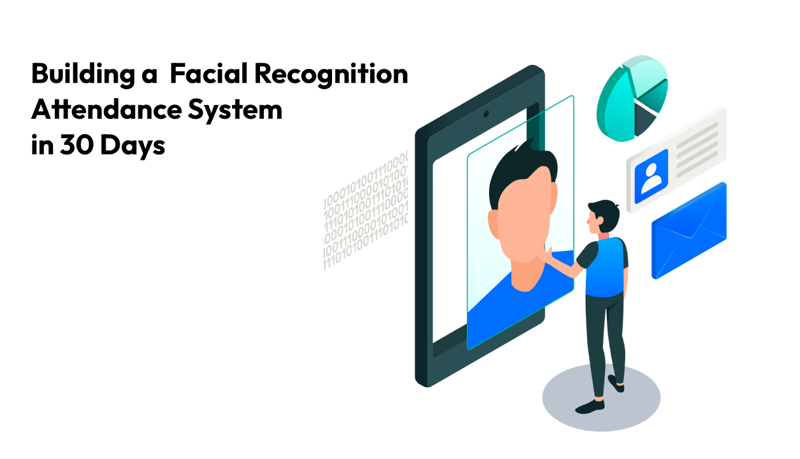
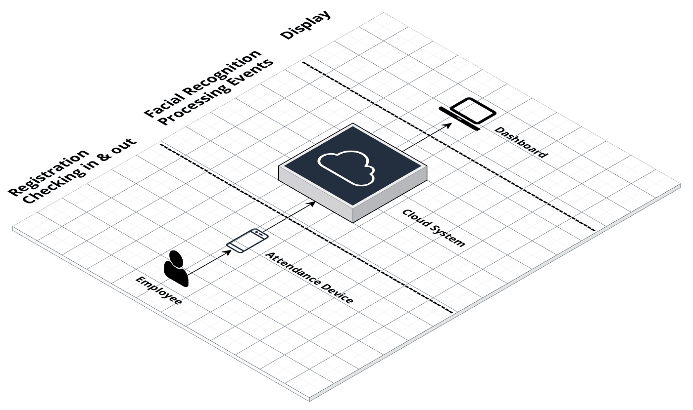
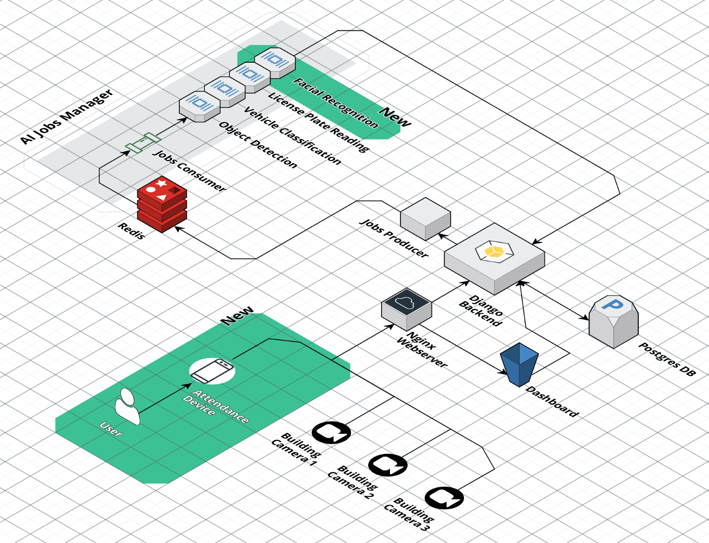
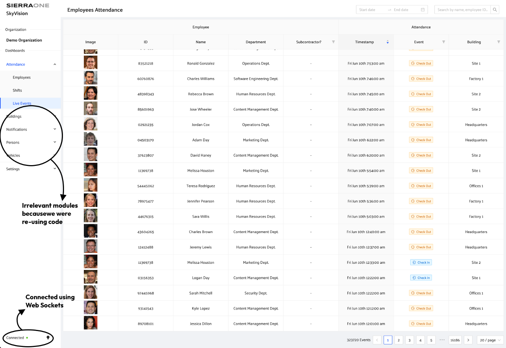
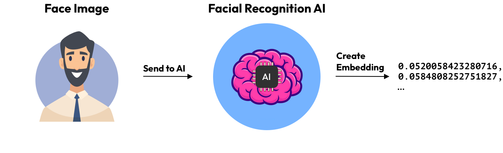
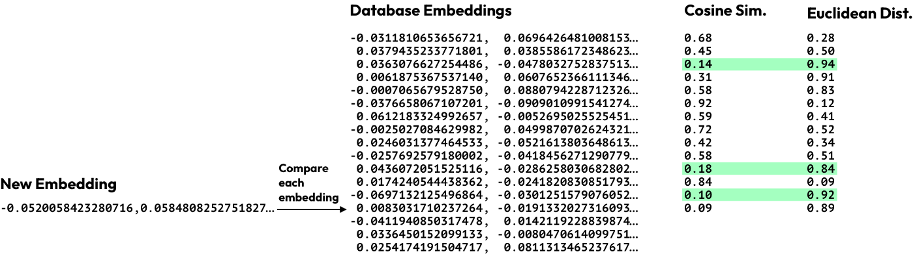
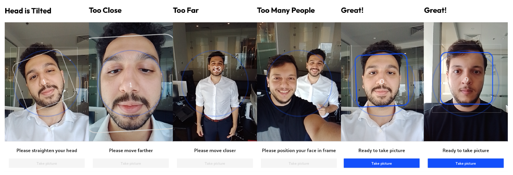
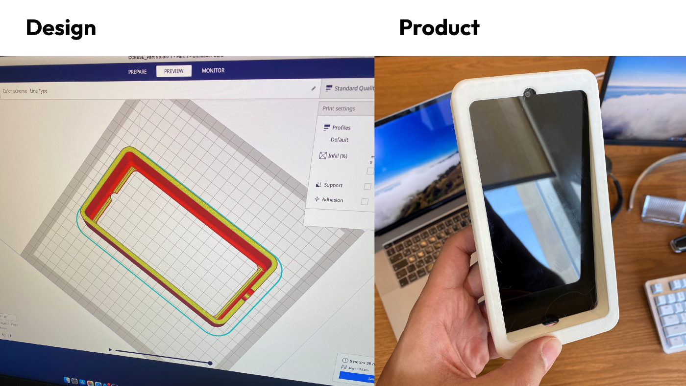
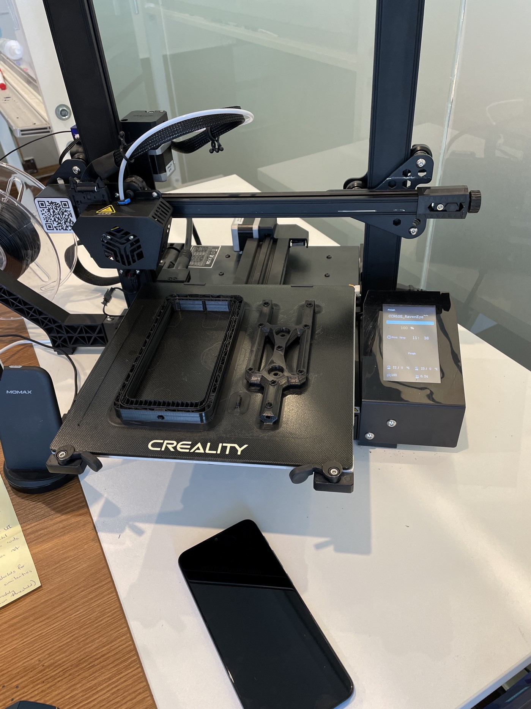

This month, our attendance management system hit 900,000 attendance events only 1 year after its inception. While we bask in our accomplishment it’s easy to forget the rough start the founder (Mohammed Fituri) and I have had starting this project.

With only two engineers (and a dream ✨) we were able to build a working prototype of our attendance management system in under 1 month, and scale to over 1,000 employees in under 3 months.

This article is a story of the initial bootstrapping period of this product and it delves into the technical challenges we’ve faced building our product.

**_This story is a love letter to hack-y solutions and how innovative they can be in the face of time and resource constraints._**

Background
==========

It’s difficult to tell this story without explaining the business side of things, as it directly correlates with the number of users that we have on the system.

> After all, you can’t properly scale tech without demand.

**SierraOne** is a company founded by Mohammed Fituri in 2019 that leverages AI and Computer Vision to solve business operation problems. In early 2021 the company was approached by Regency Group Holding (RGH), the largest real-estate company in Qatar, in an effort to replace RGH’s on-premise, finger-print system with a cloud, Facial Recognition system.

Requirements
------------

The deal was contingent on delivering a working prototype in the main office within 30 days. The deliverables were simple, it had to have:

*   A highly available device that can register employees on the system and check people in/out on a daily basis
*   A cloud system to run the facial recognition and processing events
*   A dashboard to display all the events live as they come

Our team was consistent of two software engineers (at the time it was just Mohammed Fituri and I), so, as you can imagine, this posed a great challenge for us. In fact, at first it seemed impossible but we couldn’t turn down our first official, and potentially lucrative, deal.

_A small note from the author:_ Looking back now, taking on this challenge was inadvisable as it goes against one’s very instincts as an engineer. Engineering as a field tends to lean more towards predictability, repeatability and reliability and there was no guarantee of that. We had limited time, limited expertise and limited resources; but I suppose therein lies innovation.

Needless to say, we rolled up our sleeves and braved the highly improbable odds of success.

Backend, AI & Dashboard
=======================

Backend
-------

Since we were tight on time, we didn’t want to build anything from scratch unless we _really_ had to. Luckily, we already had an on-premise server running in one of the towers in Doha from our previous work. This server was responsible for running some AI services that we developed for building surveillance (vehicle classification, object detection, etc). Our plan was to build an “attendance” module on top of the already running system in the frontend and backend.

The new module shared the networking configuration, deployment cycle, database schema, dashboard UI and most importantly the **AI Jobs Manager** from the already running system. This saved us a lot of time.

> **Note:** This also acted nicely as a boilerplate setup and saved us time in technology selection.

The attendance module just added 3 things to the backend system:

*   A way to receive attendance events.
*   A Facial recognition AI model.
*   A way to show those events.

The whole system was set up and code-wise we just needed to add an attendance module in the [**Django**](https://www.djangoproject.com/) backend and the [**ReactJS**](https://reactjs.org/) dashboard. The backend was responsible for receiving the attendance events, storing it in our DB and prompting the **Jobs Producer** to have it prepped for the AI. The dashboard would simply have to show the results of this interaction live as the events come; for that we had to used the [WebSocket API](https://developer.mozilla.org/en-US/docs/Web/API/WebSockets_API) managed by [**Django Channels**](https://channels.readthedocs.io/en/stable/)**.**

The Jobs Producer would create a job, save it in a queue managed by [**Redis**](https://redis.io/)**,** and sent on its way to be ran on our (brand new ✨) Facial Recognition service.

Now all we needed to build was the Facial Recognition service and run it in our AI Jobs Manager.

Artificial Intelligence Service
-------------------------------

We needed an AI model to recognize a person from an image of their face. For that we used a custom implementation of [**FaceNet**](https://www.geeksforgeeks.org/facenet-using-facial-recognition-system/#:~:text=FaceNet%20is%20the%20name%20of,for%20Face%20Recognition%20and%20Clustering.) that we’ve worked on in the past (more re-using let’s go!).

The model had one job, it took an image of a face and returned an embedding of that face. An embedding is basically a mathematical (vector) representation of a single face created by our model.

For every attendance event we would create a **new embedding** and compare it with a database of embeddings created by the same AI. We compared the embeddings using two functions: [**cosine similarity**](https://en.wikipedia.org/wiki/Cosine_similarity) and [**euclidean distance**](https://en.wikipedia.org/wiki/Euclidean_distance).

Each of those functions returned a score from comparing the new embedding with the old embeddings. The database embedding scoring the highest from both functions, above a certain threshold, is the closest match to the new embedding and is thus recognized as the same person from the database embedding.

This method worked very well and we were confident that given any face we are able to find the closest matching person, and then retrieve the rest of this person’s information from the database.

Now that we have our results back, let’s display it on the dashboard.

Mobile Application
==================

Everything was ready, now we needed a way to send registration and attendance images back to the backend and have them reflect on an employee’s attendance.

The main thing we were replacing with the thumb print devices is _inconvenience_, and so it would be a complete waste of time to build an application that was either slow or cumbersome to use.

> The device, and any interactions with the device had to be smooth and seamless.

The application had to do two things very well: **capture events** accurately, and **register employees** quickly and easily; our MVP would be a success if we nail these two specifications. We chose **ReactNative** because we didn’t know the nature of our hardware at this point yet.

Capturing Events
----------------

Checking in/out happens two (or sometimes more) times a day; it won’t take the user long to get resentful towards our solution if it was a slow or clunky experience. We designed the app so that it needed minimal input from the user to function.

Based on the time of the day and the shift of the user (which was inputted in the dashboard), our system would automatically guess if it’s a check in or a check out and give the user confirmation that they’ve successfully checked in or checked out. Thankfully the AI we developed is lightning fast and you can see in the following gif how fast a single recognition is.

Registration
------------

When checking in/out everyday there is going to be variances in a person’s face images. Thus the registration images for a person had to be a good representation of that person’s face and have as much in common with all his/her daily variances. To achieve that, we had to set some restrictions that we could apply on _all_ the registration images that will be on the system. We came up with 3 rules:

1.  The face shouldn’t be too far or too close to the camera.
2.  The face should be straight and not tilted in any direction.
3.  The face should be well lit and not taken in a dark place.

**Achieving #1 & #2** we used [**Google’s Face Detection**](https://developers.google.com/ml-kit/vision/face-detection) to get the face on the device itself. The Face Detection API gave us information on the [_roll, pitch, and yaw_](https://www.researchgate.net/figure/The-head-pose-rotation-angles-Yaw-is-the-rotation-around-the-Y-axis-Pitch-around-the_fig1_281587953) of each face, which told us whether the face was tilted, if it wasn’t looking straight, or if it was too close/far from the camera. We used this information to give appropriate messages to the user who is currently registering on the system.

The feedback was super fast since it all ran on the device itself, and it made for quick and easy experience for the users.

**Achieving #3** we had to build a new AI model that will light up the different facial features… I’m just kidding. That would be the appropriate solution but we just didn’t have the time.

This was a little less an engineering matter and more finding a proper well lit location to place the devices. There is a little lesson here in embracing non-engineering solutions as part of the problem solving process.

These three rules gave us great quality registration images, and weren’t too restrictive that it made the registration experience miserable.

With these two functions nailed, it was time to develop our hardware.

Hardware & Installation
=======================

Both the founder and I were software engineers and had little to no knowledge in hardware development, nor did we have money to hire or contract a company to develop and build the devices.

Additionally (and I hate to remind the reader) _we were short on time!_ The key was to start ASAP so the time that we spent on choosing a device was exactly: _0 seconds._ Both developers had an iPad at the time and so the decision was made.

After a week of development, we had a basic facial recognition implementation working on the iPad.

At this point we knew that we couldn’t sell an iPad to each of our clients if we grew. We had to move to a cheaper device, so we chose a cheaper device: an _Android tablet_. Thanks to ReactNative this wasn’t a very expensive move.

The Android tablet didn’t cut it. The price of the device was still way too high, and we couldn’t find a mount that is not very bulky and cheap enough. That’s when it hit us:

> _Let’s just 3D print the tablet case 🤯_

Unfortunately 3D printing a large case was too complicated; we would need to print multiple pieces and put them together, and if we did figure it out it would too long to print one case. Then another idea struck our minds:

> Let’s just use an Android phone instead 🤯

3D printing for a phone was a lot simpler than for a tablet and not to mention we would be saving so much on one device. This was the way to go!

Of course there were downsides to using a phone, but it didn’t matter. This was all for a prototype that we were delivering end of the month. We knew that eventually we’d move to something more robust (and we did).

This is the point where I fell in love with this project. It kind of hit me, that we were developing this whole attendance system with various people able to check in and out from different devices using hacky skills we learnt over time.

This method worked perfectly and we were able to install our first device in the head office as agreed.

Things were going grape! Our prototype was installed, and the system was able to register 40 employees quite seamlessly. They were also able to check in and out very smoothly and our on-premise server wasn’t breaking a sweat.

Conclusion
==========

Although much of what I outlined in this article was replaced with more robust and better solutions in the coming months, this duct-taped system was able to withstand the brunt of 1000 employees across 15 locations in Qatar checking in and out daily.

Hacky solutions go a long way in developing technology. A scrappy attitude is sometimes needed when facing very difficult challenges.

I hope you enjoyed this story.