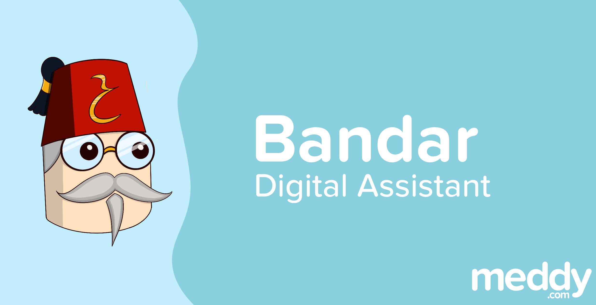
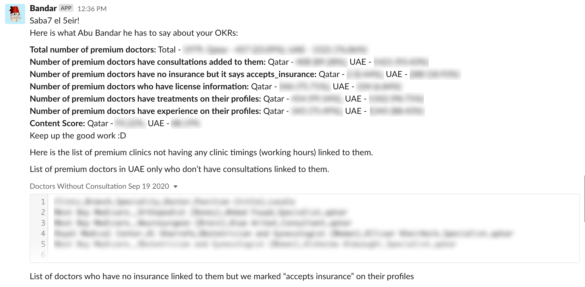
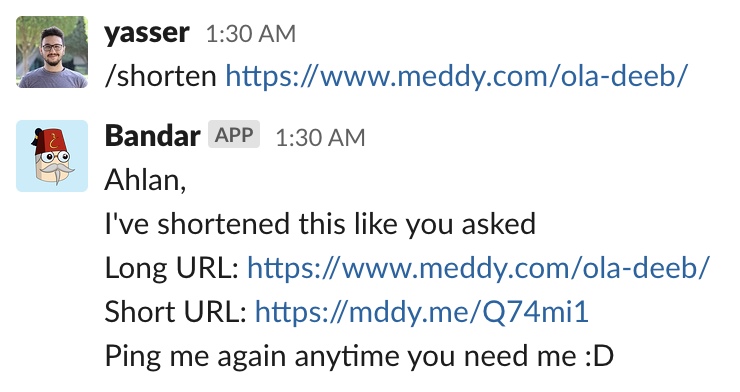
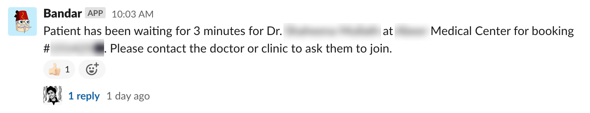
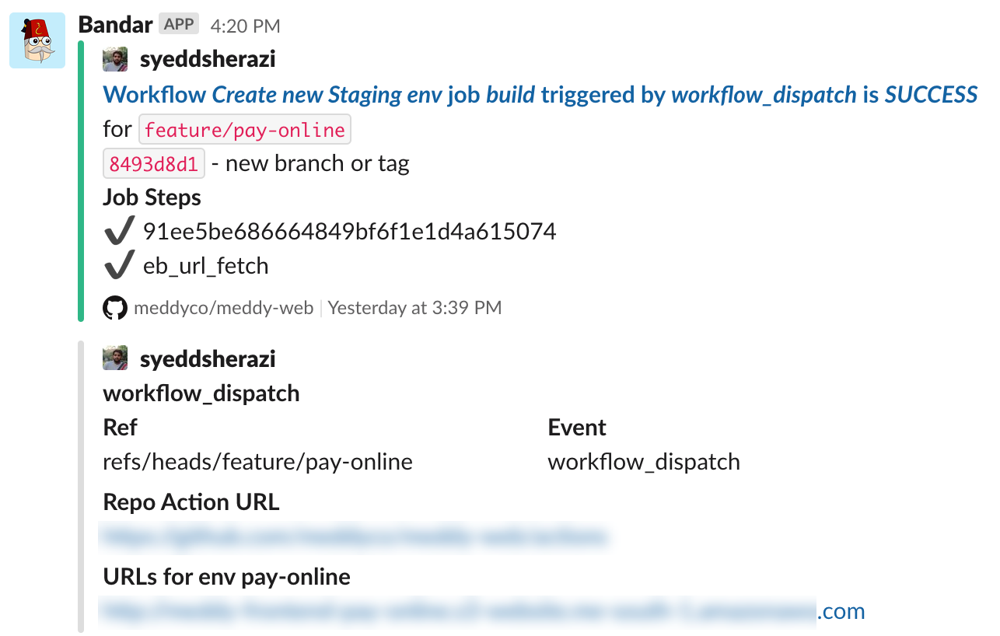
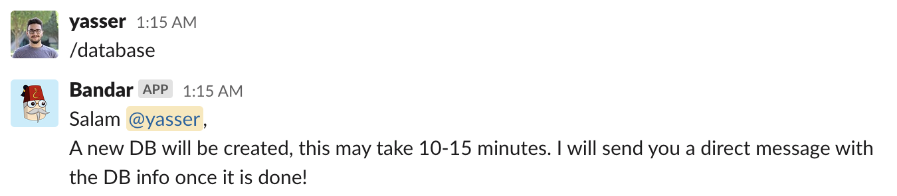
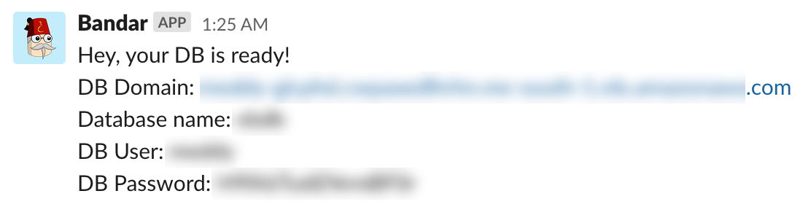
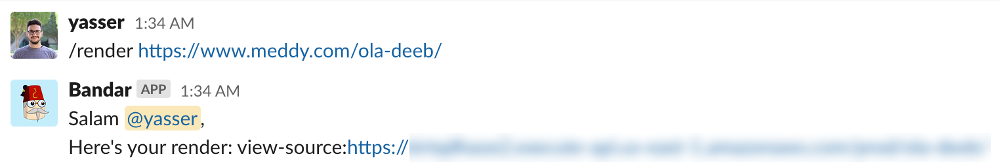

On November 4th, 2019 we created a digital assistant for Meddy to just send notifications when certain events triggered. We called him Bandar. One year later and Bandar is now doing all sorts of things. In this post we talk about Bandar and all the things he does around the company.

Bandar Ibn Abu Bandar
=====================

We call our admin portal Abu Bandar. This is a reference to an old cartoon called [Masameer](https://www.imdb.com/title/tt6298258/) one of the founders, Abdullah Al-Khenji, watched as a kid. In one of the episodes [someone calls Abu Bandar](https://www.youtube.com/watch?v=KkZ9iwOktQI&feature=youtu.be&t=92) to get an impossible thing done. Abu Bandar was a mysterious person you go to in order to get anything done, much like our admin portal 😄.

Abu Bandar means “Father of Bandar” in Arabic, so we thought it would be appropriate to make the smaller and more nimble digital assistant his son. Bandar and his father work together to help the team achieve the most in Meddy. Great family work ethic!

> **Note:** Yes we know Bandar means “Monkey” in Hindi/Urdu.

Work, Work, Work…
=================

Bandar does a lot around the company, he’s a very big fan of Rihanna’s song “Work” and we imagine he listens to it all the time. Here are some of the things he does.

Sends Reports
-------------

One of the nicest things Bandar does is compile reports and sends them on a weekly/monthly basis to the people who need them to track their goals. This makes it super easy for people to do their jobs as they don’t need to export and parse data anymore, the data is served on a silver platter whenever and wherever needed.

Shortens Links
--------------

In late 2019, we opted to use our own link shortener to maintain a look to the links that is familiar to users, have control on the short url, and save the company money.

If someone from the social media or marketing team wants to link something, they can ask Bandar for it and he will deliver.

Isn’t Bandar just [wonderful](https://mddy.me/Pf3wRf).

Warns the Team
--------------

Applications often fail to address certain use cases. In large applications where there is a lot of interactions between internal systems things inevitably go wrong. When that happens Bandar sends a message to see if we want/need to intervene manually.

Sometimes issues happen whenever there is a call that takes too long to connect or when a booking doesn’t update the clinic’s system properly. Sometimes it’s a benign issue and we just want to inform the team that it happened. Either way, Bandar helps us achieve customer satisfaction.

Notifies the Team
-----------------

We have quite a few tasks running in parallel while doing development sprints. We ask Bandar to send us notifications with information on deployment to keep track of what servers we’ve launched with which version of the code. If a launch fails or succeeds we can be sure Bandar will let us know.

This makes it easy for the team to keep track of what’s going on with whom, what’s live and what’s not, and when to leave and come back. Bandar makes things clearer.

Creates Databases
-----------------

One difficult thing is managing access to our production databases. You don’t want any opening to your production databases except for the necessary ones. One major problem is that your team cannot run SQL queries on the latest databases without going through a large hassle or exposing your database endpoint.

One solution we came up with is asking Bandar to create a database from the latest backup and take it down shortly after. This makes it very difficult for any malicious user to gain access to this and gives enough time for our team to run their queries. Since the price of databases is pro-rated this means that this solution is very cheap as well.

Renders Pages
-------------

Our website has a lot of complicated rendering to enhance user experience as much as possible. What we serve Google (and other bots) is different from what we serve users. This makes it hard for some of our team members to see the version of the page served to Google in order to do some work on our SEO.

For that reason, you can ask Bandar to get you the rendered version of a page and Bandar will return it.

We hope that this post has given you ideas of what to do with your digital assistant. Try and give them a nice design and a wide set of things to do, it increases morale quite significantly.

