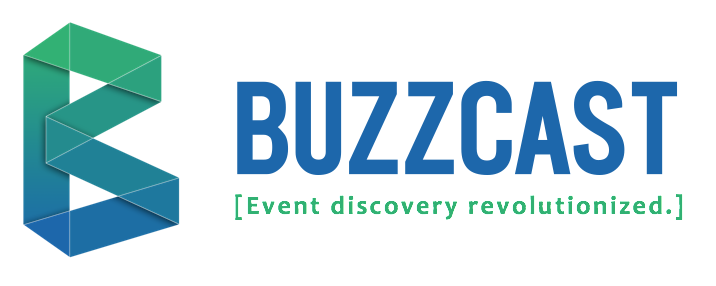
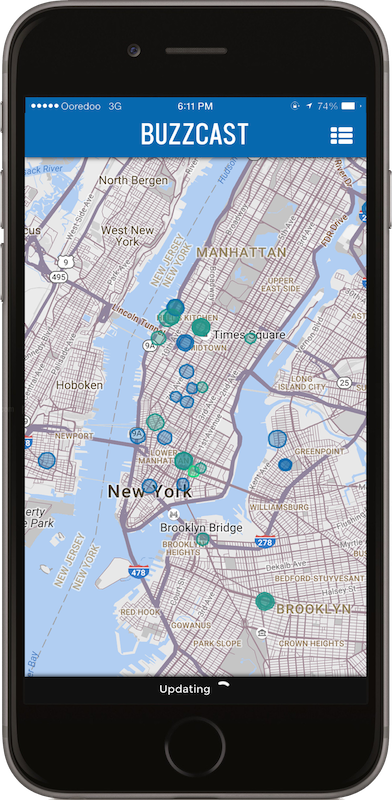
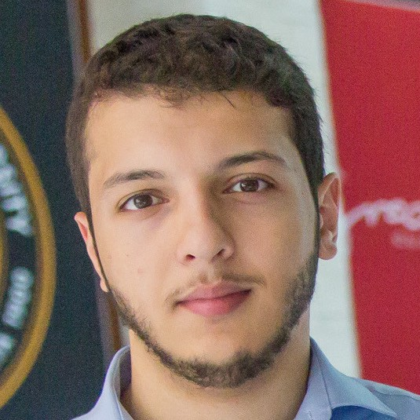
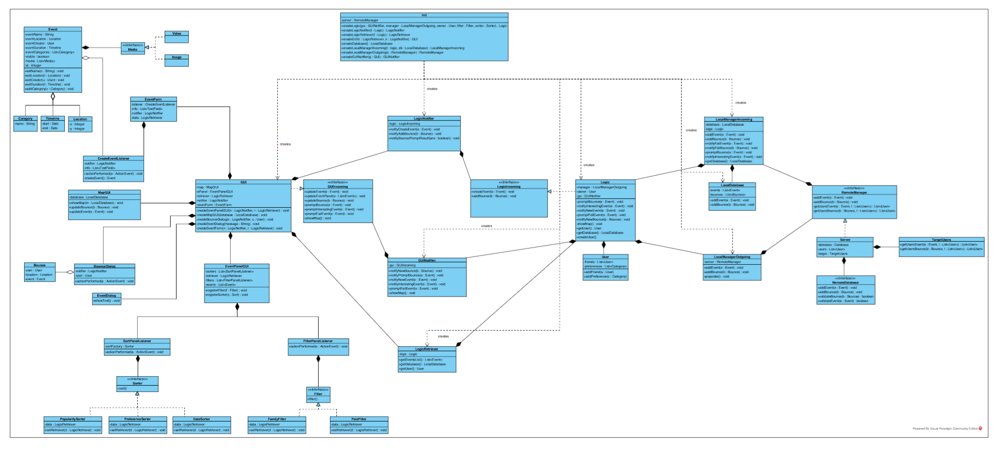
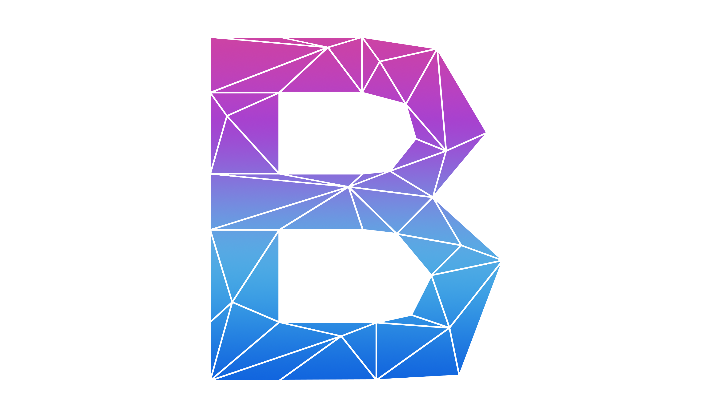
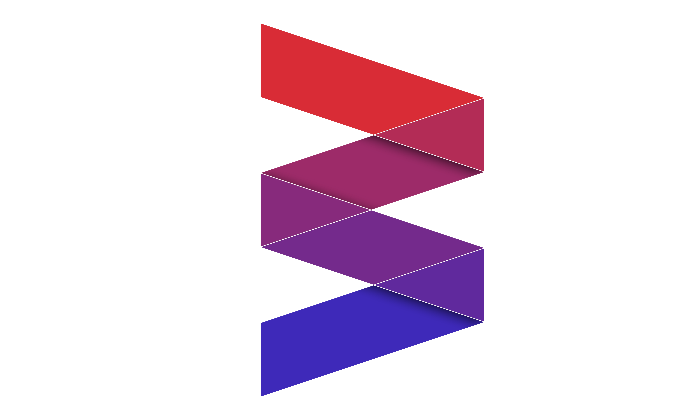
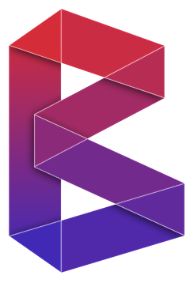
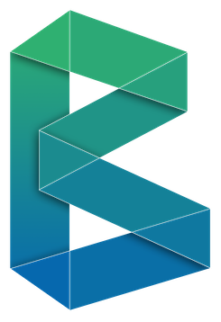
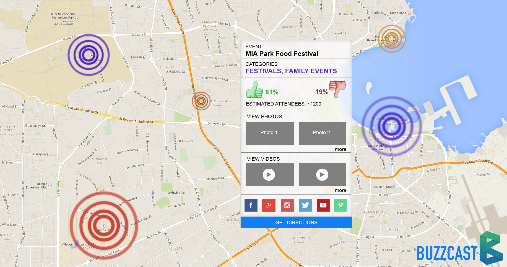
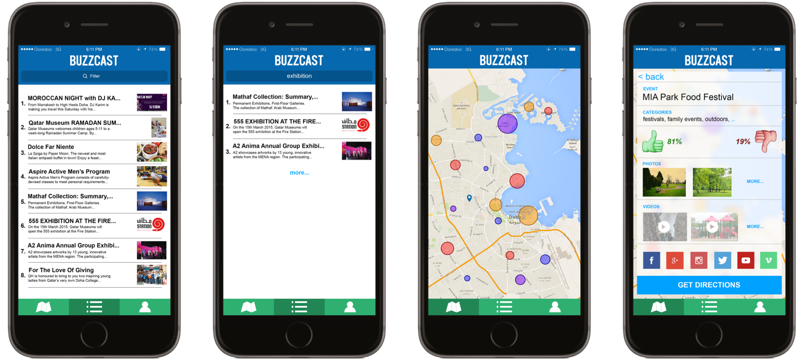

In the summer of 2015, my friends and I came up with BuzzCast, **a revolutionary new way of discovering events online** (you have absolutely no idea how many times I’ve said that). Simply put, BuzzCast is a tool that aggregates different social media feeds, finds where the events are from that feed and puts them all on a map with the hype on said event. It shows the different discussion threads found on [Facebook](http://facebook.com) and [Twitter](http://twitter.com), all the images found on Instagram, number of people attending from [Eventbrite](https://www.eventbrite.com/) and [Meetup](https://www.meetup.com/). From the feeds that we retrieve we apply some generic **Sentiment Analysis Algorithm** provided by several libraries to generate an estimation for how hyped the user is on said event. This is BuzzCast.

This blogpost aims to show the reader how **a simple idea with a great team can accomplish to amaze judges and crowds time and time again!** I will do so by showing you the journey that this idea went through, so please read this as a story, have fun, and learn as much as you can!

The Core Team
=============

Before you understand what happened and where we took this idea, I feel it’s necessary to introduce you to the team. The core team consisted of three people, however given the versatile community of Carnegie Mellon University a total of 10 people ended up working on BuzzCast. I will introduce you to these people as they become relevant in the story. That being said, I cannot start without introducing the core of the team which consists of myself (Yasser El-Sayed, nice to meet you), **Mohammed Fituri, and Musab Popatia.**

If you’ve read my previous blogs, you’d know that I’m a Computer Science major from Carnegie Mellon University; I’ve a knack for public speaking inspired by professors [Mark Stehlik](https://www.cs.cmu.edu/~mjs/) and [Randy Pauche](https://en.wikipedia.org/wiki/Randy_Pausch), not to mention an abundance of “feeling no shame” from my strong Egyptian genes. Thus, it was only natural for my teammates to entrust me with the ever so notorious task of presenting what we’ve developed. You mustn’t blame my colleagues really, I’m quite interested in presenting and public speaking as I’ve acted in multiple amateur plays and had a 15-minute comedy bit in front of a fairly large audience; it’s my thing! On top of that, I’m also a full-stack Web Developer, however I prefer front-end to back-end. Thus, I’ve played a role in developing the core features of the front-end of the application; however, since this is not a technical blog I will not delve deeper into that aspect.

**Mohammed Fituri** is also a Computer Science major from CMU; he has a knack for designing fantastically impressive designs. As a matter of fact, Fituri is multitalented and quite humble about being so. In fact, I’m certain that after reading this he’ll tell me to take it down but I will refuse. I first met him doing a 3D design for one of his freelance clients. Now when we work together we almost always go with his designs. In this project he designed the logo, the application, and all the presentation slides. His background, after all, is in Computer Science, and like me he is a full-stack Web Developer.

**Musab Popatia** is (again) a CS major from CMU; he is one of the shrewdest back-end developers I’ve encountered. In the beginning of this blog I’ve explained that BuzzCast brings together a lot of social media API’s and searches through them. This is the main feature of the app and it was developed primarily by Musab. Like Fituri and myself, he also has a knack that makes him more valuable outside his code; he reads a lot. He knows a lot of what’s going on around the world and knows more than what code is supposed to do. In fact, his mindset is heavily a business centric and can think of many ways to generate revenue and acquire strategy partners. This came in handy in our first competition, [**Challenge 22**](http://www.sc.qa/en/opportunities/challenge-22).

Challenge 22
============

Challenge 22 was initiated in January of 2015; the idea of **BuzzCast was formed in December of 2014 and recreated many, many times afterwards.** Challenge 22 is a competition that called for aspiring/current entrepreneurs/business-owners to present their ideas/businesses to a panel of investors that score the presentations and choose a winner from every category… Basically [Shark Tank](http://abc.go.com/shows/shark-tank). The categories, at the time, were **Sustainability, Event Experience, and Sports & Health.** We entered the Event Experience category and thus I will not explain the other two. The winner of every category gets incubated by one of the incubators in Qatar and wins a $20,000 prize money.

I must digress to explain something about Challenge 22. Even though it has helped shape BuzzCast to what it is now, I must say I don’t like what it stands for. [Maher Hakim](https://www.linkedin.com/in/drmaherhakim?trk=pulse-det-athr_prof-art_hdr) explains this very nicely in his blog “[The Value of Ideas](https://www.linkedin.com/pulse/value-ideas-maher-hakim?trk=mp-reader-card)” where he says that Arab countries host competitions that put value on ideas rather than actual concrete work. Which is exactly what Challenge 22 motivates through allowing simple ideas to enter.

To be fair, BuzzCast was just an idea when it entered the competition and when **it beat 355 other teams and 1000+ people** in reaching the final rounds of the competition. And I am grateful because the tough competition that reached the final stage of the competition made us work our asses off to stand a chance.

The Progression
===============

The Idea
--------

The idea initially started as a way to communicate where the events were by bouncing Buzz off each other using an app. For instance, if you were playing football (soccer) with your friends one Saturday afternoon but you don’t have enough players, you could use our app to inform people in the area that there is something happening right now and you there is some hype over it. This would be amplified when in a large event that has a lot of already-hyped-up people and they would be using our application to amplify the hype! Remember that it was just myself and Musab at the time, Fituri joined us later.

**Here was our first mistake. We barely did any customer discovery.** We had a project for 15–214: Software Construction. The point of the project was not to code a large application but rather to design one using UML diagrams, which is a universal modelling language designed to model code (Hippie shit, I know). Musab and I got too excited and we designed an entire application that we realised later it had very little to no customers.

Every book about entrepreneurship will tell you to **never, ever do this.** After talking to a few people we realised that it was a poor idea simply because no one cares about broadcasting the hype to people that they didn’t know, but would rather use social media to target people that they do know. So we found it was better for us to **farm Social Media for events** rather to generate user content, rather than have user content be generated conventionally by a person signing in using our application. That way we not only create a platform where the Buzz is automatically generated, but also show posts from different social platforms on different events. This was the first of many iteration on BuzzCast, and it was received very nicely by the people we interviewed as part of our customer discovery.

> Our vision was to have a system smart enough to look at all feeds of all social media and figure out the events and interpret the Buzz from those feeds.

This is where Mohammed Fituri joined the team. In addition, we needed to prove the technological aspect of this project to a panel of scientists that worked in the Qatar National Research Fund; I’m going to gloss over this because it’s uninteresting to a non-technical audience. What I will say though is that we asked a professor of Natural Language Processing to be our mentor in that judging stage; [Kemal Oflazer](https://www.andrew.cmu.edu/user/ko/). We also asked Maher Hakim (from the value of ideas blog mentioned above) to be our mentor and he agreed graciously. What is funny is that he was also competing against us in Challenge 22, but offered advice and help nonetheless.

Pitch
-----

I am filled with cringeworthy, yet heartwarming memories when I see the very first naive wordings, designs and implementations of BuzzCast. By this point it was the end of the semester and we just heard about Challenge 22. Our initial entry was titled “Internet Farming for a Continuous Event Feed”… _can you believe it?!!!_ I was made fun of for coming up with this dumb title, but I find it pretty hilarious nonetheless. The reason I am including the pitch this as part of the Design Progression section is because **the pitch is exceptionally important for the identity of the product.** Think of AirBnB or LinkedIn’s early pitches.

When we first started, our pitch was too technical, but it was what we wanted to convey. We wanted to convey that we are **farming the internet** (’cause that sounds cool, or at least we thought so), that we were using that to create a **continuous feed of events.** However, when we were in the final stages of Challenge 22 and met the final 18 contestants, it was hard to invoke curiosity with a technical statement like that simply because: NO ONE CARES! In fact, that only people who cared were Computer Scientists like us, which was a very bad sign. Something had to be done and thus I came up with the following statement.

> BuzzCast is a tool that aggregates various social media feeds to show the Buzz on events in one seamless map interface.

This is the one line pitch that briefly informs the person about the application, its ambitions and, more importantly, it **invokes curiosity.** I found it was very important to invoke curiosity from the listener, because they ask more about the details. You can’t initiate the telling of details because no one is curious enough to learn. Imagine I walk up to you and tell you about my aquaponics business idea, and I initially begin by saying: it’s a farm that uses bionic material from various aquatic creatures to sustain crops… **\*snoooooore\***. What if instead I said I’m making food from fish poop without wasting any farming space. Now you have questions, and only then the conversation can carry on.

If you notice however that this statement, while is an improvement, still had the term map interface, which I personally don’t like. Later on, in future competitions we improve on that as well.

Logo
----

The beginnings of BuzzCast’s designs weren’t very flattering either given the picture you see above. We wanted a low poly feel to it for a very non-specific reason: at the time all my wallpapers had a low poly art style to them because I played [Final Fantasy 7](http://images-cdn.moviepilot.com/images/c_scale,h_559,w_1024/t_mp_quality/yjhm1vfcfcf7ddssvise/final-fantasy-7-remake-all-of-the-original-s-flaws-that-need-fixing-for-release-date-fi-607562.jpg) and thought it looked cool… and Fituri agreed! This is why the above logo kinda looks that and more importantly looks atrocious (in my team’s opinion). But they were quickly improved upon given feedback from our colleagues and it went from the above hacked up design to the following designs.

As you inspect our initial designs on the side I will talk about the importance of having a “logo” when starting up an idea or business. Logo’s are the identity of the idea or business; better put, they give you the power of having an identity. Once we got a logo we were happy with, we put it in product designs, presentation slides, next to our

names, and on this blogpost (it would’ve been on our business cards if we made any). Moreover, it also helped recurrent people remember us. A logo is unique, your idea isn’t necessarily unique. For example, you could decide to start a restaurant that serves British food on a mountain in Turkey, and no one else would have same uniqueness proposition as you. However, another person could decide to

open a Scottish restaurant on a mountain in Turkey, and at that point a person that has heard of one might confuse one for the other even though these two restaurants aren’t even competing for the same customers. That being said, when you engrave a logo in their brains it associates your idea/business with an identity. This helped us massively even in the idea stage of BuzzCast as we encountered a lot of the same people in our competitions that would have mixed us up with other teams that were doing something similar, but not quite the same (as every proper idea is unique somehow).

If it wasn’t for our brand I don’t think we would have had as grave of an impression as we had.

Product Mockups
---------------

Our first product designs were not very appealing either and, not surprisingly, did not look appealing or was intuitive to use by many. I’ll say this, **never code anything without being certain of the design first.**

We knew that before we started the competition and had multiple mock ups before coding anything. That being said, even though we reached the final stages of the competition, we actually _didn’t_ code anything. The reason wasn’t laziness or incapability but we figured that a product would be useless without getting some users on it. And since we didn’t have the time to get any customers, we thought it was pretty unnecessary. That’s another mistake we’ve made. Once we made a prototype of BuzzCast, people immediately understood what the product was all about. That is not to say that a pitch is useless, but a prototype is complimentary and does more than just pictures of mockups can ever do. Moreover, when people knew that we were CS CMU students, they ask “Where is the prototype”. **Abysmal mistake.**

**Mockups aren’t for presentations but rather for developers to develop the product.** This may seem obvious, like duh (as we used to say in early 2000’s), but to a lot of people it is not even remotely so! People use mockups and brag about them as if it’s the final product, at least they do in the Middle East. Heck, we even committed that same mistake when we entered the competition. We used our mockups as if the final product was going to look and function as the mockups intended. Which they did not!

Every entrepreneurship book will tell you to iterate, and that’s what this post is all about. Indeed, we moved from the above designs to the designs below and that’s what we showed in Challenge 22 sales pitch.

Sadly, even though we’ve tried our best to win we did not win, and for good reason. The competition was way too harsh on sophomores that couldn’t prove credibility. First off we were one of two university teams in the competition, the other 16 teams were credible entrepreneurs and businessmen. I recall that one of the teams had their life’s work in the competition: it was a coating material that was extremely cheap to make (the lead scientist claimed that it was cheaper than sand) that when applied on building material or cloth made it have higher insulation capacity. I might have butchered the actuality of what the material can do but it was something ridiculous like that. While we didn’t enter in the same category, you can see the caliber of the people that did compete in Challenge 22. We were easily the weakest team in this competition. Another team that entered our category have already produced and sold 10,000 units of their product as part of their customer discovery. We didn’t even build a prototype for the sales pitch! Not to mention that our revenue model was not very well received by the judges but I won’t get into that.

Microsoft Imagine Cup
---------------------

This is where BuzzCast reached in terms of major developmental changes. Afterwards, we participated in a Microsoft Imagine Cup. And we absolutely killed it! Out of 1000+ participants there were 12 winners from 3 teams.

Our main problem at this point was our business pitch. Even though Musab was good enough to create business models for the initial rounds, he needed someone with knowledge and contacts to be able to put together a better business and revenue model. More importantly Musab doesn’t like to present (regardless of his ability), and the fact that I had to present the business plan and revenue model it was short of elaborate. The team was lacking that second part of the equation.

We had made some traction in our university and people knew about BuzzCast. One student from the Tepper School of Business by the name of Yousef Akhlaq wanted to join our team and knowing him, we were glad to have him on board. Yousef is one of the more connected people I’ve met in my time in university and has a great ability in answering questions regarding business development and was a very great public speaker. So he was a perfect addition to the team.

We won Imagine Cup nationals in Qatar and, unfortunately, due to logistics weren’t able to compete in the Regionals in Egypt.

Now this is where we meet in present time. Will we work more on BuzzCast? The answer is: **it’s complicated.** Here’s more links from several newspaper about prizes we won. It’s always nice to see work pay off. Now in the beginning of this blog I said that we worked with 10 people and if you’ve counted the number of people as you went along you’d only count 7. That’s because there were two other competitions that I haven’t mentioned that I WILL mention in my **BuzzCast — A more technical approach.**

Until then, here’s more links that will support our credibility, BuzzCast is not a hack. I’ll see you next time!

[

QU and CMU-Q teams win Imagine Cup 2016 contest
-----------------------------------------------

### DOHA: Student teams representing Qatar University and Carnegie Mellon University in Qatar (CMU-Q) have won Microsoft's…

#### thepeninsulaqatar.com

](http://thepeninsulaqatar.com/news/qatar/379890/qu-and-cmu-q-teams-win-imagine-cup-2016-contest)[

2016 World Semifinalists: Innovation | Microsoft Imagine Cup
------------------------------------------------------------

### Microsoft Imagine Cup

#### Microsoft Imagine Cupwww.imaginecup.com

](https://www.imaginecup.com/content/details/19558)[

Microsoft declares Imagine Cup victors
--------------------------------------

### By Joseph Varghese/Staff Reporter Two teams from Qatar University and one from Carnegie Mellon University in Qatar have…

#### www.gulf-times.com

](http://www.gulf-times.com/Story/490230)[

#ImagineCup #Qatar - Twitter Search
-----------------------------------

### The latest Tweets on #ImagineCup #Qatar . Read what people are saying and join the conversation.

#### twitter.com

](https://twitter.com/search?q=%20%23ImagineCup%20%23Qatar%20&src=typd)

[

Contestants gear up for Imagine Cup finals
------------------------------------------

### Microsoft Qatar will host the Imagine Cup 2016 Qatar national finals under the patronage of HE the Minister of…

#### www.gulf-times.com

](http://www.gulf-times.com/story/489369/Contestants-gear-up-for-Imagine-Cup-finals)[

20 teams compete in CarnegieApps Hackathon competition
------------------------------------------------------

### DOHA: The CarnegieApps Hackathon this year saw record participation, with 20 teams competing in the 24-hour regional…

#### www.thepeninsulaqatar.com

](http://www.thepeninsulaqatar.com/news/qatar/370323/20-teams-compete-in-carnegieapps-hackathon-competition)