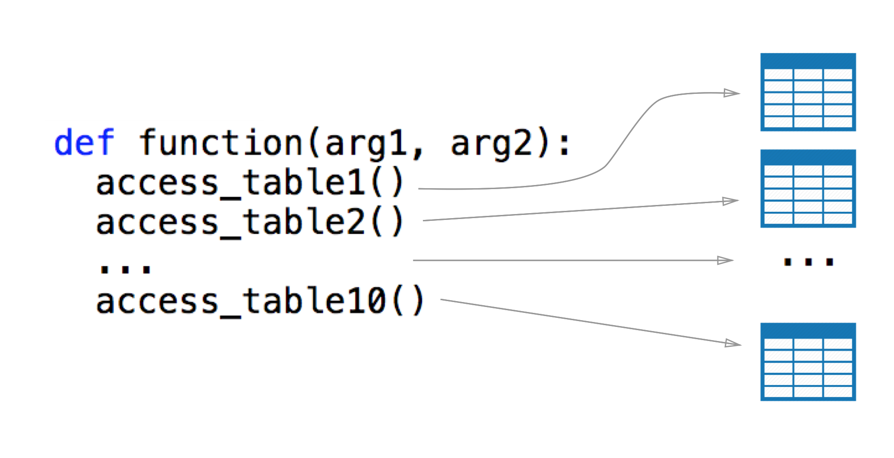

When building a product that is constantly growing in terms of usage and features, it is sometimes tough to stop and optimize your code to take up less queries/memory/processing power/magic. Here at [Meddy](https://meddy.co) we’re a relatively small team handling a relatively large codebase and userbase. This leads us to having speed issues on some of our pages and very little time to solve those issues. In this particular case, we were having problems with our Listings Page. Here’s how it looks:


If you’re having application speed issues and you’re basically alone when trying to concoct a solution, then this post will help you utilize a relatively simple caching mechanism.

!Small Disclaimer!
------------------

The code that you will see in this post is Python code and utilizes the Django Framework. Don’t be disparaged as I will be explaining the concepts and it should be easily recoded in any other language/framework.

Caching and Cache Invalidation
==============================

Why Cache?
----------

Caching is pretty f**\*ing awesome! Most of your optimizations should be done by optimizing a caching layer. In fact, if a cache doesn’t help you optimize further then your codebase is probably already very mature and you’re looking for very low level optimizations. In the book [High Performance Django](https://highperformancedjango.com/), authors Peter Baumgartner and Yann Malet say:

> Serving the entire HTTP response directly out of cache is ideal. When it isn’t possible, as many parts of the response as possible should come from cache.

In a sense you should milk everything out of your cache cow before thinking of more complex optimization.


Test payoff of a Cache
----------------------

In the setting of an application, having an in-memory cache that stores queries going to-and-for the database can have massive pay off. However it’s important to run a line profiler before and after a simple cache to see if it’s worth adding a cache or not. To test this out, I’ve ran some parts of my code on a debug server and ran a line profiler to see where the weak points are and then added a simple cache to see if it would help at all.

<div class="iframe-wrapper">
    <iframe
        width="100%"
        height="1230px"
        frameborder="0"
        scrolling="no"
        id="sizetracker"
        src="data:text/html;charset=utf-8,
        <head><base target='_blank' /></head>
        <body><script src='https://gist.github.com/yelsayed/20dce842b4d969ed53107bcde71f06e9.js'></script>
        </body>"></iframe>
</div>

You can find this line profiler tool [here](https://github.com/rkern/line_profiler). It’s an amazing piece of software written by Robert Kern.

I’m sorry if the gist above is half cut but the right side doesn’t matter, it’s all about the left side. I’ve profiled two functions, the second renders the page and the first one just returns meta tags for this specific page (title, meta… etc.). As you can see, the total time is 2.7 seconds (this is expected to be faster on the production server but it’s still pretty darn slow!).

If we do a quick analysis we see that there a couple functions being called that end up taking the bulk of the time. If we reduce the speed of these functions then it would massively decrease the overall time of the page!

Simple Fix time!
----------------

If we just cache the output of these functions, we would see the potential of having a cache layer, so let’s try it out. I’m using [Redis](https://redis.io/) for in-memory cache. For most web application frameworks, integration with Redis is pretty simple and I will not go through it in this post. We can abstract the use of a cache through the following interface:

```python
cache.get(key) # Gets the value assigned to key `key`
cache.set(key, value) # Sets the value to key `key`
```

Cool! So now let’s wrap our heavy functions with this cache, meaning we’ll do pretty much the following for our functions

```python
def heavy_function(args):  
    cached = cache.get(key)  
    if cached:  
        return cached  
      
    # ...  
    # Execute normally for this function  
    # ...  
      
    cache.set(key, result_of_execution)  
    return result_of_execution
```

Once we do this for our big functions, we suddenly have this report from our profiler.

<div class="iframe-wrapper">
    <iframe
        width="100%"
        height="1230px"
        frameborder="0"
        scrolling="no"
        id="sizetracker"
        src="data:text/html;charset=utf-8,
        <head><base target='_blank' /></head>
        <body><script src='https://gist.github.com/yelsayed/e45669c506a6b3c435842345d0da1287.js'></script>
        </body>"></iframe>
</div>

As you can see just by adding a simple cache the speed of the code went down by ~2 seconds! This is a great start but there is a big problem now, **Cache Invalidation.**

Cache Invalidation
------------------

If you refresh your page after this step you should see (or at least feel) that your page is faster, but if you try and change the data in your test DB you’ll realize that it’s not being updated. This problem is commonly referred to as [Cache Invalidation](https://en.wikipedia.org/wiki/Cache_invalidation). We need to find a way to invalidate our cache when the values of our functions are updated.

> _There are only two hard things in Computer Science: cache invalidation and naming things._
> 
> _— Phil Karlton_

Initially, I had two ways I can go about this. The first one was to update the cache of a certain method/function whenever an entry in the DB is updated (since most of the heavy functions are calls to the database). The second one was to update the result of a function whenever the output is different for the same parameters. Let’s do a quick analysis on both and why I chose the latter.

First method
------------

Having it such that we update the cache for a method/function whenever an entry in the database happens is difficult to code, not very reproducible, and more often than not will result in spaghetti code. If you’re like me and you have a large amount of tables you need to query in a single function, it’s going to be messy to update that function’s cache whenever an entry is made for that database. Let me draw you a little picture.



If you’re using an MVVC framework you probably have a model in your code that controls all accesses to your database. So you might think that it wouldn’t be so bad if we just cache and invalidate at the lowest level of our models. For example, if you call **model_1** to access **table_1** and a change happens in a row of **model_1** then you can just invalidate the cache by writing a function for **model_1**. But remember that accessing the database isn’t just one function and you can do it in many different ways, you’ll end up splitting your code into tiny little pieces and lose track of what keys in the cache you have to invalidate. It’s also an absolute nightmare to debug (learnt that the hard way).

**Second Method**
-----------------

Second method is a lot more general and doesn’t just apply to access in the database, rather to everything (such as static helper methods). There is a Python module called [functools](https://docs.python.org/3/library/functools.html) which has a decorator called **lru_cache** (the LRU here stands for least recently used, you can read about the concept more [here](https://en.wikipedia.org/wiki/Cache_replacement_policies#Least_recently_used_(LRU))). By using the **lru_cache** on a function it stores the outputs based on the input and caches the results in memory. Here is a small profiling of fibonacci function one with **lru_cache** applied and one without (n=32).

<div class="iframe-wrapper">
    <iframe
        width="100%"
        height="780px"
        frameborder="0"
        scrolling="no"
        id="sizetracker"
        src="data:text/html;charset=utf-8,
        <head><base target='_blank' /></head>
        <body><script src='https://gist.github.com/yelsayed/491a5ae9bbd0e3d3a0e453349268e3e9.js'></script>
        </body>"></iframe>
</div>

There is only one issue, this cache is not global, if you want to use it properly then it should be used within the same thread being executed. So for our method to work we just need to have our own global implementation of **lru_cache**.

Implementation
--------------

Thankfully, redis is a server running locally that stores values very much in the same way as **lru_cache** does. So what I did was look into the source code for **lru_cache** and just rewrite it as necessary.

There are three main parts, key generation, cache update and cache retrieval.

Key Generation
--------------

In the code for the **lru_cache**, it generates a certain hash from the parameters passed into the function.

It’s important to note that this assumes that if you give your function params x,y,z then the output should always be the same whenever x,y,z is passed in.

That key is used to store the output of the function in the Redis cache. On paper it looks something like this.

```python
return_value = func(**params)
key = generate_key(**params)
cache.set(key, return_value)  
return return_value
```

Now let’s code the generate_key function.

<div class="iframe-wrapper">
    <iframe
        width="100%"
        height="750px"
        frameborder="0"
        scrolling="no"
        id="sizetracker"
        src="data:text/html;charset=utf-8,
        <head><base target='_blank' /></head>
        <body><script src='https://gist.github.com/yelsayed/c3585e3029bc3b52cf190e9e9b3d78c0.js'></script>
        </body>"></iframe>
</div>

Cache Update
------------

For the cache update, it’s quite simple. All we have to do is get the old result from the cache and the new result from the cache, if they’re unequal, then just update the cache. On paper, here’s how it will look like:

```python
new_result = func(**params)
old_result = cache.get(key)  
if new_result != old_result:  
    cache.set(cache_key, new_result)
```

This is exactly how the code will look like.


<div class="iframe-wrapper">
    <iframe
        width="100%"
        height="370px"
        frameborder="0"
        scrolling="no"
        id="sizetracker"
        src="data:text/html;charset=utf-8,
        <head><base target='_blank' /></head>
        <body><script src='https://gist.github.com/yelsayed/4bfb7701a2598d7b7ef84556c53c5815.js'></script>
        </body>"></iframe>
</div>

There is a bit of a problem with this though. If your execution thread has it such that the function is going to be called in its entirety then what’s the point of a cache? Right now the execution thread looks like this:

```
call function -> call cache_wrapper -> get from cache -> **check if cache is stale by calling function????**
```

At some point we have to call the function to check if the cache is stale or not. But the entire point of a cache is to avoid calling the function!

A nice clean solution would be to update the cache in a separate thread by calling the function there. It doesn’t matter how long it would take to execute the function because it’s in a separate thread, so we good! Let’s see how that will look in the next section.

Putting it all Together (Cache Retrieval)
-----------------------------------------

Now that we have our key and a way to update our stale (if any) cache, we can generate it every time the function is called and check Redis to see if something exists for it, and then finally call the elegant update function we created. Like always, on paper this looks like this:

```python
key = generate_key(**params)  
result = cache.get(key)  
if result == null:  
    result = func(**params)  
    cache.set(key, result)  
else:  
    thread = new_thread(check_and_update_cache, **params)  
    thread.start()  
return result
```

In the above pseudocode, I open a new thread for the function that we created above to check and update the cache. Just as simple as that. Remember, we also need to make this into a decorator to make the lives of our developers easy. The final code should look like this:

<div class="iframe-wrapper">
    <iframe
        width="100%"
        height="1030px"
        frameborder="0"
        scrolling="no"
        id="sizetracker"
        src="data:text/html;charset=utf-8,
        <head><base target='_blank' /></head>
        <body><script src='https://gist.github.com/yelsayed/01a088a78da0fb68980b2561d860417b.js'></script>
        </body>"></iframe>
</div>

The last bit of code that may seem unfamiliar is the bit that makes our code into a usable decorator. If you want to understand more read [this](https://realpython.com/primer-on-python-decorators/).

Downsides of this Approach
--------------------------

Like with every approach there are some downsides to this approach. For one, opening too many threads doesn’t always have a good impact on speed. It depends on how many threads you open before it becomes too many threads. The question of how many threads is too many threads depends on your infrastructure, code, and [measurements](https://stackoverflow.com/questions/481970/how-many-threads-is-too-many). The simple solution here is to limit the number of threads you open by creating a [thread pool](https://en.wikipedia.org/wiki/Thread_pool).

Another downside is that if you think about it the data we serve is a little stale once it’s updated. Opening a new thread and updating while the main thread returns the result from a stale cache means that it’s returning the old result. This cache will obviously be updated once the thread finishes executing, and the user will get the updated result after using the function for a second time.

[Here’s the full code](https://gist.github.com/yelsayed/bd35809d5a3f12adf1dfe9ef3b0e6b19)
=========================================================================================

Thanks for reading. If you have any questions leave them in the comments.