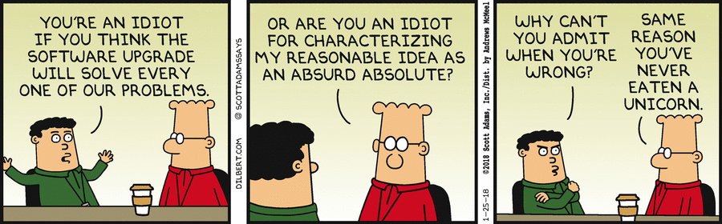

About this Post
===============

Software Entomology is a series of posts dedicated to dissecting several nasty bugs encountered by yours truly. This is parallel to a real [entomologist](https://en.wikipedia.org/wiki/Entomology) dissecting real life bugs with the exception of the “real life” part. I’m doing this because I think it’s fairly important to keep track of the big bugs that you were able to catch and solved.

In these posts I’ll usually have a TL;DR section at the top that briefly describes the issue, problem, and solution. Then further down the post I get more detailed about my own experience and how I came to the solution.

Briefly
=======

I’ll leave a brief description of the problem and solution in case you’re not interested in knowing about my own experience.

Context
-------

I updated Django from 1.11 to 2.1 and my database was returning this error for most of the tests that have been running. If you have the same problem then this post is for you.

```python
psycopg2.IntegrityError: duplicate key value violates unique constraint "doctors_doctor_pkey"
DETAIL:  Key (id)=(7) already exists.
```

Issue
-----

The issue that this error is telling us is that I’m trying to save a doctor but a doctor already exists with the same ID. If you’ve been using Django for a while you’d know pretty definitively that [**neither you nor Django**](https://docs.djangoproject.com/en/2.1/ref/models/instances/#auto-incrementing-primary-keys) have the responsibility of creating a new ID for every new object; it’s rather the responsibility of the database (PostgreSQL in my case) to do so. This was also happening when I run two different testing suites that have nothing to do with each other that both create new `Doctor` objects.

Problem
-------

The problem it turns out is using an object manager. The object manager that I had would return a subset of the returned queryset of doctors based on the `locale` variable. This `locale` would change depending on the chosen country/language by the user. This `LocalizationManager` we were using was being used for many of our Model Classes throughout the code to ensure that the correct data was being returned to the correct people. More specifically the `get_queryset` method (which is used to limit the queryset based on the locale) was being called on every `save` function.

Solution
--------

The solution was to stop using the object manager when save is called. This can be done by having a simple `with` block, in which inside it the `get_queryset` method will not be called. Here’s the full solution.

<div class="iframe-wrapper">
    <iframe
        width="100%"
        height="1470px"
        frameborder="0"
        scrolling="no"
        id="sizetracker"
        src='data:text/html;charset=utf-8,
        <head><base target="_blank" /></head>
        <body><script src="https://gist.github.com/yelsayed/316d90dcfc9a71e0bd4a45407a752268.js"></script>
        </body>'></iframe>
</div>


If you want to know more about specifics, check out the rest of this post.

What Happened?
==============

A Peek into Perdition
---------------------

Before we get into what happened I want to briefly describe some of the pain I went through.

I updated Django from 1.11 to 2.1 and after following the guide everything went nice and smooth — except 10 out of our 13 testing suites were failing at the `setUp` stage before the tests were even run.

The worst part was when I run a testing suite on its own it would pass. So to replicate the issue I would have to run all 13 suites and that took a **LONG-ASS** time. **EVERY. TIME**.

Another devilish detail was when I fix one test, another test would fail in another suite from **ANOTHER MODEL** totally unrelated to the first model.

At that point I was using every curse word in the book, wondering what I have done to make God smite me so. I was a lost soul for about three days.

Some Context
------------

2018 was a great year for [Meddy](https://www.meddy.com/) (I need lots of ⚡for this 🔌), we grew at least 6x in every single metric in the past year with our [monthly active users reaching upwards of 100k](https://hbr.org/sponsored/2019/01/how-qatar-is-building-its-own-version-of-silicon-valley).

> With great growth comes a greater strain on the software — Uncle Ben… probably

The last two weeks of the year were dedicated to patching, fixing and updating our codebase.

In my infinite wisdom I decided that it was a great idea to upgrade Django from 1.11.5 to 2.1.4 during our end-of-Q4 refactoring period. It’s something I’ve always wanted to do ever since it’s release in late 2017. Django 2.1 is faster stronger and has a [much better URL structure](https://docs.djangoproject.com/en/2.1/ref/urls/) than its predecessor. By this time most of our dependencies have updated their support for Django 2.1 so it felt like it was the perfect time to do the leap.

I thought this would take a day or two MAX. **Boy was I wrong.**

What Went Wrong?
----------------

The initial work I had to do was very smooth for the most part, a lot of the warnings provided by Django’s own docs and even other people’s [posts](https://www.metaltoad.com/blog/django-20-your-project-ready) were pretty informative on what I had to tackle. All I had to do was:

*   Upgrade all the necessary libraries
*   Patch the ones that don’t support 2.1
*   Update ForeignKeys to have `on_delete=CASCADE`
*   Make sure all the tests run

Thankfully the first three steps aren’t as painful as moving from 1.6 to say 1.9 was in the past, the Django developers learnt from their past. Initially the last step of the migration seemed like it was an easy fix, since the tests were failing from syntactic issues. However, even after fixing all the syntactical problems my tests kept vehemently failing over and over again.



After a very heavy analysis of all the errors that the tests were returning it all boiled down to one major thing: when creating a second doctor object there was an IntegrityError telling me I cannot create two doctor objects with the same ID/PK.

```python
psycopg2.IntegrityError: duplicate key value violates unique constraint "doctors_doctor_pkey"
DETAIL:  Key (id)=(7) already exists.__
```

Why this is Insane!
-------------------

The [docs state very clearly](https://docs.djangoproject.com/en/2.1/ref/models/instances/#auto-incrementing-primary-keys) that ID’s are calculated by the database so the question in my mind is why does changing the version of Django make a difference to, in my case, PostgreSQL. When I would downgrade to Django 1.11 the tests would start passing again.

I don’t usually make StackOverflow posts but this upset me so much I made a rather fruitless [one](https://stackoverflow.com/questions/53988348/integrityerror-in-testcase-runs-after-updating-to-django-2-0/53988439).

**What was the Problem?**
=========================

Some Clues
----------

I figured after some point that going after the tests was a waste of time for sure. If fixing tests breaks other tests then there is no point of fixing anything. Even if I fix all the tests, what happens when I write new ones? Obviously this was not the way to go.

I realized that since no one else is complaining about something like this, it must be something internal, so rather than pointing fingers at Django or other 3rd parties, I decided to think about the code as a whole. More specifically, since many different models were failing I was inclined to take a look at some of the modules I built as part of the core of Meddy. This includes Django apps that have nothing to do with the specifics of what makes Meddy, and instead add functionality and support the code.

If you’d like to think about it in a nicer way it’s like the [Mixins](https://en.wikipedia.org/wiki/Mixin) that only add functionality to classes without knowing much about the classes it’s adding to.

Eureka!
-------

This narrowed it down to my `LocalizationManager` that returned a subset of the data based on the locale which the user selects on the site. Here’s how it works:

<div class="iframe-wrapper">
    <iframe
        width="100%"
        height="800px"
        frameborder="0"
        scrolling="no"
        id="sizetracker"
        src='data:text/html;charset=utf-8,
        <head><base target="_blank" /></head>
        <body><script src="https://gist.github.com/yelsayed/512c26501b5883242fb9eb96466aa356.js"></script>
        </body>'></iframe>
</div>

I’m assigning the objects attribute to the `LocalizationManager` that way I only get the subset of doctors that belong to the current chosen locale, otherwise it returns all the objects that have been asked for.

Also note that the only thing I’m doing in this object manager is altering the behavior of `get_queryset`. So I tried removing that function and voilà, everything worked perfectly — except of course for the unit tests that were meant to test the `get_queryset` functionality.

Since `LocalizationManager` is actually very critical to the code, I couldn’t just remove `get_queryset` and call it a day, I had to develop a proper solution that didn’t affect the way the code behaved.

The Solution
============

Finally we arrive at the solution. I knew that the only time when `get_queryset` was an issue is when we saved the objects. So all I had to do is call the default behavior when `get_queryset` is in a `save` method. My idea is to assign a variable in the current executing thread that will be checked when `get_queryset` is called. Once it’s called then we can turn off any special alterations that we’ve made. In pseudocode here’s what I’m trying to achieve:

```python
use_custom_manager = True
def get_queryset():
    if use_custom_manager:
        do_my_own_magix()
    if not use_custom_manager:
        do_django_magix()  # Django save for Doctor object
def super_doctor_save():
    # does some magic...  
    get_queryset()  # Our own save with our own alterations
def doctor_save():
    use_custom_manager = False
    super_doctor_save()
    use_custom_manager = True
```

Whenever you assign to a global variable and then reassign it after an execution is done, a `with` block is what you need. A `with` block allows you to add context to the code being ran within a defined scope.

<figure class="gatsby-resp-image-figure" style="">
    <div class="iframe-wrapper">
        <iframe
            width="100%"
            height="620px"
            frameborder="0"
            scrolling="no"
            id="sizetracker"
            src='data:text/html;charset=utf-8,
            <head><base target="_blank" /></head>
            <body><script src="https://gist.github.com/yelsayed/87299795d6595566c695e2d5fda4608c.js"></script>
            </body>'></iframe>
    </div>
    <figcaption class="gatsby-resp-image-figcaption">
        Example of with block, straightforward.
    </figcaption>
</figure>

Given the idea that we have and the magic of `with` blocks, here’s the final solution.

<figure class="gatsby-resp-image-figure" style="">
    <div class="iframe-wrapper">
        <iframe
            width="100%"
            height="1450px"
            frameborder="0"
            scrolling="no"
            id="sizetracker"
            src='data:text/html;charset=utf-8,
            <head><base target="_blank" /></head>
            <body><script src="https://gist.github.com/yelsayed/316d90dcfc9a71e0bd4a45407a752268.js"></script>
            </body>'></iframe>
    </div>
    <figcaption class="gatsby-resp-image-figcaption">
        Final Solution
    </figcaption>
</figure>

That’s it?!
===========

You might wonder how this problem could be solved so easily. There is a rule of thumb that I believe works 80% of the time.

> The simpler the problem, the more complicated is the solution. The opposite is also true.