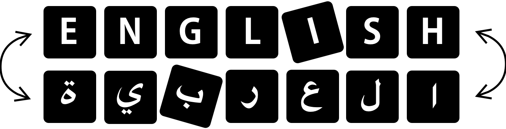
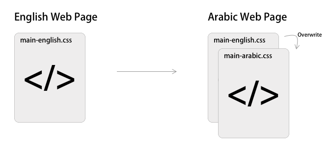
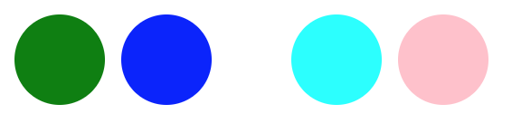

> You cannot use CSS code you built for an English web page for an Arabic web page.

I wrote a [post](https://medium.com/meddy-blog/translating-your-front-end-to-arabic-3308a511b560) previously about using SCSS to help you manage code for Arabic web pages. I’ve ran into a couple problems that I was able to solve with absolute elegance. **If anyone reading this post has a better solution to this problem please let me know.**

Brief Description of the Problem
================================

If you are tasked with creating a page that goes from English to Arabic with the click of a button (as seen here on [Meddy](https://www.meddy.com/)… shameless 🔌), you might be tempted to create one CSS file for that page and simply reuse it across the two versions of the page. Which makes sense, one file means that you’ll keep your application **DRY** and you can just focus on developing the CSS. This, unfortunately, doesn’t work so well since there are slight differences to the page structures when switching languages.

The common solution is to create two CSS files; one for English and one for Arabic, and in the Arabic CSS file overwrite parts of the English CSS to fix the inconsistencies.



The reason this is a common solution is because it’s extremely tempting to do. Whenever something looks a little awkward in the Arabic page you can just overwrite the English CSS and it will fix it.

However, this becomes **extremely unmaintainable** very quickly **especially if you’re using** [**Descendant Selectors**](https://www.sitepoint.com/descendant-selector-css-selector/). In this post we’ll discuss an elegant convenient solution to tackling this problem.

The Problem with Two Files
--------------------------

Let’s say we have classes `.seperate-children` and `.highlight-element` defined below.

<figure class="gatsby-resp-image-figure" style="">
    <div class="iframe-wrapper">
        <iframe
            width="100%"
            height="600px"
            frameborder="0"
            scrolling="no"
            id="sizetracker"
            src='data:text/html;charset=utf-8,
            <head><base target="_blank" /></head>
            <body><script src="https://gist.github.com/yelsayed/2ea870e1076f3ab981a2fa6ed3e9c29a.js"></script>
            </body>'></iframe>
    </div>
    <figcaption class="gatsby-resp-image-figcaption">
Sample code we use as an example to show bad approach.</figcaption>
  </figure>

Here’s some HTML to use the above.


<figure class="gatsby-resp-image-figure" style="">
    <div class="iframe-wrapper">
        <iframe
            width="100%"
            height="180px"
            frameborder="0"
            scrolling="no"
            id="sizetracker"
            src='data:text/html;charset=utf-8,
            <head><base target="_blank" /></head>
            <body><script src="https://gist.github.com/yelsayed/eecef682ec8920c46036095822b7eb6f.js"></script>
            </body>'></iframe>
    </div>
    <figcaption class="gatsby-resp-image-figcaption">
Some HTML to accompany the above CSS.</figcaption>
  </figure>

This should look like this:



Pretty simple, but remember in Arabic it’s from right to left by adding `direction: rtl` to the HTML. So it would look more like this in the Arabic page.


Which is not the desired effect. An easy way to fix this is make another CSS file for Arabic modifications and add this line to it.

```css
.highlight-element {  
    margin-left: 40px;  
    margin-right: unset;  
}
```

**But this doesn’t work!** This won’t do anything. The reason being, `.separate-children .highlight-element` has a higher precedence than .highlight-element. So your code will not apply and you’ll have to either use `!important` ([horrible idea](https://j11y.io/css/dont-use-important/)) or write out the entire tag (which is a bad idea… in the long run)

> But why don’t we just write the full tag Mr. Writer?!

Simply because if you’re dealing with a lot of CSS code then it’s impossible to keep track of the entire sequence of inheritance especially if you’re using [SCSS](https://sass-lang.com/) (and if you’re not, then you should), and even if you do it manually you’ll just have a file of weird and impossible to read code. **Just look at this mess!**

```css
.dashboard-navbar, .procedure-master-list-container, .row-actions, .add-element,  
.back-wrapper, .dashboards-nav-wrapper, footer, .invoice-footer, .no-content, .select-icon.meddy-light-chevron {  
    display: none;  
}  
.invoice-detail-container, .dashboards-container-wrapper {  
    width: 100% **!important**;  
}  
#mainContainer {  
    margin-top: 0 **!important**;  
}  
#invoices .invoice-detail-container .invoice-table .invoice-table-body :not(.date-picker-form) td {  
    font-size: 10px;  
    padding: 5px;  
}  
#invoices .invoice-detail-container .invoice-header {  
    font-size: 14px;  
}  
#invoices .invoice-detail-container .invoice-table .invoice-table-header th {  
    font-size: 14px;  
    padding: 5px;  
}  
#invoices .invoice-detail-container .invoice-number-input {  
    font-size: 10px;  
}  
#invoices .invoice-detail-container .assign-invoice .form-control-label {  
    font-size: 10px;  
}  
#dashboardIndex .dashboards-container {  
    padding-bottom: 0;  
}  
#invoices .invoice-detail-container {  
    margin-bottom: 0;  
}
```

Elegant Solution
----------------

Instead of overwriting and find the right sequence, it would be better to simply inject the Arabic CSS code in the English CSS code. Think about it, if you have the English CSS and you knew all the places where you should be injecting your code, then you’ll have this new file that is very close to how the Arabic CSS should look like. Here’s an illustration to help you understand:


To do this we need to use some SCSS, specifically their [mixin feature](https://sass-lang.com/guide). Here’s the code for that:

<figure class="gatsby-resp-image-figure" style="">
    <div class="iframe-wrapper">
        <iframe
            width="100%"
            height="470px"
            frameborder="0"
            scrolling="no"
            id="sizetracker"
            src='data:text/html;charset=utf-8,
            <head><base target="_blank" /></head>
            <body><script src="https://gist.github.com/yelsayed/55dae56b3a6cc80daf63db66e507bbb3.js"></script>
            </body>'></iframe>
    </div>
    <figcaption class="gatsby-resp-image-figcaption">
Implementation and usage of the mixin.</figcaption>
  </figure>

**Explanation**
---------------

The implementation and usage are explained in the comments in the code above. Basically what the mixin is doing is it takes any piece of code that you give it and injects into the page if the `$language` is set to `"arabic"`. The way you use it is while writing your code normally as if you’re in the English page, you include the `add-to-arabic` mixin and you give it some code to inject it if it were compiling the Arabic page.

But Mr. Writer what is $language…
---------------------------------

But Yasser what is this `$language` variable and how do I set it on the Arabic page only? It’s a **global variable**.

In your SCSS compiler you have to specify one file to turn from SCSS to CSS, it’s just a simple mapping. If you set the language variable at the top of the file before putting in all the other code, then you have yourself a **global variable**. Here’s another one of my famous illustrations:


My code is as simple as what’s in the illustration, and it works like a charm!

Thanks for reading. Please let me know if you have a better way of doing what you saw above.