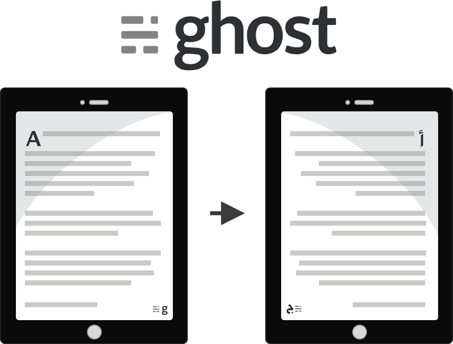
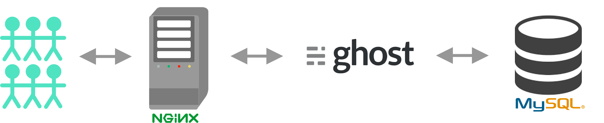
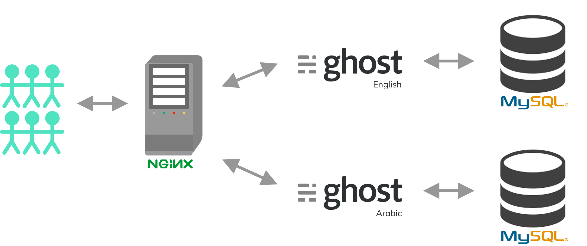
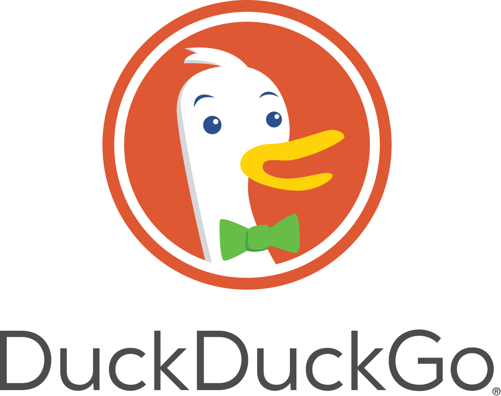
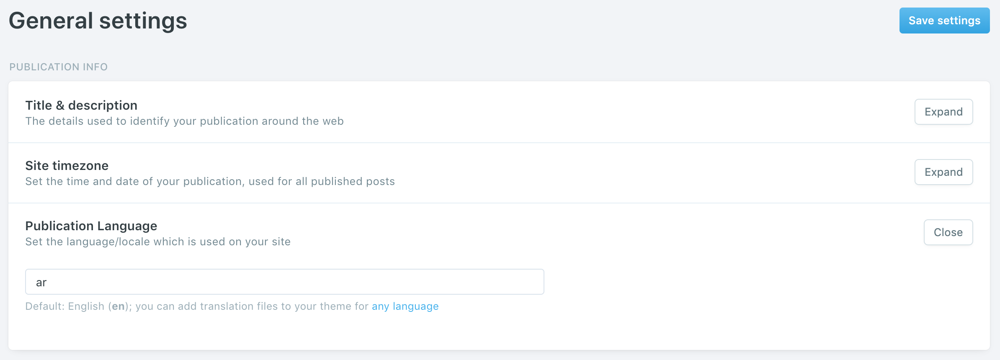

I got the chance to set up [Meddy’s](https://www.meddy.com/) new blog [Hakeem](https://hakeem.meddy.com) (🔌🔌) which is a multilingual blog that exists in [Arabic](https://hakeem.meddy.com/ar/) as well as [English](https://hakeem.meddy.com/). Though there have been multiple posts about setting up a multilingual Ghost blog, I wanted to share the specific lessons that I’ve learnt from this experience and what you need to do to achieve the same. This also uses a different method than the one described in the Ghost blog, so if you’re looking at different methods then this is worth a read.

At the end of this post I will also be sharing the themes we used to get Hakeem off the ground. If you’re interested in that you can just click [**here**](https://github.com/meddyco/duck-themes) and you’ll find it. ⭐️ it while you’re there.

**Overall Idea**
================

If you decide to set up the server using the normal way what you’ll end up with is a blog application (running Ghost magic fuel ✨) served through an Nginx web server reading data from a MySQL database.

This is what a normal Ubuntu instance of your Ghost blog would look like without modifying anything.



The idea is to serve two applications using the same resources. This means you’ll have the English and the Arabic applications running simultaneously. We’ll configure the web server such that when a user comes through /en/ (in Hakeem we have it as only /) it’ll route requests to the English application, similarly when the user comes through /ar/ it’ll route requests to the Arabic application.



> Note: Since we’re using two different databases this will mean that each application will have its own /ghost/ admin. Which will mean that posts written in the /ar/ghost/ portal will not be found over at the English /ghost/. **There is no link between these two applications.** That, as far as I can tell, is the only downside.

Doing this will be **super easy, barely an inconvenience!** Just follow along.

Getting Started
===============

To get started with what you have to do to set up a multilingual Ghost blog, first you have to set up your server. I won’t go through this myself, the lovely folks at [ghost.org](https://ghost.org/) have done a fantastic job in the following [link](https://ghost.org/docs/install/ubuntu/).

How to install & setup Ghost on Ubuntu 16.04 + 18.04
----------------------------------------------------

In the above link go through the tutorial until the [**Install Ghost section**](https://ghost.org/docs/install/ubuntu/#install-ghost) and then come back here.

**Setting up the two applications**
-----------------------------------

Welcome back!

Instead of creating one directory (like the tutorial says) we’re going to be making two directories, one for the English Ghost and one for the Arabic Ghost.

```
# I personally like this folder structure but it could be anything
$ sudo mkdir -p /var/www/ghost/en  
$ sudo mkdir -p /var/www/ghost/ar
```

After which we need to set the right permissions for each folder

```
# You need to own this user
$ sudo chown $USER:$USER /var/www/ghost/en  
$ sudo chown $USER:$USER /var/www/ghost/ar\# Set the correct permissions  
$ sudo chmod 775 /var/www/ghost/en  
$ sudo chmod 775 /var/www/ghost/ar
```

After doing all that it should look something like this

```
# Checking the permissions on the new folders
$ ls -l /var/www/ghost/  
total 16  
drwxrwxr-x 2 yasser yasser 4096 Aug 24 12:19 ar  
drwxrwxr-x 2 yasser yasser 4096 Aug 24 12:19 en
```

We’re then going to navigate into each folder and run the ghost install command.

```
$ cd /var/www/ghost/ar  
$ ghost install $ cd /var/www/ghost/en  
$ ghost install
```

Install Questions
-----------------

For each install run you’re going to be asked some questions that are designed to configure your blog. Here is an example of the arabic ghost configurations that I’ve set.

```
# Arabic Config**Enter your blog URL:** **http://blog.example.com/ar/**
Enter your MySQL hostname: (localhost) localhost  
Enter your MySQL username: root  
Enter your MySQL password: \[input is hidden\]  
**Enter your Ghost database name: (ar\_prod) ghost\_ar\_prod**  
Do you wish to set up "ghost" mysql user? (Y/n) Y  
**Do you wish to set up Nginx? (Y/n) Y**  
Do you wish to set up SSL?  (Y/n) Y  
Do you wish to set up Systemd?  (Y/n) Y  
Do you want to start Ghost?  (Y/n) n\# English Config**Enter your blog URL:** **http://blog.example.com/ar/**  
Enter your MySQL hostname: (localhost) localhost  
Enter your MySQL username: root  
Enter your MySQL password: \[input is hidden\]  
**Enter your Ghost database name: (en\_prod) ghost\_en\_prod**  
Do you wish to set up "ghost" mysql user? (Y/n) Y  
**Do you wish to set up Nginx? (Y/n) n**  
Do you wish to set up SSL?  (Y/n) Y  
Do you wish to set up Systemd?  (Y/n) Y  
Do you want to start Ghost?  (Y/n) n
```

There are three main settings above that should be noted.

*   Make sure to name the different blog URLs with the extensions that you want. In my first run of things I forgot to add the /ar at the end of the blog URL and I just couldn’t get things running when I set up my Nginx in the next steps. DON’T MAKE THAT MISTAKE! I spent hours chasing my own tail.
*   Make sure to give the two databases different names for your two Ghost applications. They can use the same username; that’s fine as long as you’re splitting the resources.
*   In the first run for the Arabic `ghost install` it’s recommended to have Ghost set up Nginx for you. In the second run for the English `install` don’t make Ghost set up Nginx for you because it would have already done that. We will be editing some of the files so this will also make it less confusing for us.

After setting up each of the arabic and english applications it’ll tell you on which ports the ghost application should be running.

If you run the Arabic `ghost install` before the english one you’ll find that

> Arabic -> http://127.0.0.1:2368
> 
> English -> http://127.0.0.1:2369

This is what we’ll base the next steps on.

Nginx Setup
-----------

We need to configure Nginx to send requests received from /ar/ to go to Arabic Ghost and /en/ to go to English Ghost.

This can be done by simply reconfiguring Nginx. Go to the Nginx `sites-available` folder and you should find three files.

```
$ cd /etc/nginx/sites-available  
$ ls  
default blog.example.com.conf blog.example.com-ssl.conf
```

The contents of the `blog.exmaple.com.conf` file should look something like this.
<div class="iframe-wrapper">
    <iframe
        width="100%"
        height="540px"
        frameborder="0"
        scrolling="no"
        id="sizetracker"
        src="data:text/html;charset=utf-8,
        <head><base target='_blank' /></head>
        <body><script src='https://gist.github.com/yelsayed/57b17c8fae49f2e0cd556cd87aba75c5.js'></script>
        </body>"></iframe>
</div>

This file only contains the configuration for the Arabic site, as it is the first one we ran. We will add the configuration for the English one to the same file. It should now look like this.

<div class="iframe-wrapper">
    <iframe
        width="100%"
        height="940px"
        frameborder="0"
        scrolling="no"
        id="sizetracker"
        src="data:text/html;charset=utf-8,
        <head><base target='_blank' /></head>
        <body><script src='https://gist.github.com/yelsayed/cbb0bb515f8fbb97280fd7400e05fbc1.js'></script>
        </body>"></iframe>
</div>

This is how the new file should look like

This should forward requests from /ar/ to the application running on port 2368 and from / to the application running on port 2369.

In addition the above file has an extra line the redirects requests to HTTPS if they’re coming from HTTP.

You will also need to change the `blog.example.com-ssl.conf` file to the following.

<div class="iframe-wrapper">
    <iframe
        width="100%"
        height="875px"
        frameborder="0"
        scrolling="no"
        id="sizetracker"
        src="data:text/html;charset=utf-8,
        <head><base target='_blank' /></head>
        <body><script src='https://gist.github.com/yelsayed/693a76a7e1e7e7b9edc6fdd9d2b8c085.js'></script>
        </body>"></iframe>
</div>

Voila! That should be it. You should have the following:

> https://blog.example.com/ar/ghost/ -> Arabic Blog
> 
> https://blog.example.com/en/ghost/ -> English Blog

Theme
=====

We didn’t have much need for anything too complicated and we were in love with the simplicity of [DuckDuckGo](https://duckduckgo.com/)’s theme for their blog, [spreadprivacy.com](https://spreadprivacy.com/). You can find their theme [here](https://github.com/duckduckgo/Casper); they used Ghost’s default theme, Casper, as a starting point.



Given DuckDuckGo’s theme as a starting point, the challenge now is to translate that theme and make it Left to Right.

This can be achieved in a few steps.

0 - Make sure you’re happy with your English theme
-------------------------------------------------

Before we start the steps it’s important to mention that we’re translating a theme. This means that we’re taking an English theme and we’re translating and transforming it to Arabic.

So before you go through the next steps make sure you’re happy with your theme as it is in English.

1 - Update your settings and set it to Arabic
--------------------------------------------

Go to your admin at **https://blog.example.com/ar/ghost/#/settings/general**.

Once there, make sure to set the **Publication Language** setting to Arabic.



2 - Add translations to your theme
---------------------------------

Adding translations to your theme can be done through the `{{t}}` tag. How it works essentially is changing this:

```html
<h1>Hello World!</h1>
```

To this:

```html
<h1>{{t "Hello World!"}}</h1>
```

The following link goes into more detail of how it works.

Ghost Handlebars Theme Helpers: translate
-----------------------------------------

`{{t}}` is a helper to output text in your site language. Check out full docs [here](https://ghost.org/docs/api/v2/handlebars-themes/helpers/translate/).

The `{{t}}` tag takes from a file that you place in your theme directory.

To add translations to your theme what you have to do is create an `ar.json` file and place it in a new folder `locales/ar.json` in your theme.

If you’d like you can use our own `ar.json` file that is show below.

<div class="iframe-wrapper">
    <iframe
        width="100%"
        height="1180px"
        frameborder="0"
        scrolling="no"
        id="sizetracker"
        src="data:text/html;charset=utf-8,
        <head><base target='_blank' /></head>
        <body><script src='https://gist.github.com/yelsayed/ecdcfeb7c0622e201b10a22db4ea0c88.js'></script>
        </body>"></iframe>
</div>

Feel free to use this file that contains our own translations.

3 - Flip all the CSS from left -> right and right -> left
--------------------------------------------------------

This one is more involved. You have to go through the theme’s code and flip every `right` keyword to `left` keyword. Once that’s done, you should see that your website is now Arabic-ized.

For example any

```css
.nav-logo {  
    height: 33px;  
    margin-left: -5px;  
}
```

Would have to become

```css
.nav-logo {  
    height: 33px;  
    /*margin-left: -5px;*/
    margin-right: -5px;  
}
```

You also have to be careful of all the margins set in a mult-value fashion as such

```css
.nav-logo {  
    height: 33px;  
    margin: 15px 0 0 10px;  
}
```

This needs to be changed to

```css
.nav-logo {  
    height: 33px;  
    /*margin: 15px 0 0 10px;*/
    margin: 15px 10px 0 0;  
}
```

Make sure to run `yarn zip` after making all the changes. That’s all you have to do to translate your theme.

Our own theme
-------------

If you want to have a ready made translatable theme you can use our very own.

[meddyco/duck-themes](https://github.com/meddyco/duck-themes)

We called it “Duck” because we used DuckDuckGo as a starting point.

Thanks for reading. Any feedback is welcome!