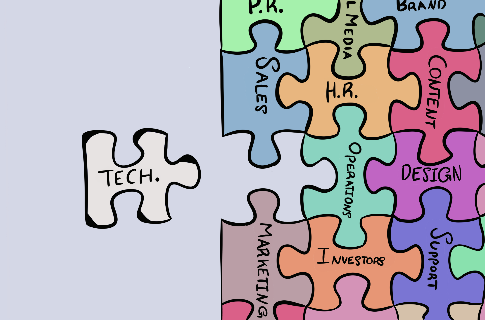
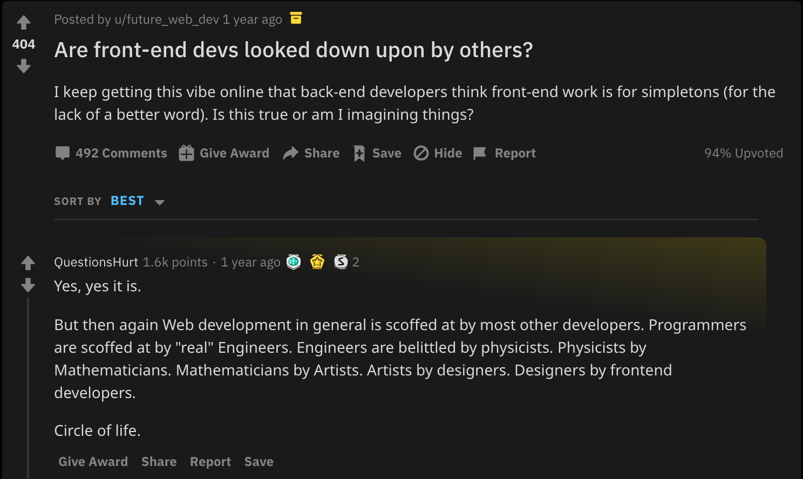

Meddy’s business grew massively over the last few years; our main metrics grew across the board. This meant that our engineering, operations, sales and marketing all had to grow to match the new demand.

To be able to build the engineering team, I read 1000s of resumes and conducted 100s of interviews over the last few years. Hiring a frontend engineer was especially excruciating. One of the interviews in specific was so bad that it was almost like satire. The pinnacle of absurdity from this interview was the following interaction:

“How do you feel about working on AngularJS?”

“I’ll be honest, if I was offered a job with a company that is working on VueJS, I’d go with their offer.” 🤨🤨🤨

I admire his honesty 😅, but I gave him some harsh feedback nonetheless. In that feedback I relayed how disappointed I was even though I didn’t know him. From what I’ve seen, his attitude was an accurate reflection of the egotistical attitude of the industry as a whole.

Engineers want to work in an ideal environment with bleeding edge tools solving complicated problems. They want to model controlled environments and provide perfect solutions. They want to develop perfectly pleated code and starch the edges, when clearly the problems of the real world are ragged and dirty. They wouldn’t even deign to touch an old framework.

What is surprising is how global this pandemic is. If you ask any product manager or technical lead what they hate the most about working with software engineers, _in any country_, there is a high probability they would say the same thing. I have, in fact, done exactly that. I asked 7 product managers and 3 technical leads from 5 different countries what they hated about working with their engineers and the answer I got was consistent with my own.

> Engineers do not focus on the bigger picture

After more reflection on the detrimental effects of this tunnel vision I’ve come to realize that it produces engineers that don’t know _what their role in a company is_, don’t focus on _delivering value_, have an _aversion to ugly solutions_, and are easily _seduced by perfect solutions_.

In this article, I will be delving into each one of these points and give advice to eradicate the effects of this tunnel-vision. If you’re a software engineer this advice will help improve your career more than a computer science book would (don’t tell my professors I said that 🤫)!

> **Note:** This is an opinion piece. This advice is directed mainly towards engineers working in product-first companies. In engineering-first companies priorities are different.

Your Role in a Company
======================

In order to get rid of tunnel-vision you first need to contextualize what you’re doing in a company. If you say your role in a company is to be a “programmer” then I can immediately tell that you don’t know what the hell you’re doing. Your role in the company is very much tied to the value you’re delivering.

Coding, like most things, is just a tool used to reach an objective. For things to matter to us as human beings, they need to be visceral and tangible. For that, you need to have a purpose behind doing what you’re doing, and that is usually what people ask about. If you ask a person that’s eating food what they’re doing and they say “chewing” you’d think they’re insane! Technically they’re right, but what they’re doing is “eating”. What matters here isn’t what they’re doing, but the purpose they’re doing it.

Your job in a company isn’t to code, your job rather is to deliver value to your users/clients. You’re hired for your skill of coding, but that doesn’t make you a coder, rather a team member who happens to know how to code.

> An engineer is simply a team member that knows how to code

You might not think that this point is worth dwelling on, but I don’t think it’s so obvious. It’s in our culture that engineers measure each other’s value by the complexity or size of their software and deride each other if their work isn’t complex enough. In fact, it makes for some good hilarity.

I’m not criticizing the humor that comes from this derision, I actually enjoy it very much. But humor imitates our reality, otherwise we wouldn’t find it funny. What I am criticizing is our belief of what value _is_ in this industry.

Value in our industry, like any other industry, comes from achievement. [Richard Stallman](https://en.wikipedia.org/wiki/Richard_Stallman) is a Harvard and MIT alum but he’s not well known for any of the code he built but rather for the contributions he’s done to the [free software movement](https://en.wikipedia.org/wiki/Free_software_movement). Yet he’s regarded as one of the most influential Computer Scientists in America.

Similarly, early engineers of successful companies are more sought after, even though at the early points of those companies their work was probably not very complex. This is because the value of the product is proportional to your own value as an engineer.

> Value isn’t code complexity its value delivered to users

Thus, it’s important to think of your role past the code itself and rather what you’re delivering. This distinction will help you focus on what’s most important: _value delivered_.

Focus on Value
==============

Focusing on delivering value will help you make better decisions during your development. Having a focus means that you move fast and work on problems that matter. Working on problems that matter at a fast pace is vital for companies to thrive, and happens to be the best antidote for code-induced insanity.

> **Note:** The reason I’m saying focus on **value delivered** rather than **output** is because measuring output is rather difficult in software; [software is intractable](https://www.goodreads.com/book/show/13629.The_Mythical_Man_Month). It’s much easier to measure the impact of your code by pegging it to the impact of the product.

To illustrate the importance of focus, I’d like to introduce you to the [_Duct Tape Programmer_](https://www.joelonsoftware.com/2009/09/23/the-duct-tape-programmer/). A duct tape programmer is a concept that [Joel Spolsky](https://www.joelonsoftware.com/about-me/) — founder of [Stack Overflow](https://stackoverflow.com/) — talks about on his blog. The analogy is while most teams argue whether to use titanium vs aluminum to build go carts the duct tape programmer would be speeding down hill, fixing his broken wooden cart with nothing but duct tape and the occasional squeeze of WD. His cart might be battered and haggard but it would also have a gold medal.

Focusing on the objective leads to making sane engineering decisions, no matter how ugly they might be. Remember we’re in a company only to deliver value, nothing else. When your focus is the internals of the product rather than the objective, you would likely fall into the trap of working on unnecessary features and specifications.

Once we go back to the analogy, this becomes a lot clearer. If the hill was on was a flaming ridge you would build the cart with heat resistant material. If it was made out of ice and 100 feet tall, then you would want to install some brakes and a heating system. An ordinary hill only warrants building a normal cart stitched together with duct tape.

When you’re focused on the objective of your product you tend to be more valuable to the team you’re working in. Remember, you’re not just an engineer but you’re also a team member. If you’re inundating the rest of the team with long deadlines and rigid solutions then you become a nuisance. You might think that the trade-off of this is a well-engineered solution and that has value of it’s own. The answer is no. **_Quick_** _and_ **_ugly_** _solutions help you make better engineering decisions._

Embrace Ugly Solutions
======================

When you’re in a time crunch, ugly solutions are all you can muster. Having worked in a startup for close to 4 years, it’s common practice to try and find the quickest way to develop a solution. This made me truly realize the beauty of ugly solutions.

To be clear, just because you’re laser-focused on the objective does not mean you won’t be making bad decisions. Problems and bad decisions are inevitable and often valuable. The best thing you can do is learn from them. Better yet, you can identify these problems via quick and dirty solutions. In this section, I will argue for the merit of ugly solutions and why embracing them will help in developing amazing problems.

Solutions Reveal Problems
-------------------------

Another instance that reminds of a duct tape programmer is in Ken Kocienda’s book, [_Creative Selection_](http://creativeselection.io/)_,_ as he recounts his time building Safari at Apple with a relatively small team of engineers. Ken and his partner wanted to use an open-source browser as a base for Safari. This open source browser was a fairly large and complex one and wasn’t very compatible with MacOS. Just booting up the software took _months_ of work!

Ken then hires a brilliant engineer working at Apple. The engineer produces a browser running on MacOS in just 2 days! Instead of using the same open-source repo, he used a much smaller unix-based one and ran it on an OS that’s running on top of MacOS. The browser ran very slowly and the input lagged. The solution was quite ugly, but it worked!

Having that ugly solution made the engineering team privy to all the problems that they needed to solve in order to complete building the browser. Ken describes this moment as if he was given a crystal ball. They still needed to make the browser run without depending on another OS, but they knew exactly what they needed to do in order to solve those problems.

In fact, having any type of solution would reveal a lot about the problems you’re facing. If Ken and his team have gone with the original route of trying to make the larger project run on MacOS, they would’ve realized all the problems they’ve had to solve eventually. That’s what building a product means. The only thing in your control is how quickly you can reveal those problems. The sooner the better.

> Ugly solutions allow you to quickly realize the problems you need to solve

Concrete Problems are Easy to Solve
-----------------------------------

If you have a very clear and basic problem that needs solving, then the solution is very straightforward. A complex problem is an amalgamation of smaller more basic problems. Properly understanding the complex problem means to properly understand its elements. This is referred to as the First Principles of Knowledge.

A great article that I go back to every once in a while is Farnam Street’s [First Principles](https://fs.blog/2018/04/first-principles/). The article explains — in part — that once concepts or ideas are taken down to their most basic elements, then understanding the concept becomes very simple. It’s how Elon Musk was able to build SpaceX rockets at unbelievably low prices. For context, the Falcon 9 cost per kilogram [was around 15% of the average space shuttle](https://ttu-ir.tdl.org/handle/2346/74082). In an interview with [Wired in 2012](https://www.wired.com/2012/10/ff-elon-musk-qa/) he talks about how he was able to get the cost so low.

“What is a rocket made of? Aerospace-grade aluminum alloys, plus some titanium, copper, and carbon fiber. And then I asked, what is the value of those materials on the commodity market? It turned out that the materials cost of a rocket was around 2 percent of the typical price” — Elon Musk.

Once you clearly understand a problem that you need to solve, the solution is straightforward. Problems beget solutions. If I tell you that it’s raining outside, a great solution is to carry an umbrella. The solution is quite concrete once the problem is clear enough.

Collecting Problems
-------------------

If problems are easy and straightforward then shouldn’t building products be easy? The problem with building products isn’t figuring out the solutions but rather figuring out the problems.

Problems only reveal themselves once there are users using your product. This means that before users use your product, most of the problems you’re solving are either incomplete or invalid; in other words, you need to invalidate your assumptions. The best way to learn about the problems of the product is by creating an imperfect product and testing with users. That way you can collect concrete problems.

This isn’t to say that you need usurp your PM and launch products over their heads. As an engineer you’re obliged to accept that users will interact with an imperfect product and ship anyways; all for the sake of collecting problems. Those problems would be concrete and well-defined. Solving them is not only easy, but it brings more value to your product.

> The more problems you discover, the better your product is

This is why building great products is difficult, because it takes time to farm all those problems.

This process of gaining context is difficult because you’re always finding out problems. If there is one thing you should take from this section it’s that **quick and dirty solutions move the product forward.**

Avoid Perfect Solutions
=======================

Not only is it difficult to try and visualize all the problems you need to solve before solving them, but I believe it’s harmful to try.

Perfect solutions are nice, but they’re like unicorns, if they do exist then they’re pretty rare. Thus, hunting unicorns is a foolish endeavor. One of the problems with the attitude of software engineers in the industry is that th_ey belie_ve that a perfect solution exists, much less that they can develop that solution within a feasible timeframe.

> Perfect solutions do not exist.

This delusion makes us do _crazy_ things, like create a full infrastructure diagram or UML chart on day one. Or building a full scale authentication system on a listings site. Or building a pre-rendering solution for a site that is yet to exist. It’s all fluff when you don’t know what the problems are. And no matter how genius your PM, CEO or CTO is, unless they’re a messiah, they cannot predict all the problems either; humans are just bad at creating comprehensive lists of things.

A perfect solution would entail that all the problems have been discovered. If that is the case, then why bother with the engineering aspect of building that solution. If all the problems have been discovered then all the engineering must’ve been already done in some shape or form in the past. It would be easier to just use that solution instead of re-inventing the wheel.

Think of a type of product that has most of their problems already discovered and see how they’re built. There are many examples: e-commerce, blog sites, landing pages etc. The specifications are so well defined that companies like Wix & Shopify were able to create an engine that generates online sites & stores with little to no operational cost. The engineering here is so trivial that we wrote code to write the code.

If you put all these together you’ll realize that the path to being a better software engineer is by contextualizing where tech lies in any product company. Technology is only a small part of any business. We’re there to support businesses, we’re seldom ever the center of businesses. Once you realize that, you can focus on delivering stuff that actually matters, making you more valuable in the market.

That’s it 😁