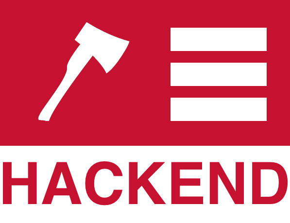

I study in a university full of brilliant people that have the ability to create a plethora of incredibly astonishing things. I was at liberty to work in many small companies that had very inspiring mentors that taught me a lot about my passion: **Software Engineering.** One thing any engineer needs is a portfolio (check out mine at [yres.me](http://yres.me) #shamelessplug).

> In this post I’ll teach you (yes you!) how to create, launch, maintain and track a portfolio.

This is what we’ll be doing. Firstly, we’re going to buy (for free!) a domain of our choosing. Next we’ll create a website, and lastly we’ll connect the domain to the website.

Step 1: Buying and Registering a Domain!
========================================

_You buy a domain from_ **_domain name registrar_** _which are just entities that reserves domain names for your use!_

One of my favorite registrars is [**namecheap**](http://namecheap.com) because it provides students with free domains. Just as long as you have an email that ends in _.edu_ you should be good.

Go to [https://www.nc.me/](https://www.nc.me/) and Choose a Domain
------------------------------------------------------------------


In the box that you see on the left enter your name. It is preferred that you just type out your full name without special characters or abbreviateions.

For example my name is Yasser El-Sayed and I own the domain [yasserelsayed.me](http://yasserelsayed.me). Akshata Shanbhag [wrote a very good post on how to pick out a domain name](http://www.makeuseof.com/tag/five-tips-choose-personal-domain-name-can-proud/).

Type in your Desired Domain Name
--------------------------------

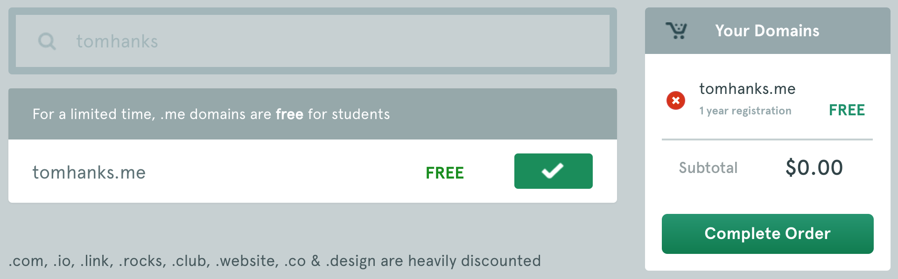

After typing in your domain name click on **“add” and “Complete Order”** so that you can be on your way to purchasing it.

Type in your Student Email Address
----------------------------------

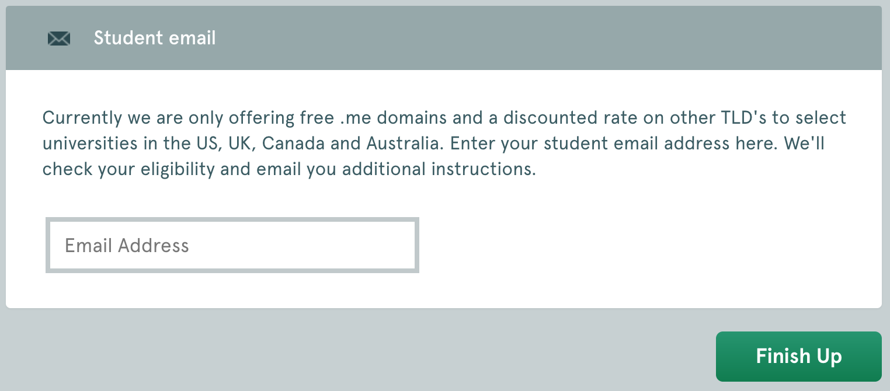

After typing in your **Student Email Address** (remember that it must in _.edu_) and checking your inbox for the verification email.

**Make an account with namecheap**
----------------------------------

Go to [namecheap.com](http://namecheap.com) and create an account using the same email you used to get your domain.

Then go to your verification email and click on it and then sign in with your new account. **Say no as we’ll set it up together manually.**

Check if you Got your Domain Under your Account
-----------------------------------------------


Go to [namecheap.com](http://namecheap.com) and sign in with your previously created account. Then hover over the “Account” dropdown menu in the homepage of the site and click on “Domain List”. You should now see the domain that you bought (for free!) earlier.

Step 2: Create your Website
===========================

Now that we have our domain, it’s time for us to make the website then find a place to host it. We’ll do this the proper way so we don’t have to depend on any external tools… **We’re going to code HTML!** I understand that many might be discouraged from coding anything at all, but HTML is the least intimidating code you could ever write.

> “If you’re a Software Engineer or Computer Scientist, then you should NEVER put HTML on your resume, simply because HTML is not code” — Wise Computer Science professor in Carnegie Mellon University, 2015

Besides, bravery in picking up a new skill is in itself a GREAT SKILL to have. I would never hire anyone that is afraid of learning a skill outside their comfort zone. So be brave! Take the plunge, I’ll go slow ;)

Download a template
-------------------

We won’t code everything from scratch, there are amazing people out there that have done impressive and professional work that we can reuse. If you go online and search for _“free html templates”_ you’ll find a large amount of templates out there that you can simply download and edit.

My recommendation though is to go to [https://shapebootstrap.net/free-templates](https://shapebootstrap.net/free-templates) or [https://startbootstrap.com](https://startbootstrap.com). My personal favorite is [blackrockdigital’s template](https://blackrockdigital.github.io/startbootstrap-freelancer/).

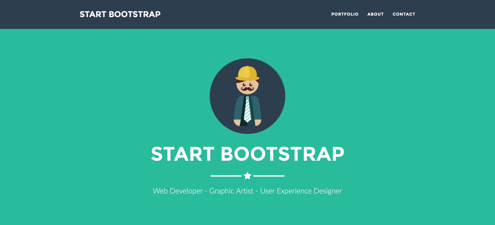

If you choose to download the blackrockdigital template, go to [https://startbootstrap.com/template-overviews/freelancer/](https://startbootstrap.com/template-overviews/freelancer/) and click on “Download”.

Now once we have downloaded the code for the site, you should have the following files. I’ve highlighted in bold the folders we care about

```
├── LICENSE├── README.md**├── css <-- We'll be using this to change the colors or our site**│   ├── freelancer.css│   └── freelancer.min.css├── gulpfile.js**├── img** **<-- We'll be using this folder to store our images**│   ├── portfolio│   └── profile.png**├── index.html <-- This is what we care about the most!**├── js <-- Don't worry about this, unless you're courageous│   ├── contact\_me.js│   ├── freelancer.js│   ├── freelancer.min.js│   └── jqBootstrapValidation.js├── less│   ├── freelancer.less│   ├── mixins.less│   └── variables.less├── mail│   └── contact\_me.php├── package.json└── vendor├── bootstrap├── font-awesome└── jquery
```

> IMPORTANT!! Make sure it works by double clicking on the **index.html** file in your filesystem. If it doesn’t work then drag and drop the index.html file in your favorite browser.

Edit the Content
----------------

To be able to edit the HTML, we need an editor, I recommend [Sublime Text 3](https://www.sublimetext.com/3) because it is a very light pleasant looking editor. Just download it and open “index.html” using it and you should see something similar to the following:

In the body tag above will be where we will edit the content of the site. If you look at the main page that is in your browser right now, you’ll see that there is a big _“Start Bootstrap”_ in the middle of the website. We would like to change that to our name.

Simply, search through your HTML for _“Start Bootstrap”_, if you’re using Sublime Text 3 then you can just press cmd+f (ctrl+f for windows). Then just change the text inside the tag. It should look like the following:

**Make sure to save** (cmd+s/ctrl+s) and then double click on the “index.html” file (or drag and drop) and you should see that the website’s text changed. Now you notice that there are a lot of text we need to change.

I’ve only done this for the header, but you should replace the text for every piece of content on the website. It’s a meticulous but rewarding process. _Jus’ sayin._

Edit the Images
---------------

Editing the pictures is a very simple process. Every image in the website that we’ve downloaded is in the _img_ folder and it’s linked to the _index.html file_.

We’ll use the same code-snippet (editing-html-2.html) and we’ll modify it to incorporate our own image, whatever that may be. First store the image that you want in the _img_ folder, then we’ll replace the url of the image in the _index.html_ file with our own image.

Edit the src above

The _src=…_ is to indicate where the image lies in your computer. For instance, this specific case says that “img/profile.png” lies in a folder called img and is called profile.png. Simple right?! If not, no worries, just checkout this [tutorial about image sources.](http://www.w3schools.com/html/html_images.asp)

Edit the Colors
---------------

Now let’s say that we want to change the colors in our site, just to make sure that we remain unique and not have someone say:

> “OH I KNOW THIS TEMPLATE!” — Major Asshole

We do this by going to the CSS file “freelance.css” as mentioned above. CSS code is composed to three things, **selectors, attributes and values.**

Generic piece of CSS code

You use the **selectors** to select an HTML tag and **attributes** choose what it is about this tag you want to change. Consequently the **value** of the attribute tells us what the change is. You can select any type of HTML tag, some selectors start with the “.” and other selectors start with the “#”. This depends on the HTML code.

```
<div id="yasser"></div>
```

In the above HTML code we can see that the tag has an “id” called “yasser”.

```
<div class="developer"></div>
```

In the above HTML code the tag has a “class” called “developer”.

Let’s say we want to give all tags with id=yasser a black background and give all tags with class=developer a white background. We do the following:

Simple, right? Now that we understand this, we are going to go through all the selectors in the “freelance.css” file and change all the colors we want to change. Again, _this is a tedious but rewarding process._

Some CSS code in “freelance.css” that needs to be changed.

In the above code I put comments that will tell you what to do.

EDIT: One thing I forgot to add is in the “index.html” file inside the <head> tag you’ll find a line that has “freelance.min.css”… change that to “freelance.css”. We were working on the wrong file, the problem is we can’t work on the “min” file cause so we change the linked css file that we’re working with.

If you follow this (along with the previous steps), you should have something like this.

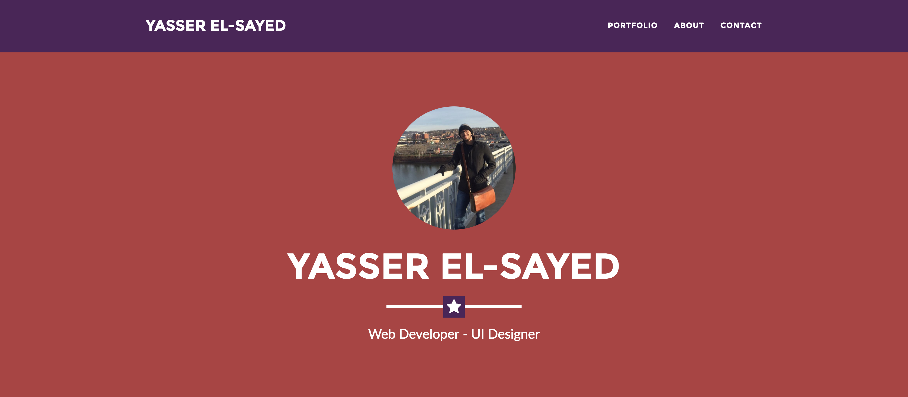

Step 3: Set Up your Github
==========================

Now that we’ve made a website let’s find a place to host it so that people can access it. Github is one of my favorite web services as a developer. It’s like a Google Drive for developers as it hosts and keeps track of all the code you upload.

Sign up for Github
------------------

Let’s start by going to [github.com](http://github.com) and signing up. I won’t tell you how to do it cuz I’m sure you’re smart enough to do this on your own.

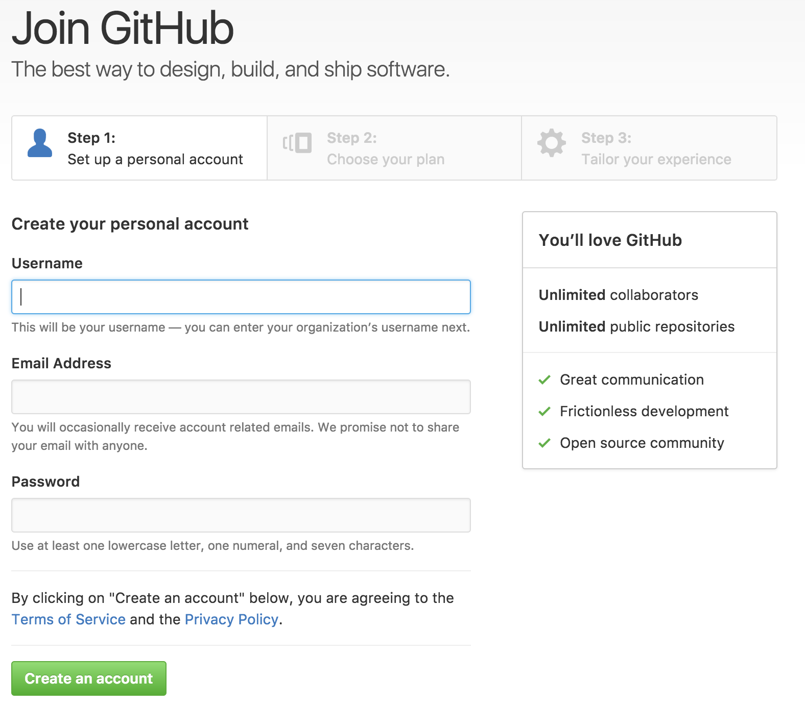

Create a Repository
-------------------

We need to create a repository in order to host our website. A **repository** is just like an online folder that contains all your files.

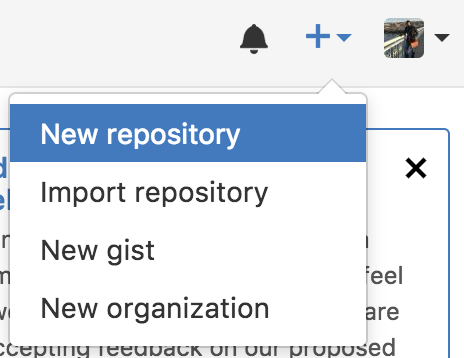

Find your profile picture in the top right corner of your website and hit the “+” dropdown button next to it. Click on the “New repository” button that dropped down.

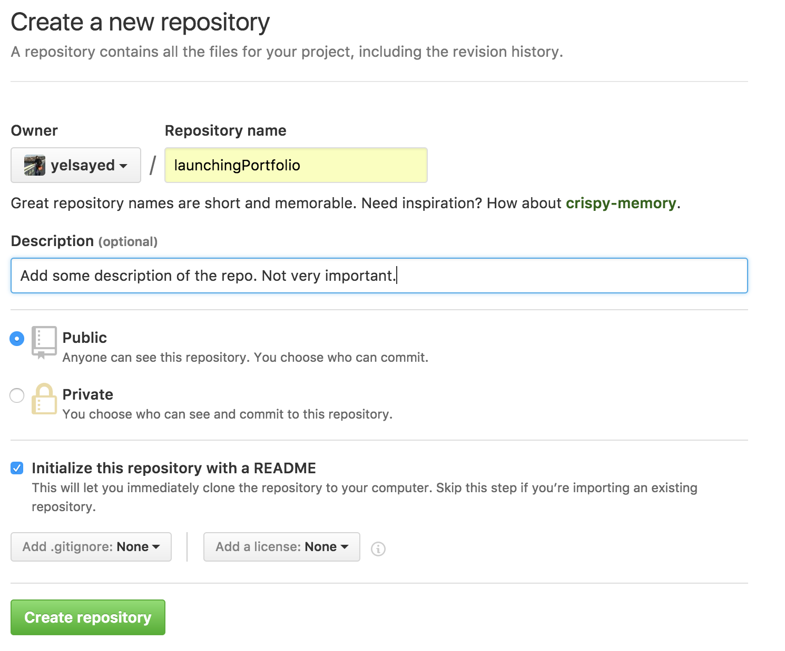

Give your repository a name like “personalsite” or “portfolio” and a proper description. **Make sure to have the “Initialize this repository with a README” option checked!**

Upload the Files
----------------

Once you’ve created the repository, the following will be your control panel for the files!

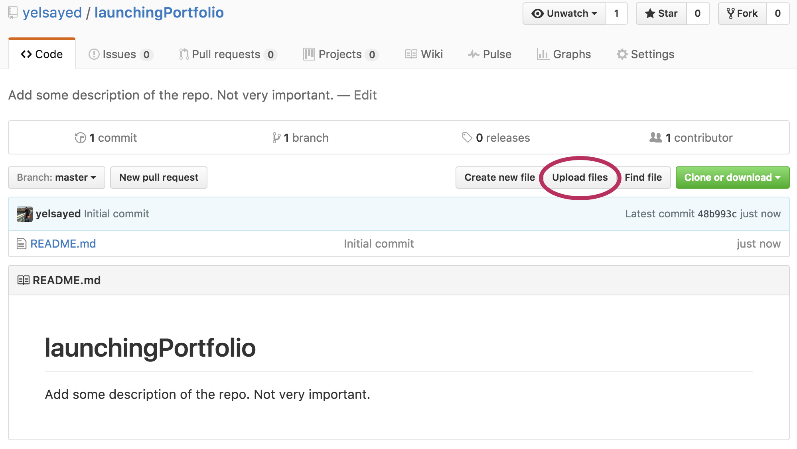

Now we need to upload the files. Click on the “Upload files” button as shown above. You should see the following:

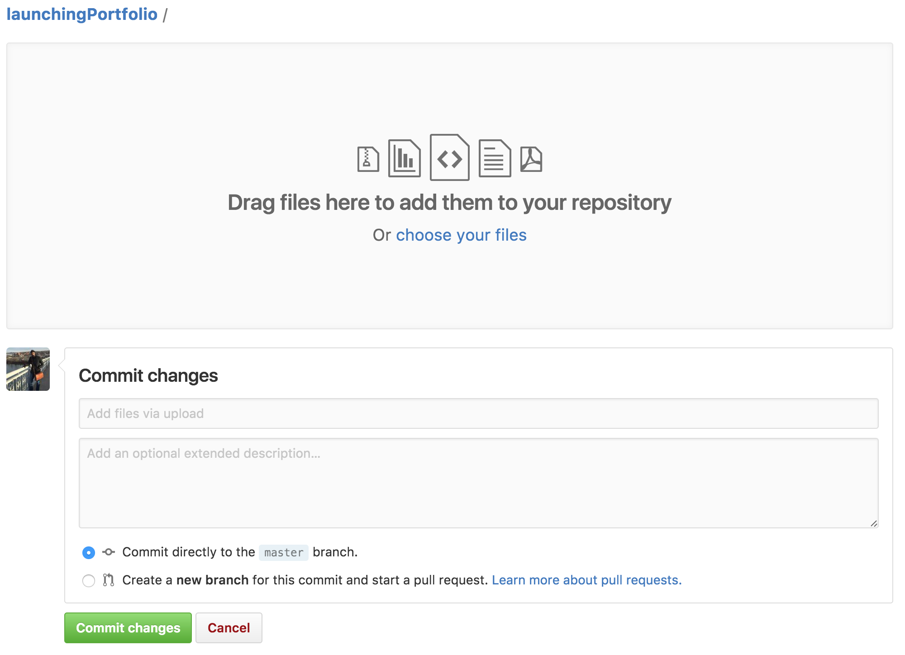

Now drag and drop your files (folder by folder and file by file) into the repository and wait for them to upload. Then click on the “Commit changes” button. You should see the following:

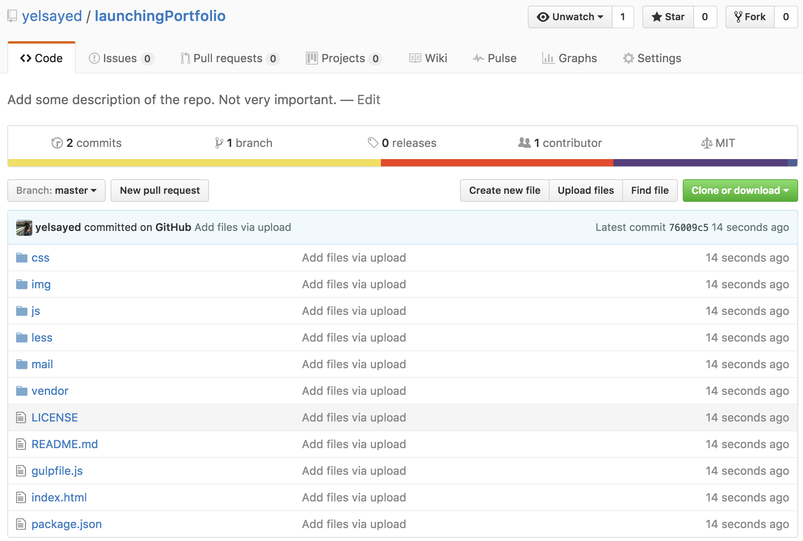

> Congratulations, now you have your website online! Now all we need is a way to view it.

Link the Domain Name with the Repository
----------------------------------------

Now that’s done let’s link the domain we bought earlier to this repository and some magic will ensue and your website will be available online.

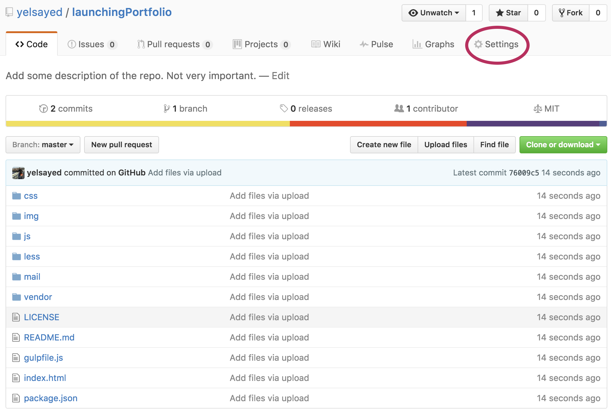

Click on the “Settings” button above and then scroll down. You should see the following:

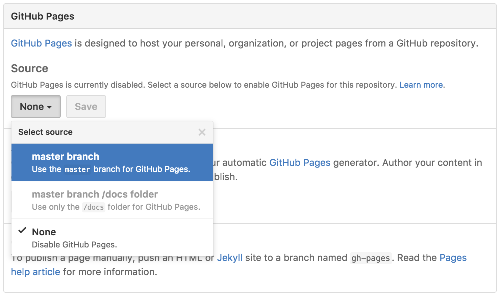

Click on the “None” dropdown under “Source” and then “master branch”. This is telling Github that if anyone access this repo using a domain it will show the “index.html” file in the “master branch”. Don’t worry about this too much. Then click “Save”.

Once you click on “Save” the page should refresh. Scroll back down and you should see the following.

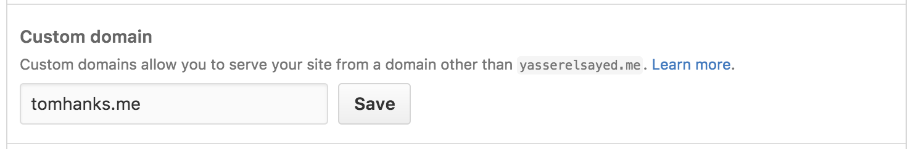

Type in the domain that you bought in the “Custom domain” box and then hit “Save” once again. You will get the following warning message once the page refreshes and you scroll down.


This is because Github can’t find a DNS record that points to its IP. Which means that in the internet, the domain that you bought is not pointing towards Github, and Github in turn is like

> “there is something wrong here, I need someone to point at me… like wtf dude”. — Github when you piss it off

So that’s what we’re going to do in the next step.

Step 4: Connect your Domain to your Github
==========================================

We’ve bought a domain, made a website, and hosted it somewhere… it’s been a long journey, but this is the final bit. _Our final task is to tell the internet to go to our Github repository when the domain is accessed._

Let’s go back to your domain name list!


Click on manage highlighted by the red circle above then click on the **Advanced DNS** tab shown in the next page.

_A DNS is a Domain Name System/Server which is a database that contains the addresses of all websites on the internet._ When we bought our domain, we didn’t tell it exactly where to go to find our website, or a little more technically: we didn’t set the IP of the machine hosting our website files… This is what we’re doing now!

Set up your DNS Records
-----------------------

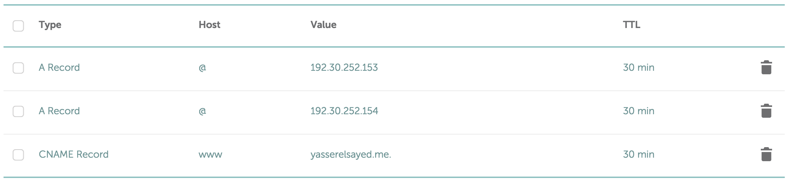

Now you should see something similar to the picture above. What we’re doing now is **we’re setting a DNS record to point to a specific IP (address) which will have our website files.**

Now the IP we’re pointing is the Github IP. Once someone types in your address in the address bar, the DNS will point to the Github Server. Once that happens, the server will look for the repository that is associated with that domain, which we indicated when we set the domain name in the settings of the repo.

Now once that’s done. **Wait a few minutes.** Then **type your domain name into your browser** and you should see your portfolio!

Visit my own portfolio at [yres.me](http://yres.me).

Final Remarks
=============

So. Now you have a website. Good shit! Updating and maintaining the website is also very easy. Just change the appropriate files and upload them to your Github repo.

There are things that I avoided explaining fully to keep it simple and comprehensive at the same time. For example how to use Git with Github, and how to track the visitors on your site. I’ll be writing more in the future, so stay tuned.

❤❤ Show me some love and [follow me on Github](https://github.com/yelsayed/) and maybe even [star my personal site repo](https://github.com/yelsayed/yelsayed.github.io). Love ya ❤❤