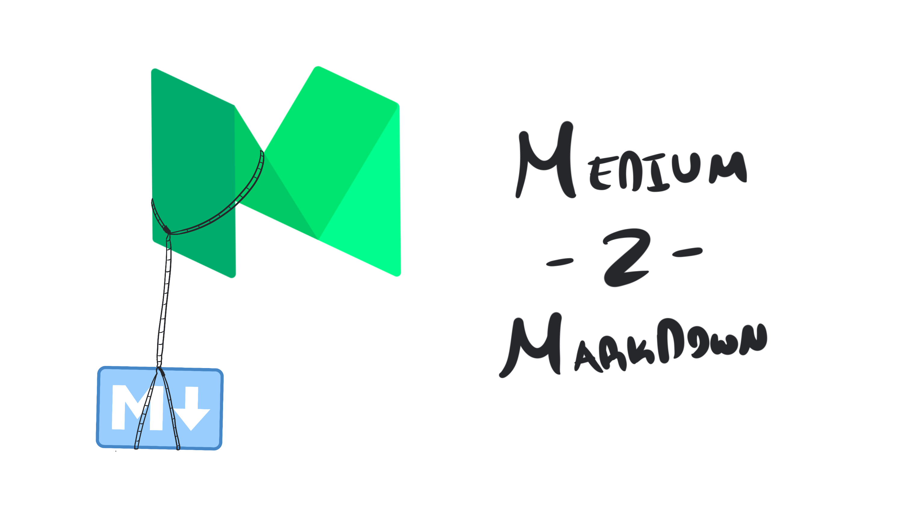

If you’re looking to start your own Gatsby personal blog site this is the tool for you.

> [md-from-medium](https://www.npmjs.com/package/md-from-medium)

Install using:

```
npm install -g md-from-medium
```

The usage is very simple:

```
md-from-medium <mediumPostUrl> <markdownDir>
```

For the next section I talk about how it works, you can also view the code over [here](https://github.com/yelsayed/md-from-medium).

How it Works
============

Brace yourselves… this is the easiest tool to build on the planet.

The script (which is around ~200 lines) has three main functions: getting the HTML of the Medium post, turning it into a proper DOM, and traversing the DOM, changing elements of it into Markdown. So straight forward 😄.

The service that does the retrieval is none other than [request](https://www.npmjs.com/package/request). This library fetches the URL and gets the raw HTML for us to parse.

> Note: Even though it’s deprecated it still has around 21 million weekly downloads

The service that converts that HTML into a proper DOM is called [cheerio](https://www.npmjs.com/package/cheerio). The DOM that comes off this has a simple jQuery-like wrapper around it for easy manipulations.

Lastly the we use another service called [turndown](https://www.npmjs.com/package/turndown). Turndown requires a lot of customization to work with the specific DOM you want it to, which is what the rest of the script is doing.

The final code of combining these three services is as simple as you think it is.

```javascript
function mdFromMedium(url) {  
    // Fetching HTML from medium...  
    return new Promise(function(resolve, reject) {  
        request({  
            uri: url,  
            method: 'GET'  
        }, function(err, httpResponse, body) {  
            // Converting HTML to DOM...  
            let $ = cheerio.load(body); // Converting into Markdown...  
            let html = $('article').html() || '';  
            let markdown = turndownService.turndown(html);  
              
            resolve(markdown);  
        });  
    });  
}
```

Thanks :D