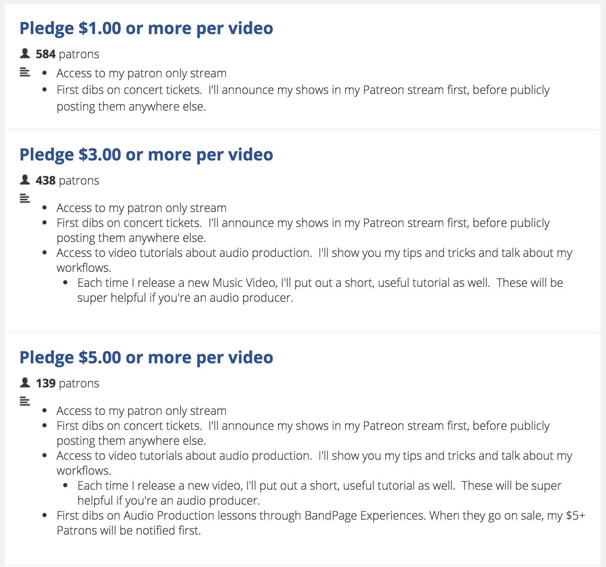
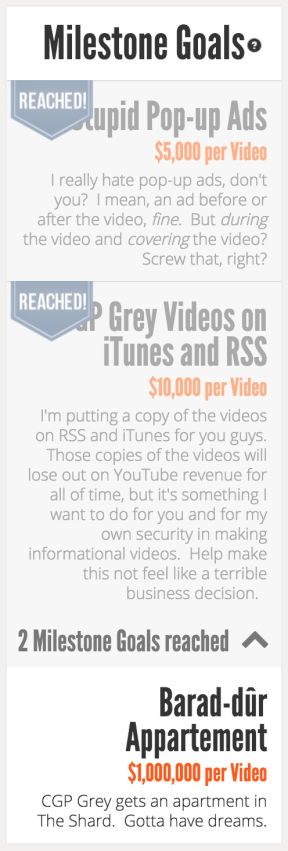
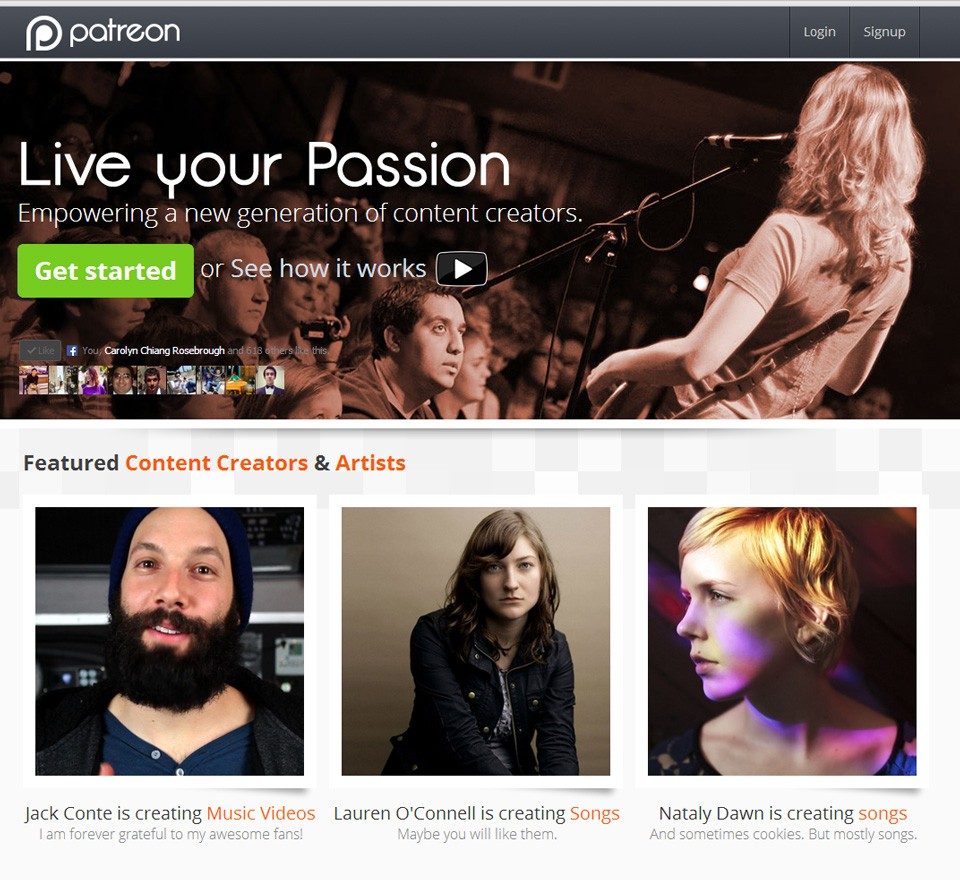
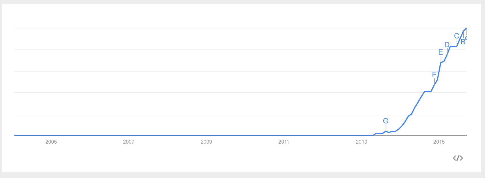
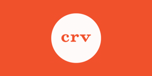
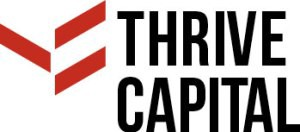

As an introverted child that grew up in Qatar, I spent most of my time on the internet browsing creative online content mainly on Reddit and YouTube. For a movie loving child that head to the cinema every weekend, seeing any type of censorship on any movie scene really disgruntled me. When watching a movie, or reading a book I always wanted to see what the author/director/artist intended to show his audience without distortion from any other sources.

Due to that mentality, and due to the fact that I didn’t find pleasure in socialising with people (I find immense pleasure in that now), I was able to find great comfort in creations that are submitted online to a large platform that held a large community of fans, and more importantly, creators. I especially liked animators ([Egoraptor](https://www.youtube.com/user/egoraptor), [Oneyng](https://www.youtube.com/user/OneyNG), [Stampertv](https://www.youtube.com/user/StamperTV), [RubberRoss](https://www.youtube.com/user/RubberNinja), [El Cid](https://www.youtube.com/user/elcid1984), [GonzoSSM](https://www.youtube.com/user/Gonzossm), [SpeedoSausage](https://www.youtube.com/user/SpeedoSausage), [RicePirate](https://www.youtube.com/user/ricepiratenewgrounds)), added to the fact that all these people had crazy and impressive personalities, with an equally crazy and loveable fanbase made me fall in love with the artistic internet personalities.

If you take a look at the recent upload rates of some of those people, they’ve gone down very drastically. As they found comfort in YouTube’s ad revenue, making a sustainable living through working on animations, [the algorithm for YouTube changed drastically](https://www.youtube.com/watch?v=Gi6FcI2wFrw), leaving these people with very little ad revenue to sustain a living. For someone like me, a person who’s fallen in love with their humour and artistic work, hearing this was absolutely heart breaking. I began feeling like I needed to support these people so they can continue doing what they’re doing. This is where I discovered [Patreon](http://patreon.com/), a crowd funding platform which is described as “an ongoing Kickstarter” (Jack Conte, Co-Founder of Patreon).

What is Patreon?
================

Patreon is an online platform that allows fans to fund their favourite artists and online creative persons. Think of it as an ongoing [Kickstarter](https://www.kickstarter.com/) for small projects, or better yet a tip jar for whenever the creator releases a new piece of content or for multiple creations throughout the month. That way the creator does not have to worry all that much [about making money while focusing on their creative works.](https://youtu.be/s5Zaf0NKXvQ?t=19m45s) A Patron (a person who donates to the artist) can set the amount to give to the artist whenever a new piece of content is released. As you can already tell, [this system mixes between old fashioned patronage and new fashioned crowd funding](http://www.forbes.com/sites/johnhancock/2013/06/18/startup-turns-followers-into-funding-for-more-than-just-one-project/). Best part is that this content can be anything! A blog, vlog, comic, video game, video, animation, drawings, or even a short story.

Monthly Patron Packages
=======================

When a Patron donates to the artist per piece of content or per month then the artist can reward his/her Patrons in any way he chooses (left). It could be by doing a silly dance for the patrons, releasing exclusive pieces of content or signed posters of their previous works. These are all included in Monthly Patron Packages, which vary depending on how much a Patron contributes towards an artist. If you think about it from a fan’s perspective this offers great incentive to donate money. Getting exclusive content, or better yet personalised content, from your favourite artist is getting recognition from a person you’ve looked up to for a long time.

Milestone Goals
===============

Patreon also has milestone goals that artists can set for themselves. When an artist reaches a new milestone he/she promises their fans that they’ll do more things to enhance their experience. Most famous example used by artists is that when a specific milestone is reached they remove ads as a way to monetise off of their content. This makes sense as ad revenue is Jack Conte’s, CEO of Patreon, concept of bane to the content creators.

This is all to incentivise the fans to donate more. Plus, saying “I’m a Patron of Jack Conte” sounds pretty hipster and cool.

How does Patreon produce revenue?
=================================

Well it’s very simple, there is a percentage that Patreon takes a percentage from all the pledges that are sent to the artists. To be clear, Jack Conte states that [Patreon’s model](http://www.billboard.com/articles/business/6502119/patreon-two-years-crowdfunding-amanda-palmer) is directed towards the creators of the content on their site. This percentage is as low as possible to sustain the costs of the company.

[http://www.youtube.com/watch?v=wH-IDF809fQ](http://www.youtube.com/watch?v=wH-IDF809fQ)

Founders of Patreon
===================

The story behind the creation of Patreon will require me to explain the background of Jack Conte and his passion to create such a platform.

Jack Conte
==========

Jack Conte graduated from [Stanford University with a Bachelor’s Degree in Music](https://music.stanford.edu/). After graduation, however, he had no money to make any major productions and spent his time making online content. Jack and his girlfriend, [Natalie Dawn](https://www.youtube.com/user/natalydawn) who was also a musician, decided to put out a cover of [Beyoncé “Single Ladies”](https://www.youtube.com/watch?v=4m1EFMoRFvY). After which he amassed a large number of views and followers on YouTube which lead to the creation of an Album called [“Tribute to Famous People”](https://itunes.apple.com/us/album/tribute-to-famous-people/id362278813) under the band name Pomplamoose. This production has put his career on track and put $22,000 in his bank account. He then used this money to expand his music career online.

For three years Jack and Natalie tried to write a hit song but failed. They got small deals to make music for TV commercials but got no real advancement to their music career in those years. The two then [put their career on hiatus](https://youtu.be/K9NjntTUJ1Q?t=8m55s) Natalie went on Kickstart to start her own solo album and Jack, fixated on re-initiating his music career, decided to learn Electronic Music and create music video with Robots.

This is where the idea of Patreon came into being. Jack had already been uploading his own music on the side and was frustrated with the amount of money YouTube made him for the amount of hits he had. So after coming up with the plan for his new music video he contacted [**Sam Yam**](https://www.linkedin.com/in/samyam), Jack’s freshman roommate and co-founder of [Adwhirl](https://www.crunchbase.com/organization/adwhirl), and told him about the idea for a site that allows fans to support their favourite artists.

This is when the company was founded and the passion presented by Jack Conte stemmed from an under appreciation from online ad networks towards the online creators that display their ads.

To give some perspective, in 2013 getting [400,000 views on YouTube can make you around $50](http://time.com/3012914/patreon-kickstarter-youtube-crowdfunding/)!! And some of those videos may take weeks or even months to create. For Jack and people like him creating a sustainable living from online Ad Revenue was simply impossible. Jack Conte: “Ad revenue as a way to monetize on content doesn’t work”. So Jack turns to his fans. “What if Kickstarter was ongoing?” — Jack Conte. Inspired by this he thought, what if I reach out to my most dedicated fans and ask “if I can have their credit cards?” This is where the idea of Patreon came from. What if every creator has a bunch of his fans tip him for every piece of content she/he creates. If a person has 100,000 followers then atleast 100 of those will be dedicated enough to give a few dollars a month for these people to continue doing what they’re doing.

Development and Customer Acquisition
====================================

In the first two months of Patreon. Sam Yam started coding the online platform both backend and frontend. In the mean time Jack Conte set out to work on his [Robot Music Video](https://www.youtube.com/watch?v=mZ02alEkbLw) to attract the attention of his fans. For two months straight he starts building a set for his video and orders two dancing robots from the UK. According to Jack he was working for [15 hours a day for 50 days](https://youtu.be/K9NjntTUJ1Q?t=11m45s) to get the set together. At the end of the two months, Sam was done with the site and Jack releases the video he’s been working on; at the end of the video he [attaches a small vlog](https://youtu.be/mZ02alEkbLw?t=3m47s) stating that he’s worked a lot and he needs the help of his fans to continue making more content. And thus Patreon was launched in May 2013.

Growth
======

The website showed a lot of growth in the first 5 months after launch. Before their SEED funding round in August, 2013 Patreon had [2,300 artists already using their platform](http://www.hypebot.com/hypebot/2013/08/patreon-receives-21-million-in-funding-jack-conte-currently-supported-at-6153-per-video.html). By the end of October of the same year [Patreon was used by over 4,000 artists](http://www.wired.com/2013/10/big-idea-patreon/) and had [100,000 registered users](http://www.forbes.com/sites/sarahmckinney/2014/04/10/patreon-a-fast-growing-marketplace-for-creators-and-patrons-of-the-arts/), and was on track to process $1M dollars by the end of the year. By the end of 2014, the company brought in $10M and was a [3,700% increase over 2013](http://www.polygon.com/2014/12/30/7468317/patreon-support-jumps-more-than-3700-percent-in-2014-to-10m).

Recent Google Trends show that Patreon’s outreach has steadily grown in the past year and is still growing and expanding its outreach.

This shows that [Patreon’s model is a very valid](http://www.billboard.com/articles/business/6502119/patreon-two-years-crowdfunding-amanda-palmer) and working one for today’s online artist and content creator. Thus the main product hasn’t changed much since it was launched. That being said, there has been changes to the design, features, and policies regarding Patrons and artists of the site. Which isn’t anything drastic.

Funding the company
===================

The company received two rounds of funding. Cumulatively they received, in the SEED round and their Series A, they received $17.1M worth of funding from various [investors](https://www.crunchbase.com/organization/patreon/investors).

Seed Round
==========

In the SEED funding round Patreon received $2.1M worth of funding from the following investors.

*   [**Alexis Ohanian**](http://alexisohanian.com/) — Co-founder of [Reddit](https://www.reddit.com/).
*   [**Freestyle Capital**](http://freestyle.vc/) — A seed stage investor that focuses on on Internet software startups. They’ve previously invested 9Gag.
*   [**Y Combinator**](https://www.ycombinator.com/) — A company that spends a small amount of capital twice a year in early stage startups. They’ve funded companies such as Reddit, Twitch and AirBNB.
*   [**CRV**](http://www.crv.com/) — Early stage startup investor.
*   [**Jonathan Teo**](https://www.linkedin.com/in/jonathanteo)
*   [**Rothenberg Ventures**](http://rothenbergventures.com/)
*   [**SV Angel**](http://svangel.com/) — Early stage startup investor.

Series A
========

In their Series A funding round they received $15M worth of funding. Jack Conte said that they could’ve received more but they [“wanted investors that believed in the arts and understand our mission”](http://techcrunch.com/2014/06/23/patreon-raises-15-million-series-a-revamps-site-to-showcase-artist-content/). They received their funding from the following investors.

*   [**Stanford University**](https://www.stanford.edu/) — Both Sam and Jack are Stanford graduates.
*   [**Y Combinator**](https://www.ycombinator.com/) — Again.
*   [**United Talent Agency**](http://www.unitedtalent.com/) — Known for funding Video Games, writers, recording artists and other fundraising companies.
*   [**Thrive Capital**](https://www.crunchbase.com/organization/thrive-capital) — Investment firm focused on online media and internet investments. Recently they’ve invested in Github, Greenhouse, and Flatarion School. All businesses that focused in enhancing the coding experience of a programmer using the internet.
*   [**David Marcus**](https://www.linkedin.com/in/dmarcus) — President of PayPal for two years and current Head of Messaging products at Facebook

Will it survive?
================

I think it’s difficult to have no biases when answering this question because the failure of this company means that my favourite artists will have to go work in a McDonalds for many unpleasant years to be able to sustain themselves. Also recall that there is really not much that was done about this issue prior to Patreon that actually worked. The bigger companies, like YouTube, offered artists money in exchange for uploading videos. While YouTube gave the artists a very comfortable and free space to upload whatever they wanted, plus traction to jumpstart their careers, often times they didn’t provide a proper means for these artists to sustain themselves.

This is all because YouTube’s algorithm favoured [Quantity over Quality](https://www.youtube.com/watch?v=Gi6FcI2wFrw). Which meant taht people that provided high quality content can no longer do that freely. Even worse the same videos which brought a large and proper income now bring less than half the income, which is difficult to say the least. To solve this, many existing companies tried to jump the wagon with solutions that didn’t last or weren’t adopted at all.

Newgrounds
==========

[Tom Fulp](http://tomfulp.newgrounds.com/) the found of [Newgrounds](http://www.newgrounds.com/) that had a similar model to YouTube’s (and was overrun by YouTube in 2008) failed to sustain all the game designers, animators and musicians that monetised off his site. This is because YouTube’s video player was better and the ad revenue was greater since YouTube had more users (Heck! I never used Newgrounds because it was blocked in Qatar at the time). But due to the recent revelations Newgrounds had tried to gain back some of their users by stating that [Newground’s product is just as good as YouTube’s and it will offer creators more money for their creation](http://www.newgrounds.com/bbs/topic/1372021). Yet Google Trends shows that users are not heading back to Newgrounds for any reason. So that didn’t work.

Vessel
======

Another thing that happened recently is the rise of another startup, called [Vessel](https://www.vessel.com/), that aimed to “fix” this issue. I put “fix” between quotes because I’m not certain if it’s fixing or more like exploiting the issue of creators on the web. Vessel’s model is to offer the fans exclusive access for a couple of dollars a month. I’ve seen many creators adopting this but I don’t see it lasting because it really feels like you’re exploiting the hardships of the creators. And if the creator has enough money I don’t see why he/she would use it. But it’s new and it’s hard to tell if it will succeed or not.

That being said, Patreon will succeed
=====================================

These aren’t the only two offered solutions for the crisis of online creators but these do reflect the existing solutions found out there. One uses a broken old model that has been abandoned by most for a reason and is not adoptible, and the other doesn’t have the purity or the passion that is necessary when dealing with something like online creators. You must understand that for someone like me it’s not about the quality of the content but it’s about the freeness of it. Of course I could go watch a movie which has a much better production quality than a webcomic. But these things are all very influenced and controlled by corporate decisions and Triple A companies which their soul purpose is to make money. When you deal with online creators you see the freedom of expression and absolute lust for their craft; to me that’s beautiful. Money shouldn’t affect their creative process, which is why I see Patreon’s model to be excellent for such people because it’s driven with passion and real regard for the content creators. That is the real way this problem should be approached.

Hey, you might be wondering what was the point of that, it’s for people who don’t know much about a company, and I tell you informally all about the company from how it’s founded to how it’s doing right now. If you enjoyed that, you might want to tell me in the comments that you did, because I might do more of these. I absolutely in love with Silicon Valley and its companies and I would do this forever if there is demand.

Also, Follow me for more!