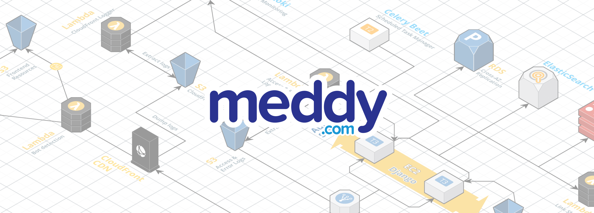
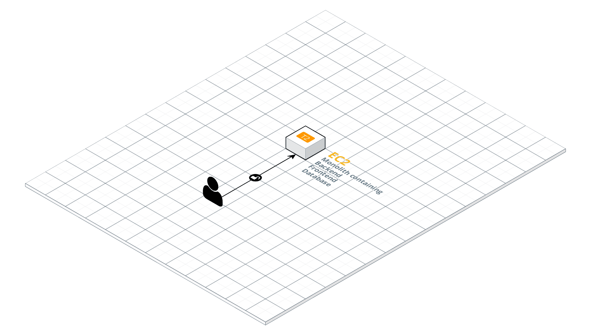
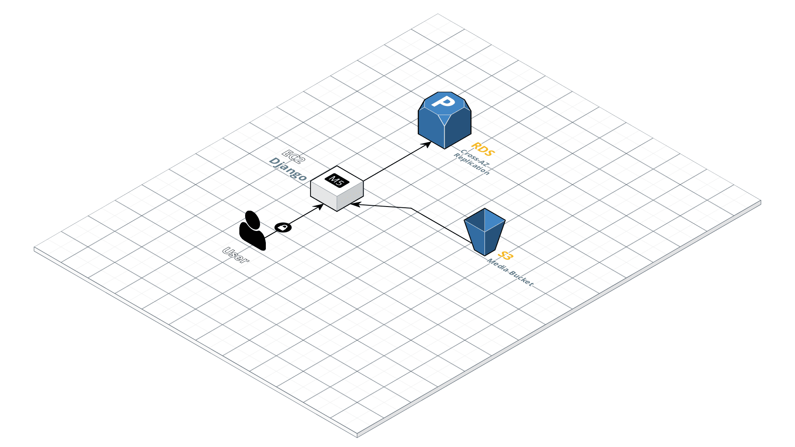
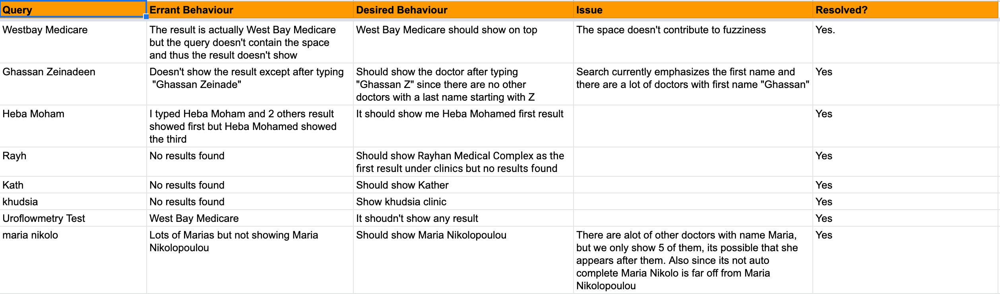
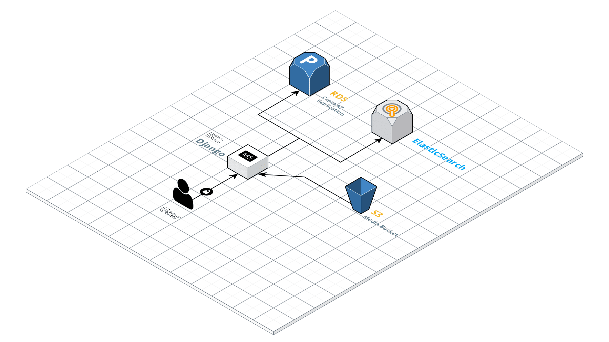
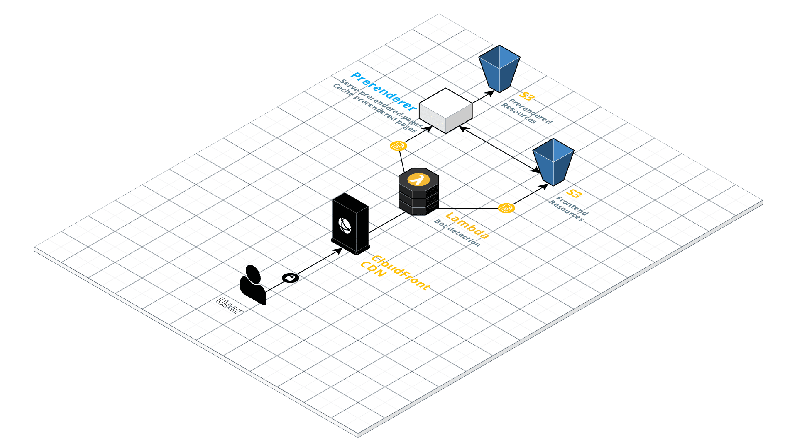
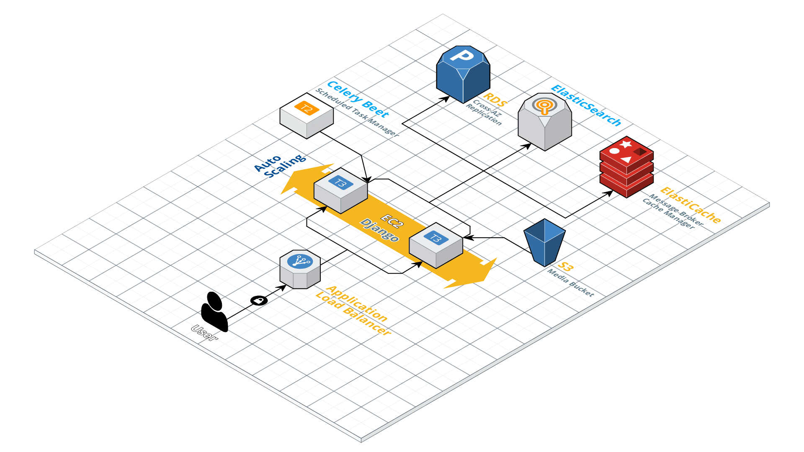
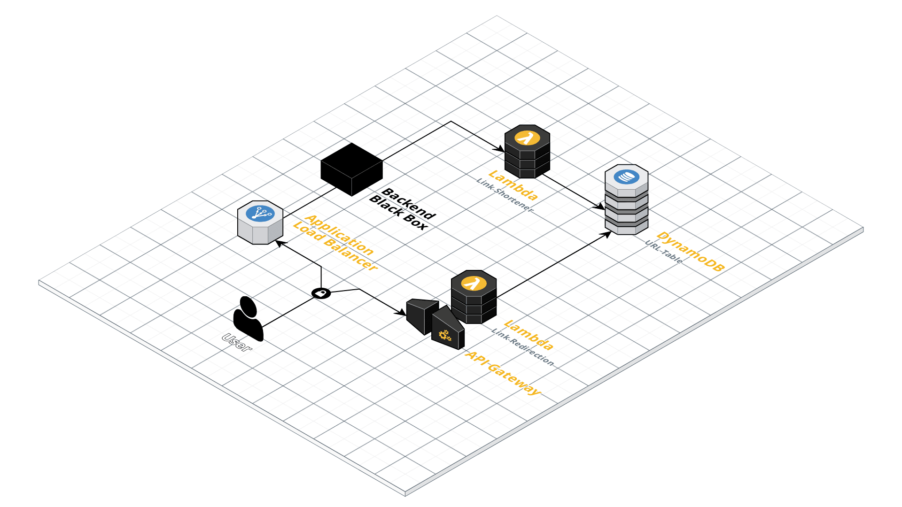
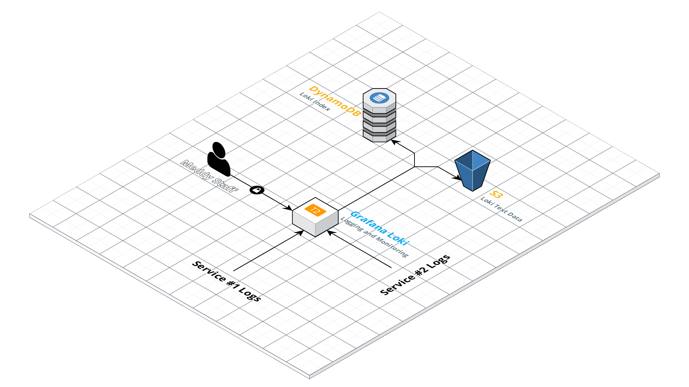
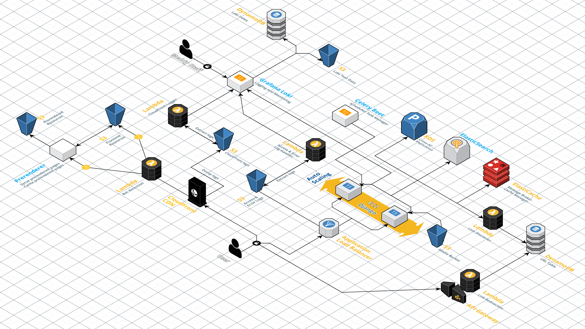

> This article is written by [Kareem Ayesh](https://medium.com/@kareemayesh) and Yasser El-Sayed.

Meddy was founded in 2016 and has since had a lot of success thanks to the scale it hit. In 2019 we celebrated our 100,000th bookings and 3 millionth user served, on top of a [Series A funding ⚡🔌️](https://www.forbesmiddleeast.com/innovation/startups/meddy-raises-25m-in-series-a-round-eyeing-uae-expansions).

Meddy has gone through a lot of technical changes in the past four years. This article serves as a technical proposal to an infrastructure for a growing tech startup. We will be talking about the initial point of the infrastructure 4 years ago, all the problems we’ve faced over the years, and the incremental solutions that we’ve implemented in the order we’ve implemented them.

**If you’re an aspiring CTO of a growing startup this article will benefit you greatly.**

Our Monolith
============

> I remember the CEO telling me that his code is better than any piece of code that I’ve written, when I asked why he said “Because it’s been used by thousands”
> 
> … and he’s right.

Technical Debt
--------------

Having a monolith alone is not a problem. It’s just natural for most monoliths evolve gracefully and turn into Frankensteins, and that’s exactly what we did.

That being said this also meant that a lot of problems will manifest throughout the lifetime of the project, and surely a lot of problems did.

> However, it wasn’t technical problems that we were worried about, it was the prospect of not being able to solve them.

**The existence of a monolith meant that problems were equal to dead-ends.** It’s only natural that the more features were requested the more problems would manifest, solving these problems is just as natural as creating the features.

An initial refactor and update to the infrastructure was paramount to set up the growth of the application and in turn have potential solutions for potential problems on all fronts. That way new feature requests never spawned a series of uh’s and um’s or worse “_I don’t think that’s possible right now_”.

Stepping Stone
==============

Data persistence was a big sore problem in the current monolith. Image uploads, the database and the logs all had to be backed up on the root filesystem and used when new instances needed to be spun up. Since there was no staging instance at that point testing happened on production and **the server failed all the time, endangering our data!**

Another big worry that needed to be addressed was deployment. Deployment was done by SSH and `git pull` from our Github origin with no type of script to automate starting new processes, run tests and report failures.

Solution
--------

It was clear that we needed some change; we decided that along with application code changes that we would have a small infrastructure change that would move the database and the file uploads to separate services.

These three problems were solved by using three AWS services:

*   Using [RDS](https://aws.amazon.com/rds/) to manage the Postgres database
*   Using [S3](https://aws.amazon.com/s3/) to store the Media uploads
*   Using [ElasticBeanstalk](https://aws.amazon.com/elasticbeanstalk/) to manage deployments

Just to re-iterate, the overall changes that we did in this project didn’t result in much of an improvement in the infrastructure. This separation just meant future problems in the application didn’t damage anything sensitive. Additionally, since there is only an application on the main EC2 instance, then that meant that any additional resource can exist on separate servers or services without issue.

**This wasn’t perfect:**

*   [Celery](http://www.celeryproject.org/) and [Redis](https://redis.io/) were on the same server as the application itself
*   The frontend application was a hybrid render between [AngularJS](https://angularjs.org/) and [Django](https://www.djangoproject.com/) which choked the processors at times
*   Logs were stored on the file server (nowhere else 😬).

At that point, volumes were low and we didn’t have a lot of services or even features so these problems were tolerable.

> Nonetheless, this project laid out a very important stepping stone for what has turned out to be a very robust summit.

Search
======

> Special mention to Yusuf Musleh for helping with this

**Search was frustrating as it took a long time and was not very accurate.** We were using an implementation of [Trigram Similarity](https://stackoverflow.com/questions/43156987/postgresql-trigrams-and-similarity) from Postgres to implement search. On large amounts of records it wasn’t the fastest and search on multiple fields wasn’t accurate at all.

Most importantly, you can’t really control the behavior of these searches. We wanted to keep track of all the issues we had with these search queries.

Whenever we would have an errant behavior we couldn’t resolve the behavior with the current implementation.

Solution
--------

Search takes up a lot of resources from the instances that it’s within. Instead of just expanding the instance and running a search application within it we decided to launch a separate service that ran [ElasticSearch](https://www.elastic.co/) on-premise on an EC2 instance. Whenever a new record would be created or updated, we would update an index in the EC2 instance. There would also be a cronjob that updates the entire index periodically.

This resulted in a much faster and better controlled search that we’ve iterated over and over without much change to the image running on our ElasticSearch service.

Load Balancing
==============

**We experienced a 10 second downtime on every single deployment.** Deployment was taken care of by ElasticBeanstalk. At a lower level, EB runs both the new (ondeck) and old (current) applications in parallel and does a symlink once all the execution scripts are successful. Since we were using one server, this symlink would cause 5–10 second downtime that needed to be resolved.

Solution
--------

To fix this, we needed to have [rolling deployment on multiple servers](https://rollout.io/blog/rolling-deployment/). This was a relatively simple endeavor that required to just have an [Application Load Balancer](https://docs.aws.amazon.com/elasticloadbalancing/latest/application/introduction.html) in front of an Autoscaling group that was managed by our ElasticBeanstalk.

Rolling deployment adds an overhead of testing and longer deployment times but removes downtime altogether.

Rendering and SEO
=================

We were using a hybrid render where the Django application would serve a partly rendered HTML and that would run the AngularJS application on the client. This caused many problems:

**Our rendering was slow and choked our dev team and our servers.** Our servers required a lot of processing power to be able to render and was [an unavoidable bottleneck](https://docs.djangoproject.com/en/3.0/topics/performance/#alternatives-to-django-s-template-language) with our response times. Even development became difficult because we needed to code a change multiple times. At some point even changing a single tracking event was a hardship.

**Poor build system resulting in high load times.** We were using our own build system since there was no AngularJS build manager for a hybrid render, and our own system had a lot of bundling inconsistencies and caching issues that resulted in unoptimized builds and high load times. This was also a hassle to change and improve.

**Website would occasionally hang for 5–10 minutes.** When we get a spike of requests from users or bots the server would open too many connections with the database, causing the database to hang. This happened **every week at the end of 2019 after our Series A brought Meddy more business.** The reason was because Django opens a database connection and keeps it open until the rendering of the HTML is over! Due to too many database connections the server would hang and eventually serve a 504.

Solution
--------

Soon after our Series A we embarked on switching our code from a Hybrid Render to a purely Client Side Render. For this to work we had to work on making a lot of changes to the way the backend serves requests.

We decided to use an S3 bucket as a static hosting for our frontend with [CloudFront](https://aws.amazon.com/cloudfront/) distributing the responses. CloudFront also gave us the option to attach [Lambda](https://aws.amazon.com/lambda/) functions to have very granular control over the requests we needed.

One of the main reasons that we did a hybrid render was a worry that SEO would be tarnished with a dynamic render; [and one of the main reasons that our website was hanging was due to request spikes caused by bots](https://community.cloudflare.com/t/anyone-else-in-the-recent-days-getting-small-attacks-from-facebook-bots/89019). Both these problems would be solved by a pre-rendering our pages and serving the pre-rendered pages to bots which is perfect for SEO.

To do so we used a service called [prerender.io](https://prerender.io/) which pre-rendered requested pages, cached those pages and served those pages to bots. We added a bot detection mechanism based on User-agent of the HTTP request in a Lambda Edge function used by our CloudFront distribution. Whenever a bot is detected, they’re redirected to [prerender.io](https://prerender.io/) to get their cached pages.

It’s important to note that once we hit 300,000 pages and prerender.io cost was very high, we decided to have our own on-premise prerender service. We implemented our own caching mechanism using S3 and [ECS Fargate](https://aws.amazon.com/fargate/) to host the service.

Sharing Caching and Scheduled Tasks
===================================

**Caching resources were not shared between servers.** Caching resources not being shared between servers meant that some requests would be cached and others won’t be. Additionally, we’ve had problems with Redis being on the servers; Redis has scheduled data dumps on the server which on two occasions caused downtime when disk space was eaten up by another service.

**Scheduled tasks needed to run on one server.** [Celery Beat](https://docs.celeryproject.org/en/latest/userguide/periodic-tasks.html) had built-in functionality to run tasks on a certain date and time and feeds off an event stream that was stored as a table in the database. This is very useful for us because we use it to send reminder SMSs for appointments at specific intervals before and after the appointment. If it was kept on the servers there would be duplicate tasks executed which would cause conflict mainly within our notification module.

Solution
--------

Since we are now using multiple servers over a load balancer, the backend has to share a similar caching server. For that purpose we used [ElastiCache](https://aws.amazon.com/elasticache/). This was extremely simple to set up. The more challenging aspect was our asynchronous task manager which was managed on each server with Celery Beat.

To decouple this we would create events on a new service that would invoke those events by making a request to the backend. The event would just store the function that needs to be called, the arguments of that function and the time it needs to be invoked in. This would have its own database that the backend would populate events on request of the backend.

> We called this new service **Celery Beet** since we thought that the Celery Beat library missed such a great opportunity.

This has one major downside: you can’t pickle since invoking requests is done through HTTP. However, since [Celery recommended against using Pickle](https://docs.celeryproject.org/projects/kombu/en/stable/userguide/serialization.html#serializers) we never used it in our code.

Redirections and Link Shortening
================================

**Redirection for shortened links happened on the client side application.** Moving to a purely client side application meant the server can’t serve a 301 on a link because all requests go to the S3 bucket. When a redirection has to happen from `/x` to `/y`, the client side application has to check with the server about `/x` and inform the Prerenderer that this page was meant to be redirected by adding an extra parameter to the DOM. To ensure that the Prerenderer picked up on that we created a page that says “Redirecting you please hold on for a second” that added that extra parameter.

This was fine for internal redirections since we don’t have that many. It wasn’t ideal for link shortening because we wanted the users to just land on those shortened links without having to wait, especially when we needed to redirect outside Meddy.

Solution
--------

To solve this we created two Lambda functions that feed off a Dynamo table that has hashes and links. One Lambda function is tasked with shortening and another Lambda function is tasked with redirecting the shortened links.

Additionally, we used an API gateway as an entry point for our redirection lambda function and attached it to a new (shorter 😁) domain for these URLs.

This works very well because Lambda provides virtually no maintenance, usage graphs and our database doesn’t have to contain a large table of these redirections.

Logging and Monitoring
======================

**The need for better logging was dire.** An increase in the number of server requests meant that we can no longer rely on rotating logs on our filesystem because the files would rotate so quickly. On top of that, the number of services we were using was increasing, and pulling files from the different filesystems was a nightmare. Having a centralized logging system for all your services is a challenge.

Solution
--------

We decided to build a service for logging and monitoring using [Grafana Loki](https://grafana.com/oss/loki/). Loki is an open source horizontally-scalable, multi-tenant log aggregation system inspired by Prometheus. While Grafana is an open source analytics and interactive visualization software. Essentially, we used Loki as a logs aggregation tool and Grafana to visualize these logs.

The idea was to have our different services push logs to an HTTP endpoint opened in the Loki service. Loki would then index them and store the logs in binary format in S3 and the indices in a DynamoDB table. This gave us a way to look for certain tags in our logs like a specific status code or a specific log level. It also gave us the ability to query our logs and even apply aggregation functions on them like count the amount of logs that have specific tags over last 5 minutes.

For event monitoring we use Grafana but this time with AWS [CloudWatch](https://aws.amazon.com/cloudwatch/). Grafana acts as a client for CloudWatch and polls data on demand to visualize it.

To be able to push logs to Loki as mentioned above, we had to use different techniques from different services like building handlers on our application servers and Lambda functions attached to data dumps. The Lambda functions were used to parse the Load Balancer and CloudFront logs from S3 and then pushing them to Loki.

Using this mix of data handlers and CloudWatch we were able to have a centralized logging and monitoring system for everything in your infrastructure, you have one place to monitor everything.

All Together
============

This is probably our most favorite article to date! This shows a lot of growth due to a lot of challenges that we went through. The most exciting thing is that this is still the beginning for Meddy.

Thank you for reading! Stay tuned for more!