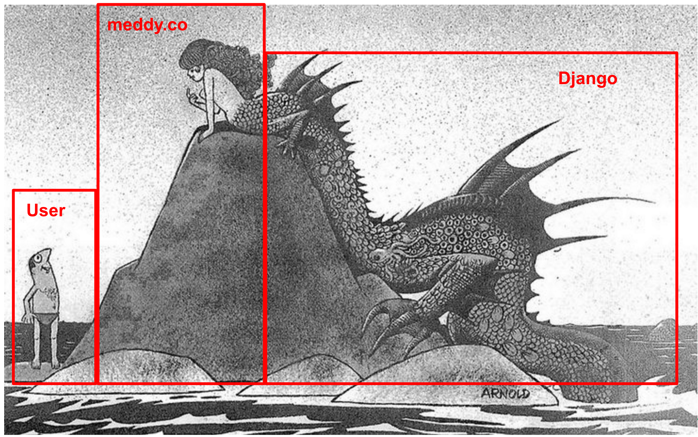
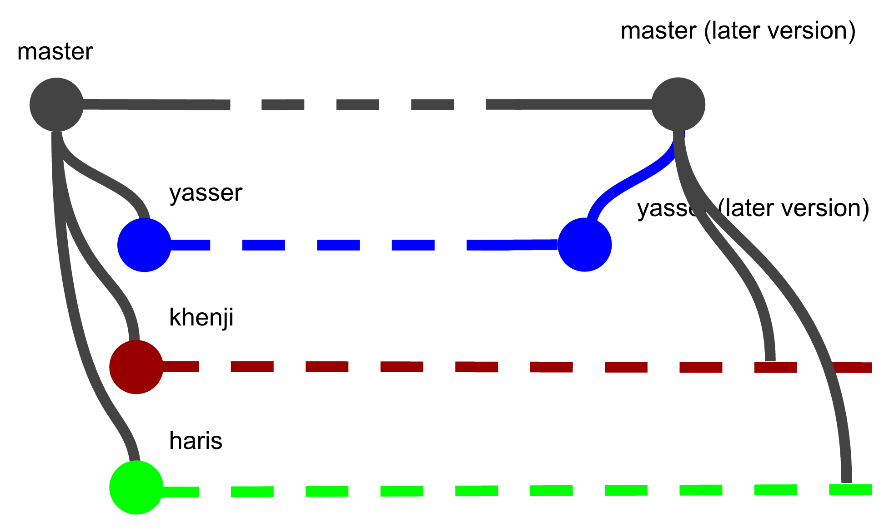
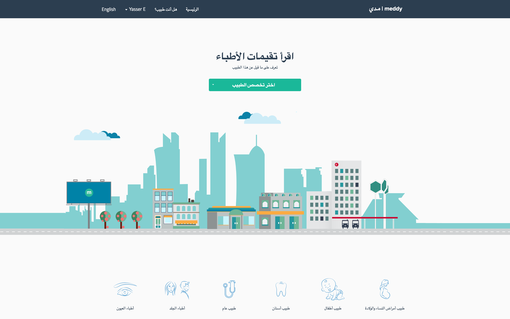

Hi, my name is Yasser El-Sayed and I’ve been interning as a Software Engineer at Meddy since mid May of this year. When I first came to Meddy I was pretty impressed with the amount of users they accumulated as well as the amount of ground this company has covered. It seemed as if the team has been focused primarily on establishing a network and gathering clients. That is what making a company is all about. However, the CEO of Meddy, Haris Aghadi, is very product oriented guy. Haris cares about the product that he’s developing for his doctors and is making sure that this product grows. If you ever have a conversation with him he’ll probably utter the words “Growth” and “SEO”! That being said, I was pretty shocked by the grim status of their code base. For a product person that appreciates good design (fantastic design in Meddy’s case) he’s been having very poor luck with finding proper engineers; at least that’s what I think, Haris usually would say that as a young startup they’ve been piling up features that clients would like. In any case, I’ve taken it upon myself to fix the code base and make it more stable. Let’s go through them one by one. I promise to go easy on the non-tech readers.

The Back-end
============

Meddy’s core engine is running on [Django](https://www.djangoproject.com/). Django is a web framework where all the logic, authentication and database relay is done. To explain what Django is consider this picture done by [Hans Arnold](http://monsterbrains.blogspot.qa/2014/03/hans-arnold.html).

What the user sees is a pretty picture that the front-end developers control. And the driving force that allows the front-end to go anywhere or be of any use to anyone is the back-end. In this case the tool that allows us to develop the back-end is called Django.

Django is a beast, with code snippets all around the internet to feed this beast and help it develop, becoming faster (deals with clients more efficiently) and stronger (deals with more clients at the same time). However this beast gets old and you need to replace it with newer versions. This is important because usually there would be **new security updates to Django with every version.** And updating to a newer Django makes it easy to **find more code snippets online** as everyone codes and writes documentation using the newest Django version. Moreover, there are usually **issues with previous versions that are made better or fixed in the newer versions.**

And so I did!
-------------

I spent some time updating Django from version 1.6 to version 1.9, and it was a hoot! I had to read a lot and fix a lot of code, but it was a challenge, and that’s what engineering is all about. Problem solving. Now unto the next challenge.

The Front-end
=============

When I was first hired I was told I will be a full-stack developer with an initial focus on front-end development, which meant I’d making new web pages for Meddy, and later working on developing back-end code. I already knew front-end development pretty well and this was in my comfort zone and was becoming sort of a passion. So when I arrived I was shocked by the status of Meddy’s front-end code. It was kinda like a cluttered desk, sure everything is there and I’m still functional while working on it, but at what cost?

The main reason that it was so cluttered is because whenever someone wanted a new addon to change the look or feel of the website, or how it was organised, they just ripped a file full of code from the internet and just stuck it in their own code. This is not a healthy system, because **it’s really bothersome of to know what code is imported where**, **what** **version is the code** you ripped from, **where to download this code** from if the file got lost, and **how do you update once a version gets deprecated.**

To solve this I introduced a package management system called [**Bower**](http://bower.io)**.** Bower is a package manager for front-end packages, and what that means is that it organises all your external code in a nice clean and accessible way.

Time for an advertisement! (not sponsored by bower)
---------------------------------------------------

Hey you! Do you have a messy desk? Do you think taping everything to the screen of your computer isn’t helpful? Do you have a lot of work, yet all these papers from all these other departments clutter up your desk, holding you back? Well look no further! Bower is a manager that will stand around your desk and keep track of all the papers you should have on your desk and retrieve them when needed! That way you’ll have all the papers you need, without cluttering up your desk and have a fast way of retrieving them.

The Collaboration System
========================

When software engineers work together on a single project they usually use some software to help them collaborate. With software in particular, collaboration needs to be flawless and seamless because some things rely on others, and mixing and matching between two logics on doing the same thing is very hard and most of the time unnecessary. It’s also important to keep track of when every change is added, as every change could potentially cause the collapse of an existing piece of your code.

Git’s logo

The most commonly used software to collaborate is called [**Git**](https://git-scm.com/) with the help of [**Github.**](http://github.com) Git is a version management system that keeps track of all the changes that happened in your software, by whom were the changes, and provides a feature to split the code between different developers. Github is just a cloud system to keep track of all the code that is coded with Git and allows for people who have access to comment and use that code.

A nice way to explain this is through a series of analogies provided by [Nick Such](https://www.startups.co/answers/1089/how-would-you-explain-github-or-git-to-people-that-are-not-programmers-or).

You know that button in Microsoft Word that says “Edit, Undo”? Git does that…but for every change that has ever been made to a project…and by any member of your team.

You know that “Track Changes” feature in Word with all the red and blue lines showing who changed what? Git does that…and it includes comments so you can explain why things were changed.

You know how Google drive has the ability to go back to a version and edit that version separately from anyone else? Git does that. It’s best to do that for every developer, give him/her a copy and let them go crazy with it, and later on you can merge their changes with yours.

You know how Dropbox backs up your files “in the cloud”, but you still have a local copy on your computer (and maybe your iPhone, too)? GitHub does that for your code.

Meddy had Git and Github set up but they were using it poorly. I remember the first piece of code I wrote Haris told me “Can you send me a zip file with all the code and tell me where to put it on the server.” You couldn’t see it but as he was saying that **I was raising a gun to head.** It had to be fixed!

The problem was simply that they had a server (that sat somewhere in the world), and they had a local code that was sitting either on their computers or on a backup somewhere. Whenever a change was done, it needed to be committed (added) to a **master version** of the code i.e. the ultimate/best version of the code so far.

In the above scheme the master version contains the code that is the latest version so far. Ideally, the server runs using master version of the code. As you can see there are three extensions from the master version called **yasser, khenji, and haris.** These extensions are basically just copies of the master version of the code. They’re named after the people that are coding using these copies. In this case you know haris and myself (as a reminder my name is Yasser, nice to meet you), and we’ll talk about Khenji in a bit. If you follow along with your eyes you’ll see that yasser stops and copies something into master. This is called a **merge,** where new code that Yasser has developed will be merged into the master code. After which the master version of the code should update all the other working versions to keep them up to date. I hope you enjoyed this little crash course on Git!

Arabic Meddy
============

When I first arrived the CTO of Meddy, Abdullah Al Khenji, said that I’ll be working with him on making the website multilingual. Meddy wanted Arabic because there is a huge population who prefers reading Arabic over English and they did not have a great experience using the English version of the product. Moreover Meddy wanted to diversify their client base, hence getting the product in Arabic was imperative to Meddy’s growth.

The main challenge with releasing Arabic was that Meddy was originally coded with a database that only understood latin characters. That was a big problem because putting any data that was Arabic was just stored as “????”. Meddy runs on MySQL, and when it was first developed they chose the character set for the database to be latin, what they should’ve done is make it UTF-8.

Now think of this as shelves for books. You want a cupboard to put your books on, and these books could be Arabic, English, German or whatever. Your cupboard is very hard to please and if you place anything other than English it will spit it out and yell at you. Moreover, you want a system to split these books; you don’t want Arabic to mix with English because depending on what language you want to read, you need to know where to find each book. Moreover, you need to know where the English version of an Arabic book is, given that they exist at all! On top of all that, you need to ensure that you store the Arabic books from right to left, otherwise it will look ugly.

Khenji and I set out to do this in the holy month of Ramadan. Even though some work was done before I joined Meddy, there was a lot to do, and I had to learn a lot of MySQL so at the end of it we are able to write pretty concise documentation and explain what was going on to other team members. It was challenging but we finally done it! And Khenji is a pretty great dude to code with, pretty chill, and an amazing manager. Everyday he’d have someone new to manage and meet.

What’s Next for our Fabled Intern?
==================================

iOS development! See ya in a month!