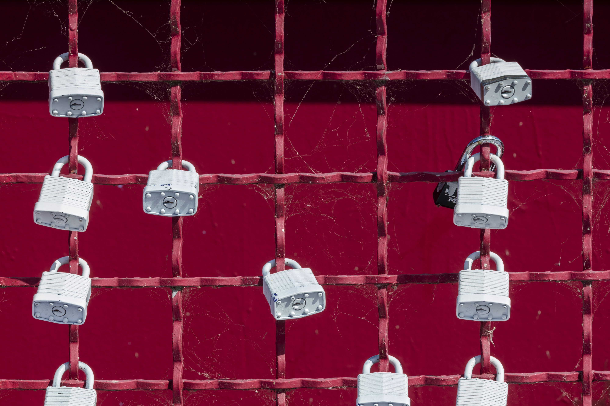
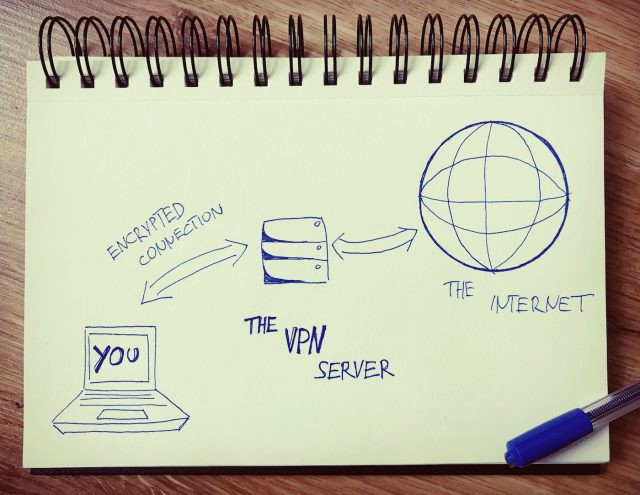
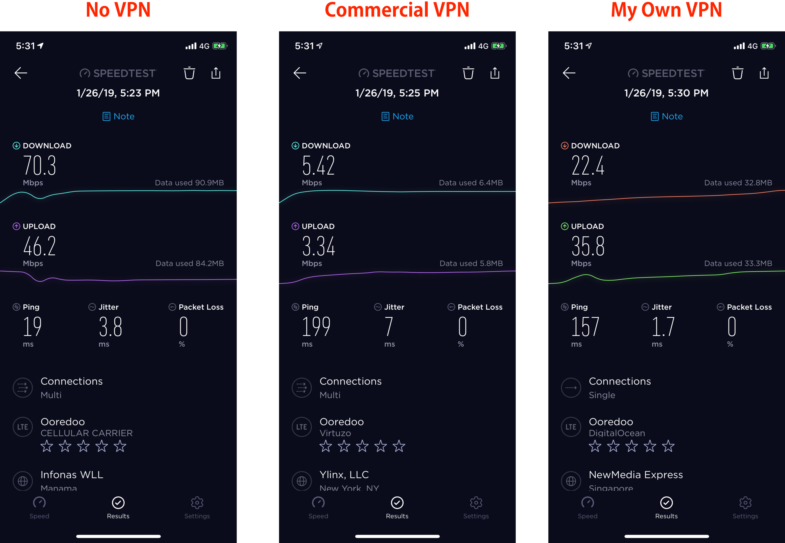
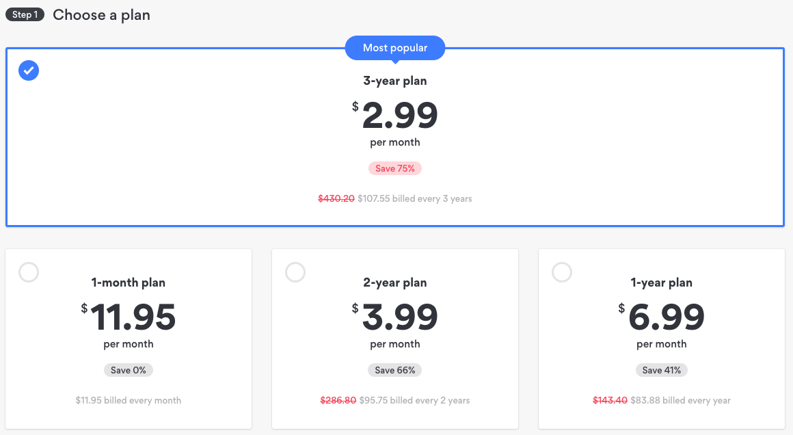

This is part 1 of 2 on setting up your own VPN Server. Part 1 is the why and [part 2](https://medium.com/@ysr.sayed/set-up-your-own-vpn-its-cheaper-faster-and-more-secure-1a78d73999f3) is the how.

Hello there 👋! I usually write more technically detailed blog posts, but I wanted to write one that can be read by just about anyone. I decided to make my own VPN and **I think you should too**.

I’ve been seeing more and more ads for VPN’s on YouTube sponsored by YouTubers; it’s not just any YouTubers but even super popular YouTubers like [PewDiePie](https://medium.com/@jayhumphy1/pewdiepie-discount-coupon-for-nordvpns-deal-how-to-get-it-and-is-nordvpn-really-worth-it-e0b2b350af05), [Phillip Defranco](https://www.youtube.com/user/sxephil), [Boogie](https://www.youtube.com/user/boogie2988), are pimping out services like [NordVPN](https://nordvpn.com/) and [Hotspot Shield](https://www.hotspotshield.com/).

For the most part, I’m really happy seeing VPN advertisements since it raises awareness towards [online privacy](https://support.betternet.co/hc/en-us/articles/218140103-What-is-a-VPN-and-why-is-it-important-). However, some of the VPN providers online recently have been shady and — given that they have more access to your data than Facebook and Google combined — it’s disconcerting.

I got the idea of having my own VPN server that will help me secure my online presence with no worry whatsoever. Thankfully, I found lots of tools that helped me out and I’m honestly surprised why everyone isn’t putting up their own VPN server.

> It’s cheaper, faster and leagues more secure… and frankly simple as can be!

In this post I’ll be telling you why you should be using your own VPN server. If you’re already into the idea of having your own VPN server, head on over to [part 2](https://medium.com/@ysr.sayed/set-up-your-own-vpn-its-cheaper-faster-and-more-secure-1a78d73999f3) where I tell you how to do it 😄.

**Why do this?**
================

To understand why to put up your own server is parallel to understanding why have a VPN server in the first place. It boils down to three things: **security, speed and price.**

**Security**
------------

There is a fair amount of understandable [pushback](https://gist.github.com/kennwhite/1f3bc4d889b02b35d8aa) towards commercial VPNs. This is a short version of a very complicated argument, if you don’t trust your Internet Service Provider (ISP) as they can track your digital footprint, then you use a VPN. The way VPNs work is by encrypting your connection with them and then forwarding your requests to the servers that you’re requesting. The VPN pretends that it’s you when making requests to the internet. You can think of it like a tunnel that goes under your ISP.

If you think about it, at some point you have to TRUST that VPN isn’t keeping track of your valuable information. Fortunately, there has been an intrepid journalistic effort to uncover any questionable behavior by these Commercial VPN providers. Unfortunately, [some dirt](https://www.digitaltrends.com/computing/commercial-vpn-huge-security-flaws/) has been uncovered by various university led studies; you can argue that these investigations are in their early stages and may be incomplete. Having said that, this does strike some fear into the hearts of us who care about our privacy. Also, however unlikely, if one of the services you’re using is compromised by a security vulnerability then your data is also compromised.

> Use your own server— Me

When you use your own VPN server, you’re basically flying under everyone’s radar. For one, while you could log your usage of the VPN it’s still YOUR server, that data isn’t going anywhere unless you say so. Second, while someone could try to attack a commercial VPN to gain access to [millions of users](https://blog.hotspotshield.com/2018/02/21/anchorfree-hotspot-shield-600-million-downloads/) (Fun Fact: I couldn’t access that link without a VPN 😂) your VPN gives access only to you, making YOU an extremely unattractive target. So unless you’re someone super important [I wouldn’t recommend this solution](https://www.washingtonpost.com/politics/ivanka-trump-used-a-personal-email-account-to-send-hundreds-of-emails-about-government-business-last-year/2018/11/19/6515d1e0-e7a1-11e8-a939-9469f1166f9d_story.html?noredirect=on&utm_term=.f9736334919a). We all know what happened last time an important person used their own server.

Speed
-----

These next two points are just nitpicks from my side, because I’m fastidious about the services I consume… why not get the best of what you’re consuming ¯\\\_(ツ)\_/¯.

When you use a commercial VPN you’re sharing it with other people, making the ping unappealing at peak times. It’s so bad that some VPNs have to make posts like [this](https://nordvpn.com/blog/8-tips-to-boost-your-vpn-speed/). It’s so bad that Netflix couldn’t load my shows in HD, which is a big issue since Netflix has **the** best network engineers in the **world**.

From the above image you can see there isn’t much of an issue with using your VPN in terms of speed because you’re the only user.

Price
-----

Lastly, it’s important that we talk about prices of commercial VPNs. I honestly don’t have an issue with the price of VPNs, I think the general price for online privacy is pretty reasonable. I’m using [NordVPN](https://join.nordvpn.com/order/) and, again, while their prices are fine I hate that I can’t pay month to month for the prices they have for the 1-year and 2-year plans.

Of course, I’m not judging their business acumen, after all “a bird in the hand” and all that. Don’t forget, the churn rate for these services is pretty high. Obviously I think this is a scam, and other payment plans for other commercial VPNs aren’t much different. The free ones are even worse!

In the followup article that teaches you how to set up your own VPN, we’ll be using [DigitalOcean](https://www.digitalocean.com/). This is where our server will be and where all the expenditure will happen. The server we’ll be using is $5 a month at most. Here’s the best part:

> If you’re not using it, you don’t have to pay for it.

Since you’re charged for the time that the server is up, if you know you won’t be using it this week, just take it down! That way you’re spending $5 **at most**, even for a heavy user like myself would end up spending $3 dollars and I know there would be a month I wouldn’t be using the VPN at all.

Downsides
=========

Alas, it’s not all sunshine, roses, candytufts and chrysanthemums. There are three downsides as far as I can tell.

In Terms of Security…
---------------------

I know I said that you’re an unlikely target which makes putting up your own server sensible. That being said, that also makes you the master of your own destiny, meaning you need to be careful not to give away the IP of your server publicly. Basically, if you’re going this route, **don’t be stupid.**

Variety
-------

You just can’t match the variety of servers that services like NordVPN or [BetterNet](https://www.betternet.co/) provide in terms of different server locations. If you need to keep switching IPs and need a myriad servers for your use-case, then this solution is simply not for you.

Multiple Devices
----------------

I’ve noticed that download speed drops when you have multiple devices streaming. I’ve opened YouTube on my phone and tested the speed on my laptop and it drops quite a bit, so it’s not sustainable for more than 2–3 devices. So make sure that you’ll be the only user of this VPN, or try to get a better, more performant server which might cost more than $5.

The Know How
------------

The tutorial is pretty simple and from what I’ve seen it doesn’t take much to set things up (that’s not to say don’t ask questions, I would love to hear from you!). However in the future if you run into a problem you’re responsible for fixing it. Since I’m a software dev by day this isn’t really a problem for me, but if you’re not comfortable with technology future issues might be difficult for you. Albeit this could be considered a positive. It’s good to learn new things, [in fact its rather addicting](https://www.quora.com/Is-anyone-addicted-to-learning). If you were ever interested in setting up a server or experimenting with VPNs then this is a perfect opportunity for you.

If you’re ready to take the next step to ensure fast internet surfing with total security, then head on over to part 2, it should be a breeze.