This is part 2 of 2 on setting up your own VPN Server. [Part 1](https://medium.com/@ysr.sayed/set-up-your-own-vpn-its-cheaper-faster-and-more-secure-ab41716724a5) is the why and part 2 is the how.
----------------------------------------------------------------------------------------------------------------------------------------------------------------------------------------------------

[](https://medium.com/?source=post_page-----1a78d73999f3--------------------------------)[

#### Yasser El-Sayed

](https://medium.com/?source=post_page-----1a78d73999f3--------------------------------)[

#### Mar 31, 2019·10 min read

](https://medium.com/set-up-your-own-vpn-its-cheaper-faster-and-more-secure-1a78d73999f3?source=post_page-----1a78d73999f3--------------------------------)

[](https://medium.com/m/signin?actionUrl=%2F_%2Fbookmark%2Fp%2F1a78d73999f3&operation=register&redirect=https%3A%2F%2Ftheyasser.medium.com%2Fset-up-your-own-vpn-its-cheaper-faster-and-more-secure-1a78d73999f3&source=post_actions_header--------------------------bookmark_preview-----------)


[Earlier I wrote about why you should set up your own VPN server](https://medium.com/@ysr.sayed/set-up-your-own-vpn-its-cheaper-faster-and-more-secure-ab41716724a5). It comes down to three reasons: **speed**, **security** and **price**.

> **Note:** this tutorial is for Apple devices only (iOS and MacOS), if you’d like to know how to set it up on other devices do let me know in the comments I’ll make another tutorial.

If you’re convinced that you should set up your own VPN, here’s how. Follow this tutorial to the **T** and if you have any problems put them in the comments and I’ll try to help you out. **This should take you 10 minutes tops.** After which you’ll have a VPN.

And don’t worry, **you don’t need to know how to code** or do anything crazy with tech, all you need is in this tutorial 😄.

The tools
=========

To achieve this we’re going to use a couple tools. I felt it necessary to introduce them and tell you what each one is for.

*   [Digital Ocean](https://www.digitalocean.com/)


Hosting service that will be used for hosting the VPN server. While there might be cheaper options, I am using this because of its user friendliness and can be used by anybody with little-to-no knowledge of the server world (don’t worry it’s still cheap).

*   [AlgoVPN](https://github.com/trailofbits/algo)


A set of scripts that will help us set up the VPN on the server that we own.

*   [WireGuard](https://www.wireguard.com/)


The VPN that we’re setting up on our server.

Setup DigitalOcean
==================

To deploy a server you need to first have an account with DigitalOcean. This is pretty straightforward. To make an account with DigitalOcean you will need to put in your Credit Card/Paypal info.

> If you’d like to get a 2-month server for free, use [this link](https://m.do.co/c/adc39ad1e490) and get $100 for 60 days. You’ll also help me out!

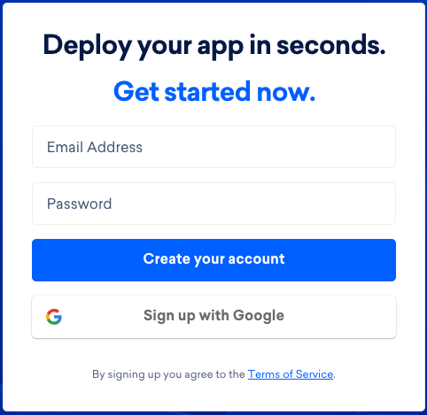

The information it asks isn’t necessary (what you’ll be using this for etc.), it will ask you for the first name of your project give it a name and scroll to bottom and click “next”.

Once you’ve set up your account you’ll be in your main control panel page.

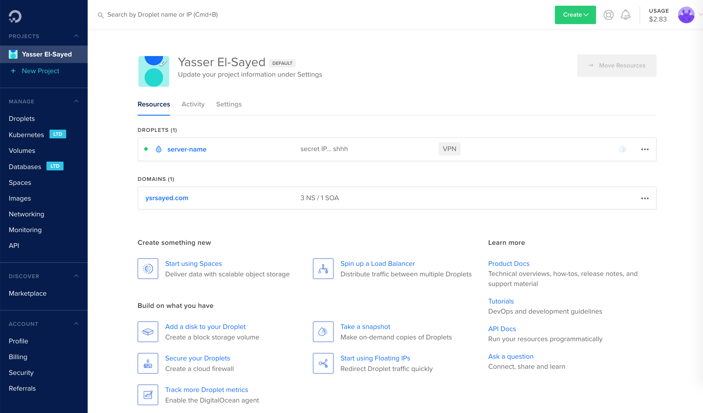

Create an API Token
-------------------

In order to create a server (droplet) on DigitalOcean it’s important to create credentials for AlgoVPN to be able to access your account. We do this by creating an [API Token](https://en.wikipedia.org/wiki/Access_token).

On the left side of the control panel page that you saw earlier there is a button called API. Click on it.

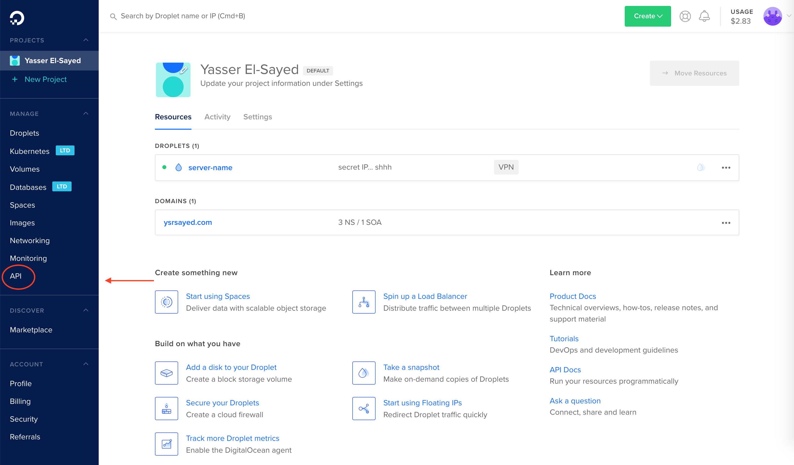

On the next page there will be a button called “Generate New Token”. Click that and the following should show up.


Give your token any name you like and when you’re done you should see your **Newly Generated Token**. Make sure that you have both Read and Write selected in the form before submitting.

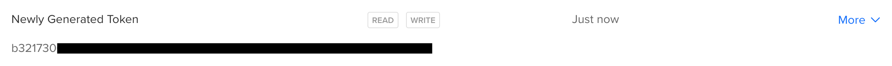

Save the little array of random characters as we’ll be using it later.

Download and Setup AlgoVPN
==========================

For this part you’ll have to use your Mac _Terminal_ to input some commands. It’s very easy and I’ll give you all the commands step by step.

Open up your _Spotlight_ and type in “Terminal”, the first result (marked with “ — Utilities”) is the option you’re looking for.

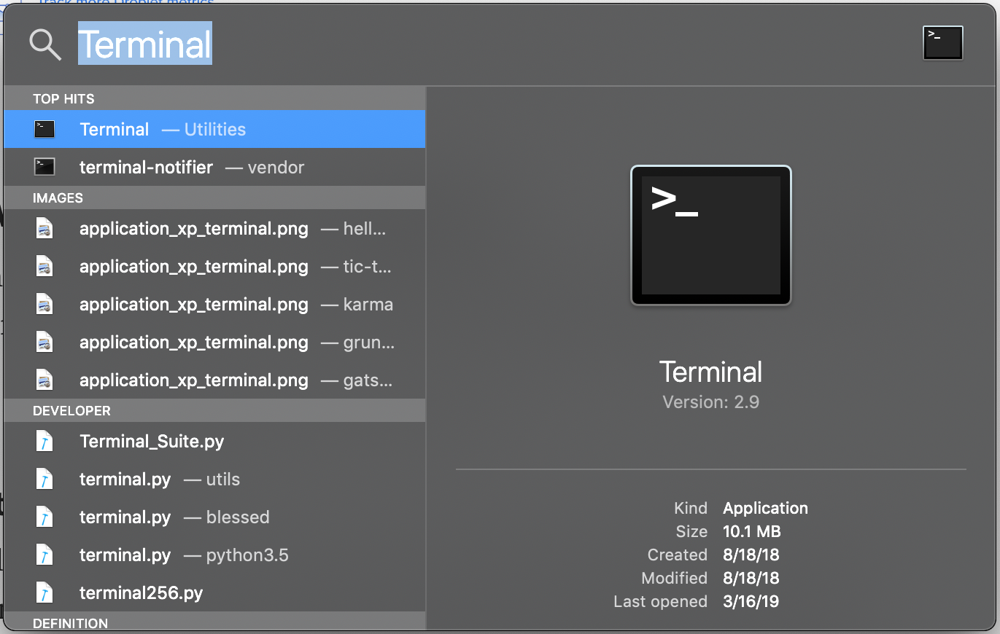

Click on it or press enter. You should see something like the following. It shouldn’t look exactly like this, so don’t worry.

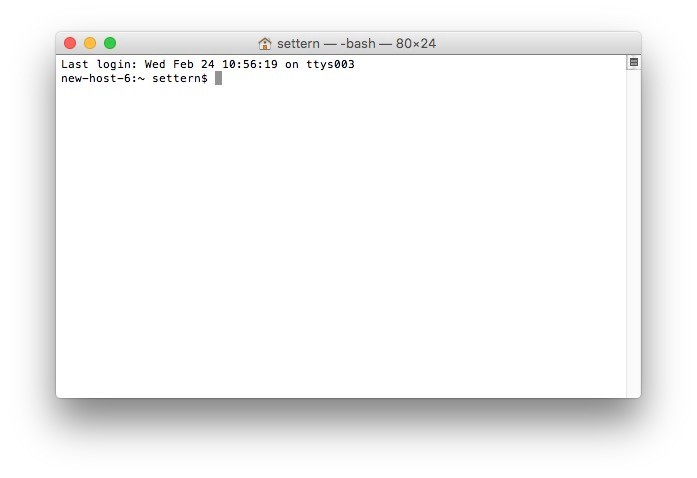

In this Terminal you can type in commands and it will do as it’s told. Let’s start off with this command that will download AlgoVPN for us from [Github](https://github.com/) and install all the necessary tools for us to get started. Copy and paste the below command into your Terminal. This might take a few minutes.

> **Note:** This command is going to ask for your computer password. As you type, nothing will show up but rest assured the computer is taking your input.
> 
> **Note:** You might get an error saying you don’t have the necessary tools, and your Mac will prompt you to install **command line developer tools**. Make sure to click on “Install” and **not** “Get Xcode”. This shouldn’t take any time at all.

```
curl https://bootstrap.pypa.io/get-pip.py | python && pip install --upgrade pip && git clone [https://github.com/trailofbits/algo.git](https://github.com/trailofbits/algo.git) && cd algo && python -m ensurepip --user && python -m pip install --user --upgrade virtualenv && python -m virtualenv --python=\`which python2\` env && source env/bin/activate && python -m pip install -U pip virtualenv && python -m pip install -r requirements.txt
```

If you want to check where your _Terminal_ is operating on your filesystem type in `open .`(“open” “space” “dot”) at any point in this tutorial. If at any point you close your _Terminal_ by mistake, make sure to reopen it and type in the following command before continuing the tutorial.

```
cd ~/algo/
```

Configure and Run AlgoVPN
=========================

Now we’re set to run the AlgoVPN command that will setup a VPN Server using your DigitalOcean account. First, we need to change the default names added in the AlgoVPN configuration. Type in `open .` in your Terminal and find a file called `config.cfg` . Open the file using _TextEdit_ or any other editor. On the top of the file, you’ll find a section called users. It should look a little like this.

```
\---\# This is the list of user to generate.  
\# Every device must have a unique username.  
\# You can generate up to 250 users at one time.  
users:  
  - phone  
  - laptop  
  - desktop\# NOTE: You must "escape" any usernames ...  
... rest of the file ...
```

Replace it with this (instead of `yourname` put in your actual name) and save the file:

```
\---\# This is the list of user to generate.  
\# Every device must have a unique username.  
\# You can generate up to 250 users at one time.  
users:  
  - yourname\# NOTE: You must "escape" any usernames ...  
... rest of the file ...
```

Now we run AlgoVPN using the command on _Terminal_:

```
./algo
```

AlgoVPN will ask you a lot of questions about the type of configuration that you want to do. In every question you have to enter a number or a letter then press enter.

Let’s go through this process together.

What provider would you like to use?
------------------------------------

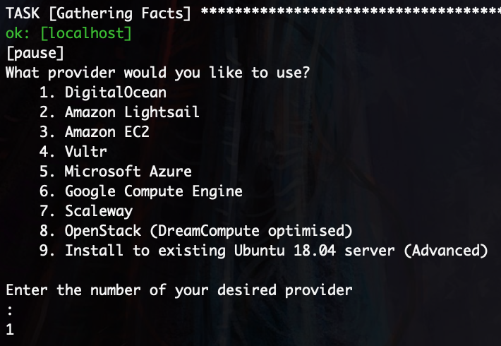

Since we are using DigitalOcean, make sure to enter “1”.

Do you want macOS/iOS clients to enable…
----------------------------------------

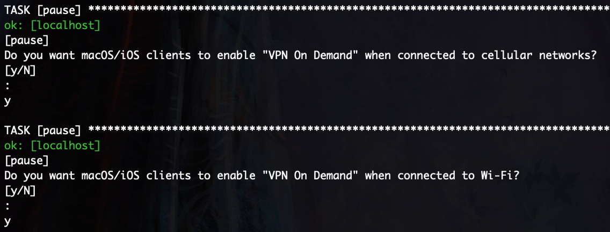

When asked questions about Mac and iOS, make sure to enter “y” (for yes) since in this tutorial we are using a Mac and will be setting up for iOS later.

List of the names of trusted Wi-Fi networks…
--------------------------------------------

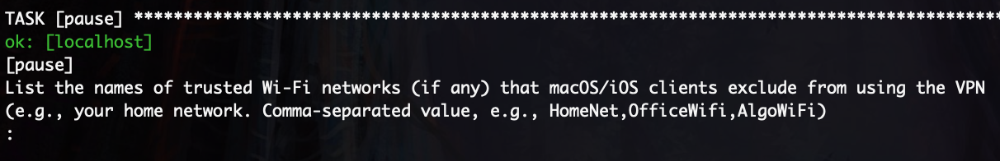

For the average person this isn’t really necessary so you can just press “Enter” to skip this step without any problems. That being said, if you want to access your VPN from only a set of Wi-Fi connections feel free to add some names.

Defaults
--------

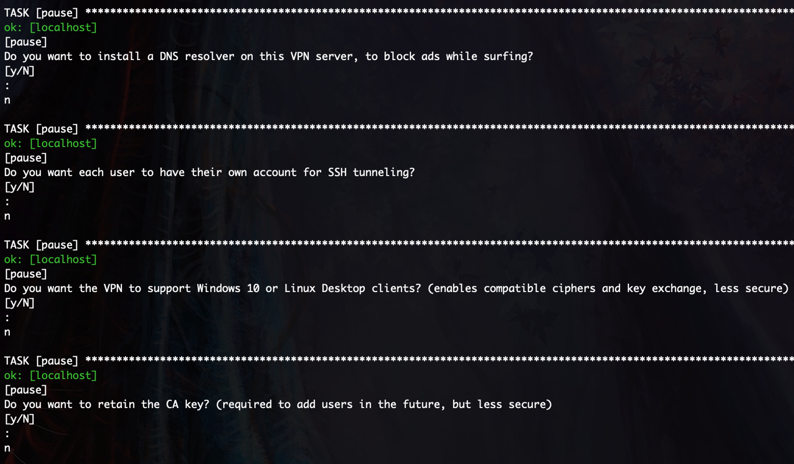

For the above questions I just put the defaults (“n”). The only exception is the “Windows 10” question, if you want to have access to your VPN from those devices you might want to answer “y”.

Enter your API token
--------------------

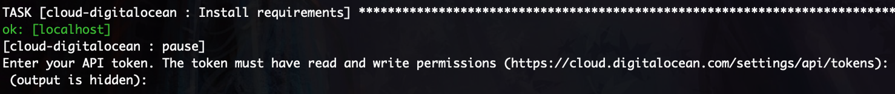

Earlier in this tutorial we made a new API Token from DigitalOcean and we saved it (or at least I hope you did). This is the time to copy and paste it. Press enter and it should take a couple seconds to verify the token.

> **Note:** When I was trying this the first time I got an error saying `~/.netrc access too permissive` . If you get this run `chmod 600 ~/.netrc` and then `./algo` again.

Choosing a Region
-----------------

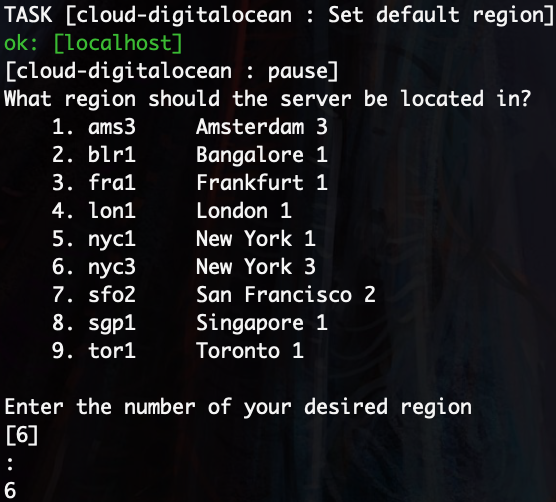

When choosing region, make sure that you choose one that is good for your needs. For example, I’m going with New York, United States (the big 🍎) for two reasons. One, their Netflix choices in the US are much better than where I currently am, so it has to be the US. Two, New York is physically closer to me than San Francisco so it’s bound to be faster. Make sure you’re getting the best ping by using [this tool](https://pingtestlive.com/digitalocean-ping) and then [this tool](http://speedtest-nyc3.digitalocean.com/) if you need to refine your search.

Once that’s done you just have to wait for around 5–10 minutes as the setUp is being done. You should see this message once it’s done.

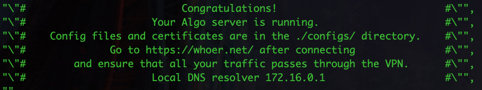

Additionally once you go back to your control panel in your DigitalOcean account you should see your server under the Droplets section.

> **You own this server!**

Connecting your devices
=======================

Now that we have our VPN server up and running, it’s time to connect our devices to it.

Getting the Configuration Files
-------------------------------

Before we can set up any device we have to get the configuration files first which will tell our devices how to connect to our VPN. Type in `open .` on your Terminal and the files you downloaded should show up. Algo set up your VPN configuration files pretty neatly, you can access them by going through `configs` > `<your ip>` > `wireguard`. There you should see two files `<your name>.png` and `<your name>.conf` . We will be using the `.png` for your iOS devices and the `.conf` for your Mac.

Connecting your iOS devices
---------------------------

On your phone you need to download a free app called Wireguard that will set up the VPN client on your iPhone/iPad.

[

‎WireGuard
----------

### ‎WireGuard is a fast, modern, and secure VPN tunnel. This app allows users to manage and use WireGuard tunnels. The app…

#### itunes.apple.com

](https://itunes.apple.com/us/app/wireguard/id1441195209?mt=8)

Once that is downloaded there is an option for you to scan a QR code which will set up things for you.

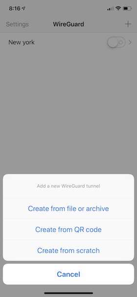

On your computer open the `.png` we talked about earlier and you’ll see that it’s an image of a QR code. Make sure to scan it from your iPhone/iPad.

After that it should be successful and it will show up in your settings page. You can now connect easily from your phone.

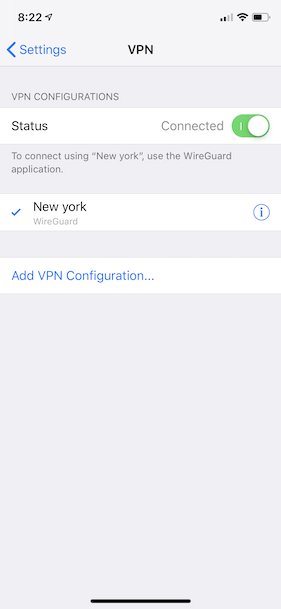

Congratulations! Now you can connect to your VPN from your iOS device!

Connecting your Mac
-------------------

Setting up your VPN for your Mac is a very similar process. You can download the WireGuard app on the Mac App Store and do pretty much the same thing.

Click on the following link to download the App.

[

‎WireGuard
----------

### ‎WireGuard is a fast, modern, and secure VPN tunnel. This app allows users to manage and use WireGuard tunnels. The app…

#### itunes.apple.com

](https://itunes.apple.com/us/app/wireguard/id1451685025?ls=1&mt=12)

Once it’s downloaded use your _Spotlight_ once more to open it. On the top of your screen you should see the WireGuard logo.


Click on the WireGuard logo and you should see this.

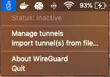

Click on “Manage tunnels”. Then you should see this.

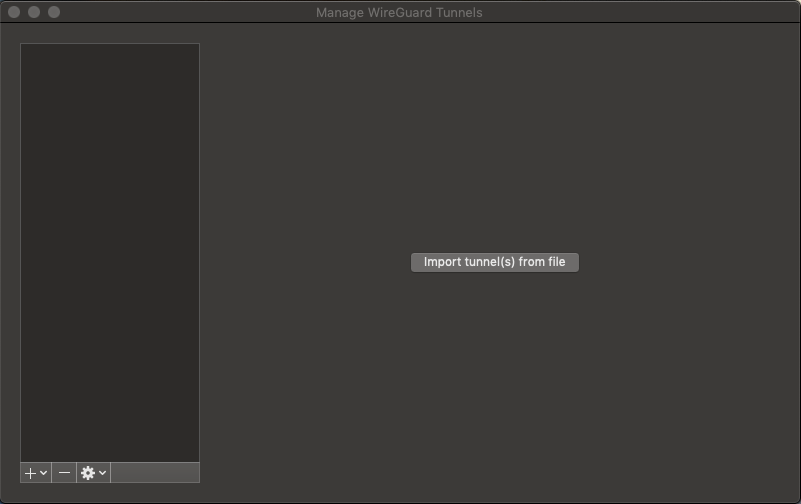

At this page you should be able to import the `.conf` file we talk about earlier.

> **Note:** We stored the file in a folder called `algo` in your /Users/<username>/ folder. If you can’t find it, go to your Finder preferences and go to the Sidebar tab. In the Sidebar add “_🏠 <username>”_ to the list of items that show up in the Sidebar. Then in the Finder you should have a new item in your Sidebar. You should find the `algo` folder after clicking on that new item.

After importing that file, your Mac should ask you the following.

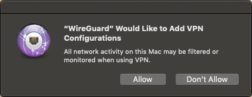

Make sure to press on “Allow” to be able to continue. Once that is done you should see the following.

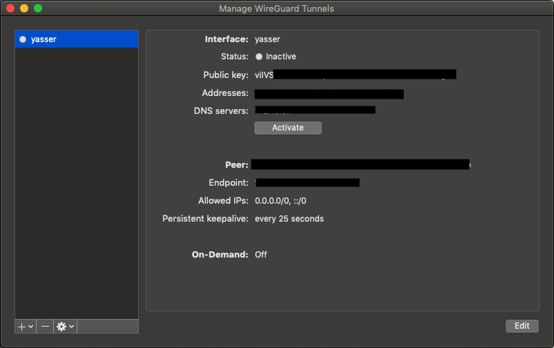

From here all you have to do is click “Activate” and Voila!

Congratulations! You’re now connected to your VPN from your Mac!

Final Notes
===========

Thanks for reading this article. I know it was a lot but you soldiered through! Remember what you’ve accomplished, you were able to set up a VPN on a server that you now own.

Sources
-------

[

How to Deploy Your Own Algo VPN Server in the DigitalOcean Cloud
----------------------------------------------------------------

### As you use your Algo VPN server, adversaries might begin tracking the server’s IP address and eventually blacklist it…

#### zeltser.com

](https://zeltser.com/deploy-algo-vpn-digital-ocean/)[

Meet Algo, the VPN that works
-----------------------------

### I think you’ll agree when I say: there’s no VPN option on the market designed with equal emphasis on security and ease…

#### blog.trailofbits.com

](https://blog.trailofbits.com/2016/12/12/meet-algo-the-vpn-that-works/)